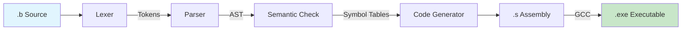

# Baa Compiler Internals

> **Version:** 0.1.1 | [← Language Spec](LANGUAGE.md) | [API Reference →](API_REFERENCE.md)

**Target Architecture:** x86-64 (AMD64)  
**Target OS:** Windows (MinGW-w64 Toolchain)  
**Calling Convention:** Microsoft x64 ABI

This document details the internal architecture, data structures, and algorithms used in the Baa compiler.

---

## Table of Contents

- [Pipeline Architecture](#1-pipeline-architecture)
- [Lexical Analysis](#2-lexical-analysis)
- [Syntactic Analysis](#3-syntactic-analysis)
- [Abstract Syntax Tree](#4-abstract-syntax-tree)
- [Semantic Analysis](#5-semantic-analysis)
- [Code Generation](#6-code-generation)
- [Global Data Section](#7-global-data-section)
- [Naming & Entry Point](#8-naming--entry-point)

---

## 1. Pipeline Architecture

The compiler operates as a multi-stage pipeline with integrated semantic analysis.



| Stage | Input | Output | File |
|-------|-------|--------|------|
| Lexer | UTF-8 source | Token stream | `lexer.c` |
| Parser | Tokens | AST | `parser.c` |
| Semantic | AST | Symbol tables | (integrated) |
| Codegen | AST + Symbols | x86-64 Assembly | `codegen.c` |
| GCC | Assembly | Executable | (external) |

---

## 2. Lexical Analysis

The Lexer (`src/lexer.c`) transforms raw bytes into `Token` structures.

### 2.1. Key Features

| Feature | Description |
|---------|-------------|
| **UTF-8 Handling** | Full Unicode support for Arabic text |
| **BOM Detection** | Skips `0xEF 0xBB 0xBF` if present |
| **Arabic Numerals** | Normalizes `٠`-`٩` → `0`-`9` |
| **Arabic Punctuation** | Handles `؛` (semicolon) `0xD8 0x9B` |

### 2.2. Token Types (v0.1.1)

```
Keywords:    صحيح, إذا, طالما, لكل, اطبع, إرجع
Literals:    INTEGER, STRING, CHAR
Operators:   + - * / % ++ -- ! && ||
Comparison:  == != < > <= >=
Delimiters:  ( ) { } [ ] , . ؛
Special:     IDENTIFIER, EOF
```

---

## 3. Syntactic Analysis

The Parser (`src/parser.c`) builds the AST using Recursive Descent with 1-token lookahead.

### 3.1. Grammar (BNF)

```bnf
Program       ::= Declaration* EOF
Declaration   ::= FuncDecl | GlobalVarDecl

FuncDecl      ::= "صحيح" ID "(" ParamList ")" Block
GlobalVarDecl ::= "صحيح" ID ("=" Expr)? "."

Block         ::= "{" Statement* "}"
Statement     ::= VarDecl | ArrayDecl | Assign | ArrayAssign
                | If | While | For | Return | Print | CallStmt

VarDecl       ::= "صحيح" ID "=" Expr "."
ArrayDecl     ::= "صحيح" ID "[" INT "]" "."
Assign        ::= ID "=" Expr "."
ArrayAssign   ::= ID "[" Expr "]" "=" Expr "."

If            ::= "إذا" "(" Expr ")" Block
While         ::= "طالما" "(" Expr ")" Block
For           ::= "لكل" "(" Init? "؛" Expr? "؛" Update? ")" Block
Return        ::= "إرجع" Expr "."
Print         ::= "اطبع" Expr "."
```

### 3.2. Expression Precedence

Implemented via precedence climbing:

```
Logical OR   ::= Logical AND { "||" Logical AND }
Logical AND  ::= Equality { "&&" Equality }
Equality     ::= Relational { ("==" | "!=") Relational }
Relational   ::= Additive { ("<" | ">" | "<=" | ">=") Additive }
Additive     ::= Multiplicative { ("+" | "-") Multiplicative }
Multiplicative ::= Unary { ("*" | "/" | "%") Unary }
Unary        ::= ("!" | "-" | "++" | "--") Unary | Postfix
Postfix      ::= Primary { "++" | "--" }
Primary      ::= INT | STRING | CHAR | ID | ArrayAccess | Call | "(" Expr ")"
```

---

## 4. Abstract Syntax Tree

The AST uses a tagged union structure for type-safe node representation.

### 4.1. Node Types

| Category | Node Types |
|----------|------------|
| **Structure** | `NODE_PROGRAM`, `NODE_FUNC_DEF`, `NODE_BLOCK`, `NODE_PARAM` |
| **Variables** | `NODE_VAR_DECL`, `NODE_ASSIGN`, `NODE_VAR_REF` |
| **Arrays** | `NODE_ARRAY_DECL`, `NODE_ARRAY_ACCESS`, `NODE_ARRAY_ASSIGN` |
| **Control** | `NODE_IF`, `NODE_WHILE`, `NODE_FOR`, `NODE_RETURN` |
| **Expressions** | `NODE_BIN_OP`, `NODE_UNARY_OP`, `NODE_POSTFIX_OP` |
| **Literals** | `NODE_INT`, `NODE_STRING`, `NODE_CHAR` |
| **Calls** | `NODE_CALL_EXPR`, `NODE_CALL_STMT`, `NODE_PRINT` |

### 4.2. Node Structure

```c
typedef struct Node {
    NodeType type;      // Discriminator
    struct Node* next;  // Linked list for siblings
    union { ... } data; // Type-specific payload
} Node;
```

---

## 5. Semantic Analysis

### 5.1. Symbol Table

```c
typedef struct {
    char name[32];
    ScopeType scope;  // GLOBAL or LOCAL
    int offset;       // Stack offset (locals) or data address (globals)
} Symbol;
```

### 5.2. Memory Allocation

| Type | Allocation | Notes |
|------|------------|-------|
| Scalar (`int`) | 8 bytes | Single stack slot |
| Array (`int[N]`) | `N × 8` bytes | Contiguous stack slots |

**Array Layout:**
- `offset` points to base address
- Element `i` at `base - (i × 8)` (stack grows down)

---

## 6. Code Generation

### 6.1. Windows x64 ABI Compliance

| Requirement | Implementation |
|-------------|----------------|
| **Register Args** | RCX, RDX, R8, R9 for first 4 params |
| **Stack Alignment** | 16-byte aligned before `call` |
| **Shadow Space** | 32 bytes reserved for callee |
| **Return Value** | RAX |

### 6.2. Array Access

To access `arr[i]`:

```asm
# 1. Compute index → RAX
# 2. Move to RCX
movq %rax, %rcx
# 3. Calculate offset
imulq $8, %rcx        # i × 8
negq %rcx             # Negate (stack grows down)
addq $OFFSET, %rcx    # Add base offset
# 4. Load value
movq (%rbp, %rcx, 1), %rax
```

### 6.3. Short-Circuit Evaluation

**AND (`&&`):**
```
1. Evaluate left → if 0, jump to END (result = 0)
2. Evaluate right
3. Compare right != 0 → result
```

**OR (`||`):**
```
1. Evaluate left → if != 0, jump to TRUE (result = 1)
2. Evaluate right → if != 0, jump to TRUE
3. Default: result = 0
```

### 6.4. For Loop Pattern

```asm
    # Init code
.Lfor_start_N:
    # Condition → if false, jump to .Lfor_end_N
    # Body code
    # Increment code
    jmp .Lfor_start_N
.Lfor_end_N:
```

---

## 7. Global Data Section

| Section | Contents |
|---------|----------|
| `.data` | Global variables (mutable) |
| `.rdata` | String literals (read-only) |
| `.text` | Executable code |

### String Table

Strings are collected during parsing and emitted with unique labels:

```asm
.section .rdata
.LC0:
    .asciz "مرحباً"
.LC1:
    .asciz "العالم"
```

---

## 8. Naming & Entry Point

| Aspect | Details |
|--------|---------|
| **Entry Point** | `الرئيسية` → exported as `main` |
| **Name Mangling** | None (direct UTF-8 labels) |
| **External Calls** | C runtime (`printf`, etc.) via `@PLT` |

---

*[← Language Spec](LANGUAGE.md) | [API Reference →](API_REFERENCE.md)*