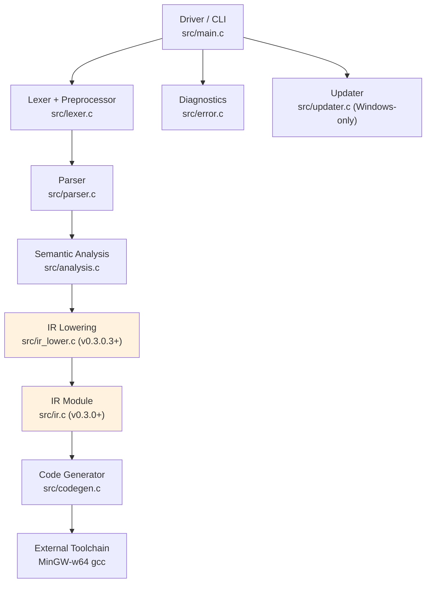

# Baa Compiler Internals

> **Version:** 0.3.2.2 | [← Language Spec](LANGUAGE.md) | [API Reference →](API_REFERENCE.md)

**Target Architecture:** x86-64 (AMD64)
**Target OS:** Windows (MinGW-w64 Toolchain)
**Calling Convention:** Microsoft x64 ABI

This document details the internal architecture, data structures, and algorithms used in the Baa compiler.

---

## Table of Contents

- [Pipeline Architecture](#1-pipeline-architecture)
- [Lexical Analysis](#2-lexical-analysis)
- [Syntactic Analysis](#3-syntactic-analysis)
- [Abstract Syntax Tree](#4-abstract-syntax-tree)
- [Semantic Analysis](#5-semantic-analysis)
- [Intermediate Representation](#6-intermediate-representation)
- [IR Constant Folding Pass](#615-ir-constant-folding-pass)
- [IR Dead Code Elimination Pass](#616-ir-dead-code-elimination-pass)
- [IR Copy Propagation Pass](#617-ir-copy-propagation-pass)
- [IR Common Subexpression Elimination Pass](#618-ir-common-subexpression-elimination-pass)
- [Instruction Selection](#619-instruction-selection-v0321)
- [Register Allocation](#620-register-allocation-تخصيص_السجلات--v0322)
- [Code Generation](#7-code-generation)
- [Global Data Section](#8-global-data-section)
- [Naming & Entry Point](#9-naming--entry-point)

---

## 1. Pipeline Architecture

The compiler is orchestrated by the **Driver** (`src/main.c`), which acts as the entry point and build manager. It parses command-line arguments to determine which stages of compilation to run.

### 1.1. Compilation Stages


| Stage | Input | Output | Component | Description |
|-------|-------|--------|-----------|-------------|
| **1. Frontend** | `.baa` Source | AST | `lexer.c`, `parser.c` | Tokenizes, handles macros, and builds the syntax tree. |
| **2. Analysis** | AST | Valid AST | `analysis.c` | **Semantic Pass**: Checks types, scopes, and resolves symbols. |
| **3. IR Lowering** | AST | IR | `ir_lower.c` (v0.3.0.3+) + `ir_builder.c` | Converts AST expressions/statements to SSA-form Intermediate Representation using the IR Builder. |
| **4. Optimization** | IR | Optimized IR | [`src/ir_analysis.c`](src/ir_analysis.c:1) + [`src/ir_pass.h`](src/ir_pass.h:1) (v0.3.1.1+) | Analysis infrastructure (CFG validation, predecessors, dominance) + future optimization passes. |
| **5. Backend** | IR | `.s` Assembly | `codegen.c` | Generates x86-64 assembly code (AT&T syntax). |
| **6. Assemble** | `.s` Assembly | `.o` Object | `gcc -c` | Invokes external assembler. |
| **7. Link** | `.o` Object | `.exe` Executable | `gcc` | Links with C Runtime. |

> **Note (v0.3.0.7):** IR lowering is now integrated into the main driver pipeline (AST → IR is built after semantic analysis). Assembly generation still uses the legacy AST→assembly backend; IR→backend integration comes later.

### 1.1.1. Component Map



### 1.2. The Driver (CLI)

The driver in `main.c` (v0.2.0+) supports multi-file compilation and various modes:

| Flag | Mode | Output | Action |
|------|------|--------|--------|
| (Default) | **Compile & Link** | `.exe` | Runs full pipeline. Deletes intermediate `.s` and `.o` files. |
| `-o <file>` | **Custom Output** | `.exe` | Sets the linked output filename (default: `out.exe`). |
| (Multiple Files) | **Multi-File Build** | `.exe` | Compiles each `.baa` to `.o` and links them. |
| `-S`, `-s` | **Assembly Only** | `.s` | Stops after codegen. Writes `<input>.s` (or `-o` when a single input file is used). |
| `-c` | **Compile Only** | `.o` | Stops after assembling. Writes `<input>.o` (or `-o` when a single input file is used). |
| `-v` | **Verbose** | - | Prints commands and compilation time; keeps intermediate `.s` files. |
| `--dump-ir` | **IR Dump** | stdout | Prints Baa IR (Arabic) after semantic analysis (v0.3.0.6+). |
| `--emit-ir` | **IR Emit** | `<input>.ir` | Writes Baa IR (Arabic) to a `.ir` file after semantic analysis (v0.3.0.7). |
| `--version` | **Version Info** | stdout | Displays compiler version and build date. |
| `--help`, `-h` | **Help** | stdout | Shows usage information. |
| `update` | **Self-Update** | - | Downloads and installs the latest version. |

### 1.3. Diagnostic Engine

The compiler uses a centralized **Diagnostic Module** (`src/error.c`) to handle errors and warnings.

**Error Features:**

- **Source Context**: Prints the actual line of code where the error occurred.
- **Pointers**: Uses `^` to point exactly to the offending token.
- **Colored Output**: Errors displayed in red (ANSI) when terminal supports it (v0.2.8+).
- **Panic Mode Recovery**: When a syntax error is found, the parser does not exit immediately. Instead, it enters "Panic Mode":
    1. It reports the error.
    2. It skips tokens forward until it finds a **Synchronization Point**.
    3. **Synchronization Points**: Semicolon `.`, Right Brace `}`, or Keywords (`صحيح`, `إذا`, etc.).
    4. Parsing resumes to find subsequent errors.

**Warning Features (v0.2.8+):**

- **Non-fatal**: Warnings do not stop compilation by default.
- **Colored Output**: Warnings displayed in yellow (ANSI) when terminal supports it.
- **Warning Names**: Each warning shows its type in brackets: `[-Wunused-variable]`.
- **Configurable**: Enable with `-Wall` or specific `-W<type>` flags.
- **Errors Mode**: Use `-Werror` to treat warnings as fatal errors.

**ANSI Color Support:**

- Windows 10+: Automatically enables Virtual Terminal Processing.
- Unix/Linux: Detects TTY via `isatty()`.
- Override with `-Wcolor` (force on) or `-Wno-color` (force off).

## 2. Lexical Analysis

The Lexer (`src/lexer.c`) transforms raw bytes into `Token` structures.

### 2.1. Internal Structure

The Lexer now supports **Nested Includes** via a state stack and **Macro Definitions**.

```c
// Represents the state of a single file being parsed
typedef struct {
    char* source;       // Full source code buffer (owned by this state)
    char* cur_char;     // Current reading pointer
    const char* filename;
    int line;
    int col;
} LexerState;

// Definition (Macro)
typedef struct {
    char* name;
    char* value;
} Macro;

// The main Lexer context
typedef struct {
    LexerState state;       // Current file state
    LexerState stack[10];   // Stack for nested includes (max depth 10)
    int stack_depth;
    
    // Preprocessor state
    Macro macros[100];      // Table of definitions
    int macro_count;
    bool skipping;          // True if inside disabled #if block
} Lexer;
```

### 2.2. Preprocessor Logic

The preprocessor is integrated directly into the `lexer_next_token` function. It intercepts directives starting with `#` before tokenizing normal code.

#### 2.2.1. Definitions (`#تعريف`)

When `#تعريف NAME VALUE` is encountered:

1. The name and value are parsed as strings.
2. They are stored in the `macros` table.
3. When the Lexer later encounters an `IDENTIFIER`:
    - It checks the macro table
    - If found, replaces the token's value with the macro value
    - Updates the token type based on the value (INT if numeric, STRING if quoted, IDENTIFIER otherwise)

#### 2.2.2. Conditionals (`#إذا_عرف`)

When `#إذا_عرف NAME` is encountered:

1. The lexer checks if `NAME` exists in the macro table.
2. If it exists, normal parsing continues.
3. If not, the lexer enters **Skipping Mode**.
4. In Skipping Mode, all tokens are discarded until `#وإلا` or `#نهاية` is found.

#### 2.2.3. Undefine (`#الغاء_تعريف`)

When `#الغاء_تعريف NAME` is encountered:

1. The lexer searches for `NAME` in the macro table.
2. If found, the entry is removed (by shifting subsequent entries).
3. If not found, the directive is ignored.

#### 2.2.4. Include (`#تضمين`)

When `#تضمين "file"` is encountered:

1. The filename is extracted from the quoted string.
2. The file is read into memory using `read_file()`.
3. The current lexer state is pushed onto the include stack.
4. The lexer state is updated to point to the new file's content.
5. When EOF is reached, the previous state is popped and restored.

### 2.3. Key Features

| Feature | Description |
|---------|-------------|
| **UTF-8 Handling** | Full Unicode support for Arabic text |
| **BOM Detection** | Skips `0xEF 0xBB 0xBF` if present |
| **Arabic Numerals** | Normalizes `٠`-`٩` → `0`-`9` |
| **Arabic Punctuation** | Handles `؛` (semicolon) `0xD8 0x9B` |

### 2.4. Token Types

```
Keywords:    صحيح, نص, منطقي, ثابت, إذا, وإلا, طالما, لكل, اختر, حالة, افتراضي, اطبع, اقرأ, إرجع, توقف, استمر
Literals:    INTEGER, STRING, CHAR, TRUE, FALSE
Operators:   + - * / % ++ -- ! && ||
Comparison:  == != < > <= >=
Delimiters:  ( ) { } [ ] , . : ؛
Special:     IDENTIFIER, EOF
```

> **Note:** `ثابت` (const) was added in v0.2.7 for immutable variable declarations.

---

## 3. Syntactic Analysis

The Parser (`src/parser.c`) builds the AST using Recursive Descent with 1-token lookahead.

### 3.1. Grammar (BNF)

```bnf
Program       ::= Declaration* EOF
Declaration   ::= FuncDecl | GlobalVarDecl

FuncDecl      ::= Type ID "(" ParamList ")" Block
                | Type ID "(" ParamList ")" "."    // Prototype (v0.2.5+)
GlobalVarDecl ::= ConstMod? Type ID ("=" Expr)? "."

ConstMod      ::= "ثابت"                           // NEW in v0.2.7
Type          ::= "صحيح" | "نص" | "منطقي"          // Updated in v0.2.9

Block         ::= "{" Statement* "}"
Statement     ::= VarDecl | ArrayDecl | Assign | ArrayAssign
                | If | Switch | While | For | Return | Print | Read | CallStmt
                | Break | Continue

VarDecl       ::= ConstMod? Type ID "=" Expr "."   // Local declarations require an initializer
ArrayDecl     ::= ConstMod? "صحيح" ID "[" INT "]" "."  // Updated in v0.2.7
Assign        ::= ID "=" Expr "."
ArrayAssign   ::= ID "[" Expr "]" "=" Expr "."

If            ::= "إذا" "(" Expr ")" Block ("وإلا" (Block | If))?
Switch        ::= "اختر" "(" Expr ")" "{" Case* Default? "}"
Case          ::= "حالة" (INT | CHAR) ":" Statement*
Default       ::= "افتراضي" ":" Statement*

While         ::= "طالما" "(" Expr ")" Block
For           ::= "لكل" "(" Init? "؛" Expr? "؛" Update? ")" Block
Break         ::= "توقف" "."
Continue      ::= "استمر" "."
Return        ::= "إرجع" Expr "."
Print         ::= "اطبع" Expr "."
Read          ::= "اقرأ" ID "."
```

### 3.2. Expression Precedence

Implemented via precedence climbing:

```
Logical OR   ::= Logical AND { "||" Logical AND }
Logical AND  ::= Equality { "&&" Equality }
Equality     ::= Relational { ("==" | "!=") Relational }
Relational   ::= Additive { ("<" | ">" | "<=" | ">=") Additive }
Additive     ::= Multiplicative { ("+" | "-") Multiplicative }
Multiplicative ::= Unary { ("*" | "/" | "%") Unary }
Unary        ::= ("!" | "-" | "++" | "--") Unary | Postfix
Postfix      ::= Primary { "++" | "--" }
Primary      ::= INT | STRING | CHAR | ID | ArrayAccess | Call | "(" Expr ")"
```

---

### 3.3. Error Handling Strategy

The parser uses `synchronize()` to recover from errors.

**Example Scenario:**

```baa
صحيح س = ١٠  // Error: Missing dot
صحيح ص = ٢٠.
```

1. Parser expects `.` but finds `صحيح`.
2. `report_error()` is called.
3. `synchronize()` is called. It skips until it sees `صحيح` (start of next statement).
4. Parser continues parsing `صحيح ص = ٢٠.`.
5. At the end, compiler exits with status 1 if any errors were found.

---

## 4. Abstract Syntax Tree

The AST uses a tagged union structure for type-safe node representation.

### 4.1. Node Types

| Category | Node Types |
|----------|------------|
| **Structure** | `NODE_PROGRAM`, `NODE_FUNC_DEF`, `NODE_BLOCK` |
| **Variables** | `NODE_VAR_DECL`, `NODE_ASSIGN`, `NODE_VAR_REF` |
| **Array Decls** | `NODE_ARRAY_DECL`, `NODE_ARRAY_ACCESS`, `NODE_ARRAY_ASSIGN` |
| **Control Flow** | `NODE_IF`, `NODE_WHILE`, `NODE_FOR`, `NODE_RETURN` |
| **Branching** | `NODE_SWITCH`, `NODE_CASE`, `NODE_BREAK`, `NODE_CONTINUE` |
| **Expressions** | `NODE_BIN_OP`, `NODE_UNARY_OP`, `NODE_POSTFIX_OP`, `NODE_CALL_EXPR` |
| **Literals** | `NODE_INT`, `NODE_STRING`, `NODE_CHAR`, `NODE_BOOL` |
| **Calls & I/O** | `NODE_CALL_STMT`, `NODE_PRINT`, `NODE_READ` |

### 4.2. Node Structure

```c
typedef struct Node {
    NodeType type;      // Discriminator
    struct Node* next;  // Linked list for siblings
    union { ... } data; // Type-specific payload
} Node;
```

---

## 5. Semantic Analysis

The Semantic Analyzer (`src/analysis.c`) performs a static check on the AST before code generation.

### 5.1. Responsibilities

1. **Symbol Resolution**: Verifies variables are declared before use.
2. **Type Checking**: Enforces `TYPE_INT`, `TYPE_STRING`, and `TYPE_BOOL` compatibility.
3. **Scope Validation**: Manages visibility rules.
4. **Constant Checking** (v0.2.7+): Prevents reassignment of immutable variables.
5. **Control Flow Validation**: Ensures `break` and `continue` are used only within loops/switches.
6. **Function Validation**: Checks function prototypes and definitions match.
7. **Usage Tracking** (v0.2.8+): Tracks variable usage for unused variable warnings.
8. **Dead Code Detection** (v0.2.8+): Detects unreachable code after `return`/`break`.

### 5.2. Constant Checking (v0.2.7+)

The analyzer tracks the `is_const` flag for each symbol and enforces immutability:

| Error Condition | Error Message |
|-----------------|---------------|
| Reassigning a constant | `Cannot reassign constant '<name>'` |
| Modifying constant array element | `Cannot modify constant array '<name>'` |
| Constant without initializer | `Constant '<name>' must be initialized` |

### 5.3. Warning Generation (v0.2.8+)

The analyzer generates warnings for potential issues that don't prevent compilation:

#### Unused Variable Detection

**Algorithm:**

1. Each symbol has an `is_used` flag initialized to `false`.
2. When a variable is referenced (in expressions, assignments, etc.), the flag is set to `true`.
3. At end of function scope, all local variables with `is_used == false` generate a warning.
4. At end of program, all global variables with `is_used == false` generate a warning.

**Exception:** Function parameters are marked as "used" implicitly to avoid false positives.

#### Dead Code Detection

**Algorithm:**

1. While analyzing a block, track if a "terminating" statement was encountered.
2. Terminating statements: `NODE_RETURN`, `NODE_BREAK`, `NODE_CONTINUE`.
3. If a terminating statement was found and there are more statements after it, generate a warning.

**Implementation:**

```c
static void analyze_statements_with_dead_code_check(Node* statements, const char* context) {
    bool found_terminator = false;
    Node* stmt = statements;
    while (stmt) {
        if (found_terminator) {
            warning_report(WARN_DEAD_CODE, ...);
            found_terminator = false; // Avoid multiple warnings
        }
        analyze_node(stmt);
        if (is_terminating_statement(stmt)) {
            found_terminator = true;
        }
        stmt = stmt->next;
    }
}
```

#### Variable Shadowing

When a local variable is declared with the same name as a global variable, a `WARN_SHADOW_VARIABLE` warning is generated.

### 5.4. Isolation Note

Since v0.2.4, `analysis.c` and `codegen.c` **maintain separate symbol tables** for isolation. The `Symbol` struct definition is shared via `baa.h`, but each module manages its own table. This ensures validation logic is independent from generation logic.

**Future improvement:** Unify symbol tables into a shared context object passed between phases.

The analyzer walks the AST recursively. It maintains a **Symbol Table** stack to track active variables in the current scope. If it encounters:

- `x = "text"` (where x is `int`): Reports a type mismatch error.
- `print y` (where y is undeclared): Reports an undefined symbol error.
- `x = 5` (where x is `const`): Reports a const reassignment error (v0.2.7+).

### 5.5. Memory Allocation

| Type | C Type | Size | Notes |
|------|--------|------|-------|
| `صحيح` | `int64_t` | 8 bytes | Signed integer |
| `نص` | `char*` | 8 bytes | Pointer to .rdata string |
| `منطقي` | `bool` (stored as int) | 8 bytes | Stored as 0/1 in 8-byte slots |

**I/O note (v0.2.9):** The current backend emits `printf("%d\\n", ...)` and `scanf("%d", ...)`, so printed/read integers are effectively 32-bit even though storage uses 8 bytes.

---

### 5.6. Constant Folding (Optimization)

The parser performs constant folding on arithmetic expressions. If both operands of a binary operation are integer literals, the compiler evaluates the result at compile-time.

**Example:**

- Source: `٢ * ٣ + ٤`
- Before folding: `BinOp(+, BinOp(*, 2, 3), 4)`
- After folding: `Int(10)`

**Supported Operations:** `+`, `-`, `*`, `/`, `%`
**Note:** Division/modulo by zero is detected and reported during folding.

---

## 6. Intermediate Representation (v0.3.0+)

The IR Module (`src/ir.h`, `src/ir.c`) provides an Arabic-first Intermediate Representation using SSA (Static Single Assignment) form.

### 6.1. Design Philosophy

Baa's IR is designed with three goals:

1. **Arabic Identity**: All opcodes, types, and predicates have Arabic names.
2. **Technical Parity**: Comparable to LLVM IR, GIMPLE, or WebAssembly in capabilities.
3. **SSA Form**: Each virtual register is assigned exactly once, enabling powerful optimizations.

### 6.2. IR Structure

```
IRModule
├── globals: IRGlobal*      // Global variables
├── funcs: IRFunc*          // Functions
└── strings: IRStringEntry* // String literal table

IRFunc
├── name: char*
├── ret_type: IRType*
├── params: IRParam[]
├── blocks: IRBlock*        // Linked list of basic blocks
├── entry: IRBlock*         // Entry block pointer
└── next_reg: int           // Virtual register counter

IRBlock
├── label: char*            // Arabic label (e.g., "بداية", "حلقة")
├── id: int
├── first/last: IRInst*     // Instruction list
├── succs[2]: IRBlock*      // Successors (0-2 for br/br_cond)
├── preds: IRBlock**        // Predecessors (dynamic array)
└── next: IRBlock*          // Next block in function

IRInst
├── op: IROp                // Opcode
├── type: IRType*           // Result type
├── dest: int               // Destination register (-1 if none)
├── operands[4]: IRValue*   // Up to 4 operands
├── cmp_pred: IRCmpPred     // For comparison instructions
├── phi_entries: IRPhiEntry* // For phi nodes
└── call_*: ...             // For call instructions
```

### 6.3. IR Opcodes (Arabic)

| Category | Opcode | Arabic | Description |
|----------|--------|--------|-------------|
| **Arithmetic** | `IR_OP_ADD` | جمع | Addition |
| | `IR_OP_SUB` | طرح | Subtraction |
| | `IR_OP_MUL` | ضرب | Multiplication |
| | `IR_OP_DIV` | قسم | Division |
| | `IR_OP_MOD` | باقي | Modulo |
| | `IR_OP_NEG` | سالب | Negation |
| **Memory** | `IR_OP_ALLOCA` | حجز | Stack allocation |
| | `IR_OP_LOAD` | حمل | Load from memory |
| | `IR_OP_STORE` | خزن | Store to memory |
| **Comparison** | `IR_OP_CMP` | قارن | Compare with predicate |
| **Logical** | `IR_OP_AND` | و | Bitwise AND |
| | `IR_OP_OR` | أو | Bitwise OR |
| | `IR_OP_NOT` | نفي | Bitwise NOT |
| **Control** | `IR_OP_BR` | قفز | Unconditional branch |
| | `IR_OP_BR_COND` | قفز_شرط | Conditional branch |
| | `IR_OP_RET` | رجوع | Return |
| | `IR_OP_CALL` | نداء | Function call |
| **SSA** | `IR_OP_PHI` | فاي | Phi node |
| | `IR_OP_COPY` | نسخ | Copy value |
| **Conversion** | `IR_OP_CAST` | تحويل | Type cast |

### 6.4. IR Types (Arabic)

| Type | Arabic | Bits | Description |
|------|--------|------|-------------|
| `IR_TYPE_VOID` | فراغ | 0 | No value |
| `IR_TYPE_I1` | ص١ | 1 | Boolean |
| `IR_TYPE_I8` | ص٨ | 8 | Byte/Char |
| `IR_TYPE_I16` | ص١٦ | 16 | Short |
| `IR_TYPE_I32` | ص٣٢ | 32 | Int |
| `IR_TYPE_I64` | ص٦٤ | 64 | Long (primary) |
| `IR_TYPE_PTR` | مؤشر | 64 | Pointer |
| `IR_TYPE_ARRAY` | مصفوفة | varies | Array |
| `IR_TYPE_FUNC` | دالة | - | Function type |

### 6.5. Comparison Predicates

| Predicate | Arabic | Description |
|-----------|--------|-------------|
| `IR_CMP_EQ` | يساوي | Equal |
| `IR_CMP_NE` | لا_يساوي | Not Equal |
| `IR_CMP_GT` | أكبر | Greater Than |
| `IR_CMP_LT` | أصغر | Less Than |
| `IR_CMP_GE` | أكبر_أو_يساوي | Greater or Equal |
| `IR_CMP_LE` | أصغر_أو_يساوي | Less or Equal |

### 6.6. Virtual Registers

Registers use Arabic naming with Arabic-Indic numerals:

- Format: `%م<n>` where `م` = مؤقت (temporary)
- Examples: `%م٠`, `%م١`, `%م٢`, ...

The `int_to_arabic_numerals()` function converts integers to Arabic-Indic digits (٠١٢٣٤٥٦٧٨٩).

### 6.7. Example IR Output

**Baa Source:**

```baa
صحيح الرئيسية() {
    صحيح س = ١٠.
    صحيح ص = ٢٠.
    إرجع س + ص.
}
```

**Generated IR (Arabic mode):**

```
دالة الرئيسية() -> ص٦٤ {
بداية:
    %م٠ = حجز ص٦٤
    خزن ص٦٤ ١٠, %م٠
    %م١ = حجز ص٦٤
    خزن ص٦٤ ٢٠, %م١
    %م٢ = حمل ص٦٤ %م٠
    %م٣ = حمل ص٦٤ %م١
    %م٤ = جمع ص٦٤ %م٢, %م٣
    رجوع ص٦٤ %م٤
}
```

### 6.8. IR Module API (Low-Level)

Key functions for building IR directly (without builder):

```c
// Module
IRModule* ir_module_new(const char* name);
void ir_module_add_func(IRModule* module, IRFunc* func);
int ir_module_add_string(IRModule* module, const char* str);

// Function
IRFunc* ir_func_new(const char* name, IRType* ret_type);
int ir_func_alloc_reg(IRFunc* func);
IRBlock* ir_func_new_block(IRFunc* func, const char* label);

// Block
IRBlock* ir_block_new(const char* label, int id);
void ir_block_append(IRBlock* block, IRInst* inst);

// Instructions
IRInst* ir_inst_binary(IROp op, IRType* type, int dest, IRValue* lhs, IRValue* rhs);
IRInst* ir_inst_cmp(IRCmpPred pred, int dest, IRValue* lhs, IRValue* rhs);
IRInst* ir_inst_load(IRType* type, int dest, IRValue* ptr);
IRInst* ir_inst_store(IRValue* value, IRValue* ptr);
IRInst* ir_inst_br(IRBlock* target);
IRInst* ir_inst_br_cond(IRValue* cond, IRBlock* if_true, IRBlock* if_false);
IRInst* ir_inst_ret(IRValue* value);
IRInst* ir_inst_call(const char* target, IRType* ret_type, int dest, IRValue** args, int arg_count);
IRInst* ir_inst_phi(IRType* type, int dest);

// Printing
void ir_module_print(IRModule* module, FILE* out, int use_arabic);
void ir_module_dump(IRModule* module, const char* filename, int use_arabic);
```

### 6.9. IR Builder API (High-Level, v0.3.0.2+)

The IR Builder (`src/ir_builder.h`, `src/ir_builder.c`) provides a convenient builder pattern API:

```c
// Builder lifecycle
IRBuilder* ir_builder_new(IRModule* module);
void ir_builder_free(IRBuilder* builder);

// Function/Block creation
IRFunc* ir_builder_create_func(IRBuilder* builder, const char* name, IRType* ret_type);
IRBlock* ir_builder_create_block(IRBuilder* builder, const char* label);
void ir_builder_set_insert_point(IRBuilder* builder, IRBlock* block);

// Register allocation
int ir_builder_alloc_reg(IRBuilder* builder);

// Emit instructions (auto-appends to current block)
int ir_builder_emit_add(IRBuilder* builder, IRType* type, IRValue* lhs, IRValue* rhs);
int ir_builder_emit_sub(IRBuilder* builder, IRType* type, IRValue* lhs, IRValue* rhs);
int ir_builder_emit_mul(IRBuilder* builder, IRType* type, IRValue* lhs, IRValue* rhs);
int ir_builder_emit_alloca(IRBuilder* builder, IRType* type);
int ir_builder_emit_load(IRBuilder* builder, IRType* type, IRValue* ptr);
void ir_builder_emit_store(IRBuilder* builder, IRValue* value, IRValue* ptr);
void ir_builder_emit_br(IRBuilder* builder, IRBlock* target);
void ir_builder_emit_br_cond(IRBuilder* builder, IRValue* cond, IRBlock* if_true, IRBlock* if_false);
void ir_builder_emit_ret(IRBuilder* builder, IRValue* value);
int ir_builder_emit_call(IRBuilder* builder, const char* target, IRType* ret_type, IRValue** args, int arg_count);

// Control flow structure helpers
void ir_builder_create_if_then(IRBuilder* builder, IRValue* cond,
                                const char* then_label, const char* merge_label,
                                IRBlock** then_block, IRBlock** merge_block);
void ir_builder_create_while(IRBuilder* builder,
                              const char* header_label, const char* body_label,
                              const char* exit_label,
                              IRBlock** header_block, IRBlock** body_block,
                              IRBlock** exit_block);

// Constants
IRValue* ir_builder_const_int(int64_t value);
IRValue* ir_builder_const_i64(int64_t value);
IRValue* ir_builder_const_bool(int value);
```

**Benefits over low-level API:**

- Automatic register allocation
- Automatic CFG edge management (successors/predecessors)
- Source location propagation
- Control flow structure helpers for if/else/while
- Statistics tracking

### 6.10. AST → IR Lowering (Expressions, v0.3.0.3+)

Expression lowering lives in `src/ir_lower.h` and `src/ir_lower.c` and is built on top of the IR Builder (`src/ir_builder.h`, `src/ir_builder.c`).

Key concepts:

- `IRLowerCtx`: Lowering context (builder + simple local bindings table).
- `ir_lower_bind_local()`: Bind a variable name to its `حجز` pointer register. *(Statement lowering will populate this in v0.3.0.4.)*
- `lower_expr()`: Lower AST expressions into IR operands (`IRValue*`) and emits IR instructions via the builder.

Currently lowered expressions:

- `NODE_INT`, `NODE_STRING`, `NODE_CHAR`, `NODE_BOOL`
- `NODE_VAR_REF` (loads via `حمل`)
- `NODE_BIN_OP` (arithmetic, comparisons, logical ops)
- `NODE_UNARY_OP` (neg/not)
- `NODE_CALL_EXPR` (calls via `نداء`)

### 6.11. AST → IR Lowering (Statements, v0.3.0.4+)

Statement lowering is implemented in the same module and currently supports:

- `NODE_VAR_DECL`: emit `حجز` + `خزن` and bind the variable name via `ir_lower_bind_local()`
- `NODE_ASSIGN`: emit `خزن` to an existing local binding
- `NODE_RETURN`: emit `رجوع`
- `NODE_PRINT`: emit `نداء @اطبع(...)` (builtin call)
- `NODE_READ`: emit `نداء @اقرأ(%ptr)` (builtin call)

### 6.12. AST → IR Lowering (Control Flow, v0.3.0.5+)

Control flow lowering extends statement lowering to produce a full CFG using:

- `قفز` (unconditional branch)
- `قفز_شرط` (conditional branch)

Currently lowered control-flow nodes:

- `NODE_IF`: then/else/merge blocks with `قفز_شرط`
- `NODE_WHILE`: header/body/exit blocks, back edge to header (`قفز`)
- `NODE_FOR`: init + header/body/increment/exit blocks (`استمر` targets increment)
- `NODE_SWITCH`: comparison-chain dispatch + case blocks + default + end (with fallthrough)
- `NODE_BREAK`: branch to active loop/switch exit block
- `NODE_CONTINUE`: branch to active loop header/increment block

For full specification, see [BAA_IR_SPECIFICATION.md](BAA_IR_SPECIFICATION.md).

### 6.13. IR Printer (v0.3.0.6)

The IR printer provides a canonical, Arabic-first text format for debugging and tooling.

- Core printer entry point: [`ir_module_print()`](src/ir.c:1641)
- Instruction formatting: [`ir_inst_print()`](src/ir.c:1355)
- Values / registers / immediates: [`ir_value_print()`](src/ir.c:1348)
- Arabic-Indic numerals for registers: [`int_to_arabic_numerals()`](src/ir.c:53)

The driver exposes the printer via the CLI flag `--dump-ir` implemented in [`src/main.c`](src/main.c:1). This flag:

1. Parses + analyzes the source as usual.
2. Builds an IR module using [`IRBuilder`](src/ir_builder.h:43) and lowers AST statements using [`lower_stmt()`](src/ir_lower.c:725).
3. Prints IR to stdout.

> **Note:** This is currently a debug path for inspection only. The main compilation pipeline still generates assembly directly from AST (full IR pipeline integration is scheduled for v0.3.0.7).

**Example invocation:**

```powershell
build\baa.exe --dump-ir program.baa
```

---

### 6.14. IR Analysis Infrastructure (v0.3.1.1)

The IR analysis layer provides foundational compiler analyses required by the upcoming optimizer pipeline:

- **CFG validation**: ensure each block has a terminator (`قفز` / `قفز_شرط` / `رجوع`)
  - [`ir_func_validate_cfg()`](src/ir_analysis.h:36)
  - [`ir_module_validate_cfg()`](src/ir_analysis.h:42)

- **Predecessor rebuilding**: recompute `preds[]` and `succs[]` from terminator instructions (useful after IR edits)
  - [`ir_func_rebuild_preds()`](src/ir_analysis.h:56)
  - [`ir_module_rebuild_preds()`](src/ir_analysis.h:61)

- **Dominator tree + dominance frontier**: compute `idom` for each block and build dominance frontier sets
  - [`ir_func_compute_dominators()`](src/ir_analysis.h:77)
  - [`ir_module_compute_dominators()`](src/ir_analysis.h:82)

> Implementation lives in [`src/ir_analysis.c`](src/ir_analysis.c:1).

---

### 6.15. IR Constant Folding Pass (طي_الثوابت) — v0.3.1.2

The IR constant folding pass optimizes Baa IR by evaluating arithmetic and comparison instructions at compile time when both operands are immediate constants. It replaces all uses of the folded register with the constant value and removes the instruction from its block.

**File:** [src/ir_constfold.c](src/ir_constfold.c)

**Entry Point:** [`ir_constfold_run()`](src/ir_constfold.c)

**Pass Descriptor:** [`IR_PASS_CONSTFOLD`](src/ir_constfold.c) (used with the optimizer pipeline).

**Supported Operations:**

- Arithmetic: جمع (add), طرح (sub), ضرب (mul), قسم (div), باقي (mod)
- Comparisons: قارن <predicate> (eq, ne, gt, lt, ge, le)

**How it works:**

1. Scans each function and block for foldable instructions.
2. If both operands are immediate integer constants, computes the result.
3. Replaces all uses of the destination register with a new constant IRValue.
4. Removes the folded instruction from its block.
5. Pass is function-local; virtual registers are scoped per function.

**Testing:** See [tests/ir_constfold_test.c](tests/ir_constfold_test.c).

**API:** See [docs/API_REFERENCE.md](API_REFERENCE.md) for function signatures.

---

### 6.16. IR Dead Code Elimination Pass (حذف_الميت) — v0.3.1.3

The IR dead code elimination pass removes useless IR after lowering/other optimizations:

- **Dead SSA instructions:** any instruction that produces a destination register which is never used, and has no side effects.
- **Unreachable blocks:** any basic block not reachable from the function entry block.

**File:** [`src/ir_dce.c`](src/ir_dce.c)

**Entry Point:** [`ir_dce_run()`](src/ir_dce.c:300)

**Pass Descriptor:** [`IR_PASS_DCE`](src/ir_dce.c:29)

**Conservative correctness rules:**

- `نداء` (calls) are treated as side-effecting and are not removed even if the result is unused.
- `خزن` (stores) are not removed.
- Terminators (`قفز`, `قفز_شرط`, `رجوع`) are never removed.

**CFG hygiene:**

- Unreachable-block removal uses [`ir_func_rebuild_preds()`](src/ir_analysis.c:132) before/after pruning.
- Phi nodes are pruned of incoming edges from removed predecessor blocks to avoid dangling references.

**Testing:** See [`tests/ir_dce_test.c`](tests/ir_dce_test.c:1).

**API:** See [docs/API_REFERENCE.md](API_REFERENCE.md) for function signatures.

---

### 6.17. IR Copy Propagation Pass (نشر_النسخ) — v0.3.1.4

The IR copy propagation pass removes redundant SSA copy chains by replacing uses of registers defined by `نسخ` (`IR_OP_COPY`) with their original source values. This simplifies the IR and improves the effectiveness of later passes (like common subexpression elimination and dead code elimination).

**File:** [`src/ir_copyprop.c`](src/ir_copyprop.c:1)

**Entry Point:** [`ir_copyprop_run()`](src/ir_copyprop.c:1)

**Pass Descriptor:** [`IR_PASS_COPYPROP`](src/ir_copyprop.c:1)

**Scope:** Function-local (virtual registers are scoped per function in the current IR).

**What it does:**
- Detects `IR_OP_COPY` instructions (`نسخ`) and builds an alias map (`%مX` → source value).
- Canonicalizes copy chains (e.g. `%م٣ = نسخ %م٢`, `%م٢ = نسخ %م١`) so `%م٣` is rewritten to `%م١`.
- Rewrites operands in:
  - normal instruction operands
  - `نداء` call arguments
  - `فاي` phi incoming values
- Removes `نسخ` instructions after propagation.

**Testing:** See [`tests/ir_copyprop_test.c`](tests/ir_copyprop_test.c:1).

---

### 6.18. IR Common Subexpression Elimination Pass (حذف_المكرر) — v0.3.1.5

The IR common subexpression elimination (CSE) pass detects duplicate computations with identical opcode and operands, replacing subsequent uses with the first computed result.

**File:** [`src/ir_cse.c`](src/ir_cse.c)

**Entry Point:** [`ir_cse_run()`](src/ir_cse.c)

**Pass Descriptor:** [`IR_PASS_CSE`](src/ir_cse.c)

**Algorithm:**

1. For each function and block, hash each pure expression (opcode + operand signatures).
2. If a duplicate hash is found, replace all uses of the duplicate instruction's destination register with the original result.
3. Remove redundant instructions after propagation.

**Eligible Operations (pure, no side effects):**

- Arithmetic: جمع (add), طرح (sub), ضرب (mul), قسم (div), باقي (mod)
- Comparisons: قارن (compare)
- Logical: و (and), أو (or), نفي (not)

**NOT Eligible (side effects or non-deterministic):**

- Memory: حجز (alloca), حمل (load), خزن (store)
- Control: نداء (call), فاي (phi), terminators (branches/returns)

**Testing:** See [`tests/ir_cse_test.c`](tests/ir_cse_test.c).

**API:** See [docs/API_REFERENCE.md](API_REFERENCE.md) for function signatures.

---

### 6.19. Instruction Selection (اختيار_التعليمات) — v0.3.2.1

The instruction selection pass converts Baa IR (SSA form) into an abstract machine representation (`MachineModule`) that closely mirrors x86-64 instructions while keeping virtual registers. Physical register assignment is deferred to the register allocation pass (v0.3.2.2).

**Files:** [`src/isel.h`](src/isel.h), [`src/isel.c`](src/isel.c)

**Entry Point:** [`isel_run()`](src/isel.c) — takes an `IRModule*`, returns a `MachineModule*`.

#### 6.19.1. Architecture Overview

```
IRModule ──→ isel_run() ──→ MachineModule
  IRFunc        │              MachineFunc
  IRBlock       │              MachineBlock
  IRInst        │              MachineInst (1:N expansion)
                ▼
         ISelCtx (internal context)
         - current function/block
         - vreg counter
         - stack size tracking
```

Each IR instruction is lowered to one or more `MachineInst` nodes. The expansion ratio is typically 1:1 to 1:4 depending on the IR opcode (e.g., `IR_OP_DIV` expands to MOV + CQO + IDIV).

#### 6.19.2. Key Data Structures

| Structure | Description |
|-----------|-------------|
| `MachineOp` | Enum of ~30 x86-64 opcodes: ADD, SUB, IMUL, IDIV, NEG, CQO, MOV, LEA, LOAD, STORE, CMP, TEST, SETcc (6 variants), MOVZX, AND, OR, NOT, XOR, JMP, JE, JNE, CALL, RET, PUSH, POP, NOP, LABEL, COMMENT |
| `MachineOperandKind` | NONE, VREG, IMM, MEM, LABEL, GLOBAL, FUNC |
| `MachineOperand` | Union: vreg number, immediate value, memory (base+offset), label id, global/func name |
| `MachineInst` | Doubly-linked list node: op + dst/src1/src2 operands + ir_reg + comment |
| `MachineBlock` | Label + instruction list + successors + linked-list next |
| `MachineFunc` | Name + block list + vreg counter + stack_size + param_count |
| `MachineModule` | Function list + globals (ref from IR) + strings (ref from IR) |

#### 6.19.3. Instruction Lowering Patterns

| IR Opcode | Machine Pattern | Notes |
|-----------|-----------------|-------|
| `IR_OP_ADD` / `IR_OP_SUB` / `IR_OP_MUL` | `MOV dst, lhs; OP dst, rhs` | Two-address form. Immediates inlined as src2 |
| `IR_OP_DIV` / `IR_OP_MOD` | `MOV RAX, lhs; CQO; IDIV rhs` | If rhs is immediate, temp vreg is allocated for MOV |
| `IR_OP_NEG` | `MOV dst, src; NEG dst` | Two-instruction pattern |
| `IR_OP_ALLOCA` | `LEA dst, [RBP - offset]` | Stack offset tracked in `ISelCtx.stack_size` |
| `IR_OP_LOAD` | `LOAD dst, [ptr]` or `LOAD dst, @global` | Global variables use MACH_OP_GLOBAL operand |
| `IR_OP_STORE` | `STORE [ptr], src` | Immediate values can be stored directly to memory |
| `IR_OP_CMP` | `CMP lhs, rhs; SETcc tmp; MOVZX dst, tmp` | SETcc selected by predicate (EQ/NE/GT/LT/GE/LE). If LHS is immediate, temp vreg is used |
| `IR_OP_AND` / `IR_OP_OR` | `MOV dst, lhs; OP dst, rhs` | Same two-address form as arithmetic |
| `IR_OP_NOT` | `MOV dst, src; XOR dst, 1` | Logical NOT (boolean inversion) |
| `IR_OP_BR` | `JMP label` | Unconditional jump |
| `IR_OP_BR_COND` | `TEST cond, cond; JNE true_label; JMP false_label` | Three-instruction pattern |
| `IR_OP_RET` | `MOV RAX, val; RET` | Uses special vreg -2 (= RAX) |
| `IR_OP_CALL` | `MOV param_regs, args...; CALL @func; MOV dst, RAX` | Windows x64 ABI: RCX/RDX/R8/R9 (vregs -10..-13) |
| `IR_OP_PHI` | `NOP` | Placeholder; copy insertion deferred to register allocation |
| `IR_OP_CAST` | `MOVZX dst, src` (zero-extend) or `MOV dst, src` (same/larger size) | Size-dependent |

#### 6.19.4. Special Virtual Register Conventions

The instruction selector uses negative vreg numbers to represent physical register constraints that will be resolved during register allocation:

| Vreg | Physical Register | Purpose |
|------|-------------------|---------|
| -1 | RBP | Memory base for stack accesses |
| -2 | RAX | Return value register |
| -10 | RCX | 1st function argument (Windows x64) |
| -11 | RDX | 2nd function argument (Windows x64) |
| -12 | R8 | 3rd function argument (Windows x64) |
| -13 | R9 | 4th function argument (Windows x64) |

#### 6.19.5. Design Decisions

1. **Virtual registers preserved:** ISel keeps IR virtual register numbers intact. Physical register mapping is entirely deferred to v0.3.2.2 (register allocation).
2. **Immediate inlining:** Constants are embedded as `MACH_OP_IMM` wherever x86-64 encoding permits. Where not allowed (CMP first operand, IDIV divisor), a temp vreg + MOV is emitted.
3. **Phi nodes as NOPs:** Phi instructions become NOP placeholders. Actual copy insertion into predecessor blocks is deferred to SSA destruction during register allocation.
4. **MachineModule references IR data:** Global variables and string tables are referenced (not copied) from the IR module. Memory is freed by the IR module.
5. **Stack size tracking:** Each `IR_OP_ALLOCA` increments the function's `stack_size` by 8 bytes. The LEA instruction uses the accumulated offset.

**Testing:** See [`tests/isel_test.c`](tests/isel_test.c) — 8 test suites, 56 assertions.

---

### 6.20. Register Allocation (تخصيص_السجلات) — v0.3.2.2

The register allocator transforms virtual register references in machine instructions into physical x86-64 registers. It uses the **Linear Scan** algorithm for simplicity and fast compilation.

**Source:** [`src/regalloc.h`](../src/regalloc.h) / [`src/regalloc.c`](../src/regalloc.c)

#### 6.20.1. Architecture Overview

```
MachineModule (vregs)
    │
    ├── 1. Number Instructions    ← Sequential numbering for position tracking
    ├── 2. Compute def/use        ← Per-block def/use bitsets
    ├── 3. Liveness Analysis      ← Iterative dataflow → live-in/live-out
    ├── 4. Build Live Intervals   ← vreg → [start, end] ranges
    ├── 5. Linear Scan            ← Assign physical registers, spill on pressure
    ├── 6. Insert Spill Code      ← Handle spilled vregs
    └── 7. Rewrite Operands       ← Replace VREG → physical reg / MEM
    │
    ▼
MachineModule (physical regs)
```

#### 6.20.2. Key Data Structures

| Structure | Purpose |
|-----------|---------|
| `PhysReg` | Enum of 16 x86-64 physical registers (RAX=0 through R15=15) |
| `LiveInterval` | Per-vreg range: `{vreg, start, end, phys_reg, spilled, spill_offset}` |
| `BlockLiveness` | Per-block bitsets: `{def, use, live_in, live_out}` as `uint64_t*` arrays |
| `RegAllocCtx` | Full context: function, inst_map, block liveness, intervals, vreg→phys mapping, spill tracking |

#### 6.20.3. Allocation Order

Registers are allocated in a specific priority order to minimize callee-save overhead:

1. **Caller-saved temporaries:** R10, R11 (free to use, no save/restore)
2. **General purpose:** RSI, RDI (caller-saved on Windows x64)
3. **Callee-saved:** RBX, R12, R13, R14, R15 (require save/restore in prologue/epilogue)
4. **ABI-reserved:** RAX, RCX, RDX, R8, R9 (return value / argument registers, allocated last)

**Always reserved:** RSP (stack pointer), RBP (frame pointer) — never allocated.

#### 6.20.4. Special Virtual Register Conventions

ISel emits negative vregs for ABI-fixed locations. The register allocator resolves these during rewrite:

| Virtual Reg | Physical Reg | Purpose |
|-------------|-------------|---------|
| `-1` | RBP | Frame pointer (memory base) |
| `-2` | RAX | Return value |
| `-10` | RCX | 1st argument (Windows x64) |
| `-11` | RDX | 2nd argument (Windows x64) |
| `-12` | R8 | 3rd argument (Windows x64) |
| `-13` | R9 | 4th argument (Windows x64) |

#### 6.20.5. Liveness Analysis

The liveness analysis uses iterative dataflow on bitsets:

1. **def/use computation:** Walk each block's instructions. For each instruction, if a vreg is used before being defined in the block, it goes into `use`. If defined, it goes into `def`. Two-address form (e.g., `add dst, dst, src`) records `dst` as both use and def.

2. **Dataflow iteration:** Iterate in reverse block order until fixpoint (max 100 iterations):
   - `live_out[B] = union(live_in[S])` for all successors S of B
   - `live_in[B] = use[B] union (live_out[B] - def[B])`

3. **Interval construction:** Walk instructions sequentially, extending intervals for vregs in live_in/live_out sets at block boundaries.

#### 6.20.6. Spilling

When register pressure exceeds available registers, the allocator spills the longest-lived interval (comparing current candidate vs active intervals). Spilled vregs are assigned stack offsets relative to RBP. During rewrite, spilled VREG operands are converted to MEM operands `[RBP + offset]`, leveraging x86-64's ability to have one memory operand per instruction.

#### 6.20.7. Design Decisions

1. **Linear scan over graph coloring:** Chosen for simplicity and O(n log n) compilation speed. Sufficient for the current optimization level.
2. **Spill via rewrite (not explicit loads/stores):** Spilled vregs become `[RBP+offset]` MEM operands directly, avoiding extra load/store instruction insertion. Works because x86-64 allows one memory operand per instruction.
3. **RSP/RBP always reserved:** Frame pointer is always maintained for simple stack access. No frame pointer omission.
4. **Callee-saved tracking:** `RegAllocCtx.callee_saved_used[]` tracks which callee-saved registers are allocated, informing prologue/epilogue generation in the code emission phase.

**Testing:** See [`tests/regalloc_test.c`](tests/regalloc_test.c) — 8 test suites, 51 assertions.

---

## 7. Code Generation

### 7.1. Loop Control & Branching

To support nested loops and switches, the code generator maintains stacks:

- **Loop Continue Stack** (`loop_continue_stack`): Stores labels for `continue` statements.
- **Loop Break Stack** (`loop_break_stack`): Stores labels for `break` statements.
- **Loop Depth Counter** (`loop_depth`): Tracks nesting level.

**Special Case - Switch Statements:**

- Switch accepts `break` but not `continue` (unless nested in a loop).
- When entering a switch, the continue label is inherited from the enclosing loop (if any).
- The break label points to the end of the switch.

**Switch Code Generation Logic:**

1. **Pass 1 - Comparisons**: Generate jump instructions for all case values.
   - Store case label IDs in an array for Pass 2.
   - If no match, jump to default (if exists) or end.
2. **Pass 2 - Bodies**: Generate code for each case body.
   - Uses the stored label IDs from Pass 1.
   - Natural fallthrough between cases (C-style).
3. **End Label**: All breaks jump here.

**State Management:**

```c
// Reset state for each compilation unit
static void reset_codegen() {
    global_count = 0;
    local_count = 0;
    current_stack_offset = 0;
    label_counter = 0;
    loop_depth = 0;
}
```

**Critical:** `reset_codegen()` is called at the start of each file compilation to prevent state leakage between translation units.

### 7.2. Windows x64 ABI Compliance

| Requirement | Implementation |
|-------------|----------------|
| **Register Args** | RCX, RDX, R8, R9 for first 4 params |
| **Stack Alignment** | 16-byte aligned before `call` (Size 272) |
| **Shadow Space** | 32 bytes reserved above parameters for callee |
| **Return Value** | RAX |
| **Caller-saved** | RAX, RCX, RDX, R8-R11 |
| **Callee-saved** | RBX, RBP, RDI, RSI, R12-R15 |

### 7.3. Printing

The `اطبع` statement uses the symbol type to determine the format string:

- If `TYPE_INT` → call `printf("%d\n")`
- If `TYPE_STRING` → call `printf("%s\n")`

---

## 8. Global Data Section

| Section | Contents |
|---------|----------|
| `.data` | Global variables (mutable) |
| `.rdata` | String literals (read-only) |
| `.text` | Executable code |

### String Table

Strings are collected during parsing and emitted with unique labels:

```asm
.section .rdata,"dr"
.LC0:
    .asciz "مرحباً"
.LC1:
    .asciz "العالم"
```

---

## 9. Naming & Entry Point

| Aspect | Details |
|--------|---------|
| **Entry Point** | `الرئيسية` → exported as `main` |
| **Name Mangling** | None - functions use their Arabic UTF-8 names as assembly labels |
| **Special Case** | `الرئيسية` is explicitly exported as `main` using `.globl main` |
| **External Calls** | C runtime (`printf`, etc.) via `@PLT` |

---

*[← Language Spec](LANGUAGE.md) | [API Reference →](API_REFERENCE.md)*
