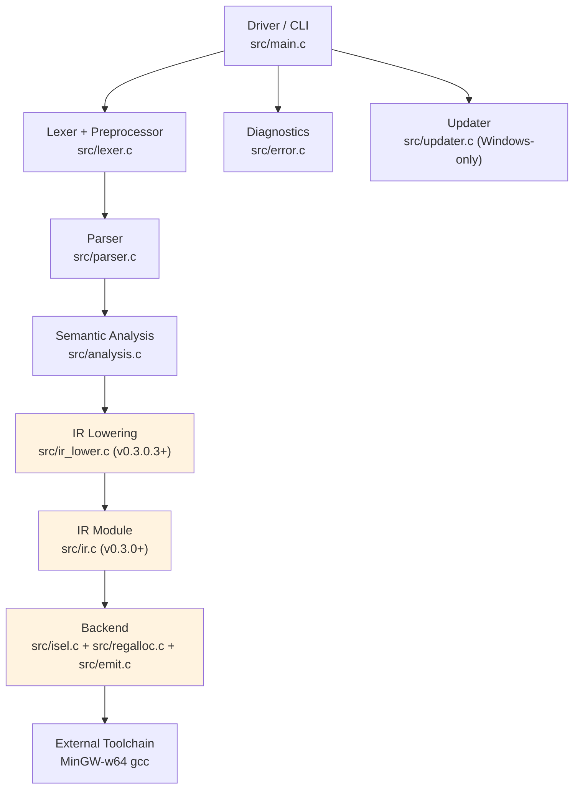

# Baa Compiler Internals

> **Version:** 0.4.1.0 | [← Language Spec](LANGUAGE.md) | [API Reference →](API_REFERENCE.md)

**Target Architecture:** x86-64 (AMD64)
**Targets:** Windows x64 (COFF/PE) + Linux x86-64 (ELF)
**Calling Conventions:** Microsoft x64 ABI (Windows) + SystemV AMD64 ABI (Linux)

This document details the internal architecture, data structures, and algorithms used in the Baa compiler.

---

## Table of Contents

- [Pipeline Architecture](#1-pipeline-architecture)
- [Lexical Analysis](#2-lexical-analysis)
- [Syntactic Analysis](#3-syntactic-analysis)
- [Abstract Syntax Tree](#4-abstract-syntax-tree)
- [Semantic Analysis](#5-semantic-analysis)
- [Intermediate Representation](#6-intermediate-representation)
- [IR Mem2Reg Pass](#6145-ir-mem2reg-pass-ترقية_الذاكرة_إلى_سجلات--v03252)
- [IR Out-of-SSA Pass](#6146-ir-out-of-ssa-pass-الخروج_من_ssa--v03252)
- [IR SSA Verification](#6147-ir-ssa-verification-التحقق_من_ssa--v03253)
- [IR Well-Formedness Verification](#6148-ir-well-formedness-verification-التحقق_من_سلامة_الـir--v03265)
- [IR Canonicalization Pass](#6149-ir-canonicalization-pass-توحيد_الـir--v03265)
- [IR CFG Simplification Pass](#61410-ir-cfg-simplification-pass-تبسيط_cfg--v03265)
- [IR Data Layout Module](#61411-ir-data-layout-module-نموذج_تخطيط_البيانات--v03266)
- [IR Constant Folding Pass](#615-ir-constant-folding-pass)
- [IR Dead Code Elimination Pass](#616-ir-dead-code-elimination-pass)
- [IR Copy Propagation Pass](#617-ir-copy-propagation-pass)
- [IR Common Subexpression Elimination Pass](#618-ir-common-subexpression-elimination-pass)
- [IR Global Value Numbering Pass](#6181-ir-global-value-numbering-pass)
- [IR Loop Invariant Code Motion Pass](#6182-ir-loop-invariant-code-motion-pass)
- [IR Inlining Pass](#6183-ir-inlining-pass)
- [IR Loop Unrolling Pass](#6184-ir-loop-unrolling-pass)
- [Instruction Selection](#619-instruction-selection-v0321)
- [Register Allocation](#620-register-allocation-تخصيص_السجلات--v0322)
- [Code Generation](#7-code-generation)
- [Global Data Section](#8-global-data-section)
- [Naming & Entry Point](#9-naming--entry-point)
- [IR Developer Guide](IR_DEVELOPER_GUIDE.md)
- [Code Review Checklist](CODE_REVIEW_CHECKLIST.md)

---

## 1. Pipeline Architecture

The compiler is orchestrated by the **Driver** (`src/main.c`), which acts as the entry point and build manager. It parses command-line arguments to determine which stages of compilation to run.

### 1.1. Compilation Stages


```mermaid
flowchart LR
    A[".baa Source"] --> B["Lexer + Preprocessor"]
    B -->|Tokens| C["Parser"]
    C -->|AST| D["Semantic Analysis"]
    D -->|Validated AST| E["IR Lowering"]
    E -->|IR| F["Optimizer"]
    F -->|Optimized IR| G["Code Generator"]
    G --> H[".s Assembly"]
    H -->|GCC -c| I[".o Object"]
    I -->|GCC -o| J[".exe Executable"]
    
    style A fill:#e1f5fe
    style J fill:#c8e6c9
    style E fill:#fff3e0
    style F fill:#fff3e0
```

| Stage | Input | Output | Component | Description |
|-------|-------|--------|-----------|-------------|
| **1. Frontend** | `.baa` Source | AST | `lexer.c`, `parser.c` | Tokenizes, handles macros, and builds the syntax tree. |
| **2. Analysis** | AST | Valid AST | `analysis.c` | **Semantic Pass**: Checks types, scopes, and resolves symbols. |
| **3. IR Lowering** | AST | IR | `ir_lower.c` (v0.3.0.3+) + `ir_builder.c` | Converts AST expressions/statements to SSA-form Intermediate Representation using the IR Builder. |
| **4. Optimization** | IR | Optimized IR | `ir_optimizer.c`, `ir_mem2reg.c`, `ir_sccp.c`, `ir_gvn.c`, etc. | Full middle-end: Inlining (O2), Mem2Reg, Canon, InstCombine, SCCP, ConstFold, CopyProp, GVN (O2), CSE (O2), DCE, CFGSimplify, LICM. |
| **5. Backend** | IR | `.s` Assembly | `isel.c`, `regalloc.c`, `emit.c` | Lowers IR to machine instructions, allocates registers, and emits x86-64 AT&T assembly. |
| **6. Assemble** | `.s` Assembly | `.o` Object | `gcc -c` | Invokes external assembler. |
| **7. Link** | `.o` Object | `.exe` Executable | `gcc` | Links with C Runtime. |

> **Note (v0.3.2.4+):** The compiler uses the full IR-based backend pipeline end-to-end: AST → IR → Optimizer → ISel → RegAlloc → Emit → Assembly.

### 1.1.1. Component Map


```mermaid
flowchart TB
    Driver["Driver / CLI\nsrc/main.c"] --> Lexer["Lexer + Preprocessor\nsrc/lexer.c"]
    Lexer --> Parser["Parser\nsrc/parser.c"]
    Parser --> Analyzer["Semantic Analysis\nsrc/analysis.c"]
    Analyzer --> Lower["IR Lowering\nsrc/ir_lower.c (v0.3.0.3+)"]
    Lower --> IR["IR Module\nsrc/ir.c (v0.3.0+)"]
    IR --> Backend["Backend\nsrc/isel.c + src/regalloc.c + src/emit.c"]
    Backend --> GCC["External Toolchain\nMinGW-w64 gcc"]

    Driver --> Diagnostics["Diagnostics\nsrc/error.c"]
    Driver --> Updater["Updater\nsrc/updater.c (Windows-only)"]
    
    style Lower fill:#fff3e0
    style IR fill:#fff3e0
    style Backend fill:#fff3e0
```

### 1.2. The Driver (CLI)

The driver in `main.c` (v0.2.0+) supports multi-file compilation and various modes:

| Flag | Mode | Output | Action |
|------|------|--------|--------|
| (Default) | **Compile & Link** | `.exe` | Runs full pipeline. Deletes intermediate `.s` and `.o` files. |
| `-o <file>` | **Custom Output** | `.exe` | Sets the linked output filename (default: `out.exe`). |
| (Multiple Files) | **Multi-File Build** | `.exe` | Compiles each `.baa` to `.o` and links them. |
| `-S`, `-s` | **Assembly Only** | `.s` | Stops after code emission. Writes `<input>.s` (or `-o` when a single input file is used). |
| `-c` | **Compile Only** | `.o` | Stops after assembling. Writes `<input>.o` (or `-o` when a single input file is used). |
| `-v` | **Verbose** | - | Prints commands and compilation time; keeps intermediate `.s` files. |
| `--debug-info` | **Debug Info** | `.s/.o/.exe` | Emits source `.file/.loc` info and passes `-g` to toolchain. |
| `--asm-comments` | **Assembly Comments** | `.s` | Emits explanatory comments in generated assembly (prologue/epilogue/blocks). |
| `-O0` / `-O1` / `-O2` | **Optimization Level** | - | Selects optimizer aggressiveness (`-O1` is default). |
| `--dump-ir` | **IR Dump** | stdout | Prints Baa IR (Arabic) after semantic analysis (v0.3.0.6+). |
| `--emit-ir` | **IR Emit** | `<input>.ir` | Writes Baa IR (Arabic) to a `.ir` file after semantic analysis (v0.3.0.7). |
| `--dump-ir-opt` | **Optimized IR Dump** | stdout | Prints Baa IR (Arabic) after optimization (v0.3.2.6.5). |
| `--verify` | **Verify (All)** | stderr | Runs `--verify-ir` + `--verify-ssa` (requires `-O1`/`-O2`) (v0.3.2.9.1). |
| `--verify-ir` | **IR Verification** | stderr | Verifies IR well-formedness (operands/types/terminators/phi/calls) after optimization and before Out-of-SSA/backend (v0.3.2.6.5). |
| `--verify-ssa` | **SSA Verification** | stderr | Verifies SSA invariants after Mem2Reg and before Out-of-SSA (**requires `-O1`/`-O2`**) (v0.3.2.5.3). |
| `--verify-gate` | **Verifier Gate (Debug)** | stderr | Runs `--verify-ir`/`--verify-ssa` after each optimizer iteration (**requires `-O1`/`-O2`**) (v0.3.2.6.5). |
| `--time-phases` | **Phase Timings** | stderr | Prints per-phase timing and IR arena memory stats (`[TIME]`/`[MEM]`) (v0.3.2.9.2). |
| `--target=<t>` | **Target Select** | `.s/.o/.exe` | Selects backend target: `x86_64-windows` or `x86_64-linux`. |
| `-fPIC` / `-fPIE` | **Code Model (ELF)** | `.s/.o/.exe` | Enables PIC/PIE-friendly emission on Linux/ELF. |
| `-fno-pic` / `-fno-pie` | **Disable PIC/PIE** | `.s/.o/.exe` | Disables PIC/PIE modes. |
| `-mcmodel=small` | **Code Model** | `.s/.o/.exe` | Uses small code model (only supported model). |
| `-fstack-protector` / `-fstack-protector-all` / `-fno-stack-protector` | **Stack Protector (ELF)** | `.s/.o/.exe` | Controls stack-canary emission on Linux/ELF. |
| `-funroll-loops` | **Loop Unrolling (Opt-in)** | - | Conservatively fully-unrolls small constant-trip-count loops after Out-of-SSA (v0.3.2.7.1). |
| `--version` | **Version Info** | stdout | Displays compiler version and build date. |
| `--help`, `-h` | **Help** | stdout | Shows usage information. |
| `update` | **Self-Update** | - | Downloads and installs the latest version. |

### 1.3. Diagnostic Engine

### 1.3.1. Benchmarking (v0.3.2.9.2)

The repository includes a small benchmark suite under `bench/` and a runner script:

- Runner: `scripts/bench.py`
- Bench programs: `bench/runtime_*.baa` (compile+run) and `bench/compile_*.baa` (compile-time/memory)

Examples:

```
# Run all benchmarks (compile + runtime)
python3 scripts/bench.py --mode all

# Compile-only benchmark (compiler only, no assembler/linker)
python3 scripts/bench.py --mode compile_s --opt O2

# Memory profiling on Linux (uses /usr/bin/time -v)
python3 scripts/bench.py --mode mem --opt O2

# Include verifier and per-phase stats
python3 scripts/bench.py --mode compile_s --opt O2 --verify --time-phases
```

Notes:

- The runner uses repo-relative paths to avoid toolchain quoting issues when the repo path contains spaces.
- `--time-phases` prints `[TIME]`/`[MEM]` lines to stderr for machine parsing.

### 1.3.2. Regression Testing (v0.3.8)

- Primary runner: `scripts/qa_run.py`
  - `--mode quick`: integration smoke (`tests/integration/**/*.baa` via `tests/test.py`)
  - `--mode full`: integration + regression + verify smoke + multi-file smoke
  - `--mode stress`: full + `tests/stress/*.baa` + seeded fuzz-lite (timeout-guarded)
- Legacy runners remain valid:
  - `tests/test.py` (integration)
  - `tests/regress.py` (integration + corpus + negatives)
- On all hosts: docs-derived v0.2.x corpus runs under `tests/corpus_v2x_docs/`.
- Test metadata markers (recognized by `tests/test.py` and `tests/regress.py`):
  - `// RUN:` execution contract (`expect-pass`, `expect-fail`, `runtime`, `compile-only`, `skip`)
  - `// FLAGS:` per-test compiler flags
  - `// EXPECT:` negative diagnostic anchor(s)
  - `// ARGS:` runtime executable arguments
  - `// STDIN:` stdin lines for runtime tests (may repeat; joined with `\n` + trailing newline)
  - `// EXPECT-ASM:` assembly substring expectations (used with `-S` compile-only tests)
- Stress programs live under `tests/stress/`.

Windows build:

```
cmake -B build -G "MinGW Makefiles"
cmake --build build

python scripts\qa_run.py --mode full
```

Linux build:

```
cmake -B build-linux -DCMAKE_BUILD_TYPE=Release
cmake --build build-linux -j

python3 scripts/qa_run.py --mode full
```

The compiler uses a centralized **Diagnostic Module** (`src/error.c`) to handle errors and warnings.

Note (v0.3.2.9.4): semantic analysis errors now use `error_report(...)` as well, so semantic diagnostics include `file:line:col` and source context like parser errors.

**Error Features:**

- **Source Context**: Prints the actual line of code where the error occurred.
- **Pointers**: Uses `^` to point exactly to the offending token.
- **Colored Output**: Errors displayed in red (ANSI) when terminal supports it (v0.2.8+).
- **Panic Mode Recovery (v0.3.7)**: When a syntax error is found, the parser does not exit immediately. It reports the error, enters panic mode, then synchronizes by context:
    1. **Statement mode**: sync on `.`, `}` and statement starters.
    2. **Declaration mode**: sync on declaration starters (`صحيح`, `نص`, `هيكل`, `اتحاد`, `ثابت`, `ساكن`, ...).
    3. **Switch mode**: sync on `حالة`, `افتراضي`, `}` and statement terminators.
    4. Parsing resumes after the nearest valid anchor to reduce cascading diagnostics.

**Warning Features (v0.2.8+):**

- **Non-fatal**: Warnings do not stop compilation by default.
- **Colored Output**: Warnings displayed in yellow (ANSI) when terminal supports it.
- **Warning Names**: Each warning shows its type in brackets: `[-Wunused-variable]`.
- **Configurable**: Enable with `-Wall` or specific `-W<type>` flags.
- **Errors Mode**: Use `-Werror` to treat warnings as fatal errors.
- **Numeric Diagnostics (v0.3.5.5)**: `-Wimplicit-narrowing` and `-Wsigned-unsigned-compare`.

**ANSI Color Support:**

- Windows 10+: Automatically enables Virtual Terminal Processing.
- Unix/Linux: Detects TTY via `isatty()`.
- Override with `-Wcolor` (force on) or `-Wno-color` (force off).

## 2. Lexical Analysis

The Lexer (`src/lexer.c`) transforms raw bytes into `Token` structures.

### 2.1. Internal Structure

The Lexer now supports **Nested Includes** via a state stack and **Macro Definitions**.

```c
// Represents the state of a single file being parsed
typedef struct {
    char* source;       // Full source code buffer (owned by this state)
    char* cur_char;     // Current reading pointer
    const char* filename; // اسم الملف الحالي
    int line;
    int col;
} LexerState;

// Definition (Macro)
typedef struct {
    char* name;  // اسم الماكرو
    char* value; // القيمة الاستبدالية
} Macro;

// The main Lexer context
typedef struct {
    // الحالة الحالية
    LexerState state;

    // مكدس التضمين (Include Stack)
    LexerState stack[10]; // أقصى عمق للتضمين: 10
    int stack_depth;

    // حالة المعالج القبلي (Preprocessor State)
    Macro macros[100];    // جدول الماكروهات (حد أقصى 100)
    int macro_count;      // عدد الماكروهات المعرفة
    bool skipping;        // هل نحن في وضع التخطي؟ (مُشتق من مكدس الشروط)

    // مكدس الشروط (#إذا_عرف/#وإلا/#نهاية) لدعم التعشيش بشكل صحيح
    struct {
        unsigned char parent_active;
        unsigned char cond_true;
        unsigned char in_else;
    } if_stack[32];
    int if_depth;
} Lexer;
```

**Lexer Limits:**

| Limit | Value | Description |
|-------|-------|-------------|
| Max Include Depth | 10 | `stack[10]` - maximum nested `#تضمين` |
| Max Macros | 100 | `macros[100]` - maximum `#تعريف` macros |
| Max Conditional Nesting | 32 | `if_stack[32]` - maximum nested `#إذا_عرف` |

### 2.2. Preprocessor Logic

The preprocessor is integrated directly into the `lexer_next_token` function. It intercepts directives starting with `#` before tokenizing normal code.

#### 2.2.1. Definitions (`#تعريف`)

When `#تعريف NAME VALUE` is encountered:

1. The name and value are parsed as strings.
2. They are stored in the `macros` table.
3. When the Lexer later encounters an `IDENTIFIER`:
    - It checks the macro table
    - If found, replaces the token's value with the macro value
    - Updates the token type based on the value (INT if numeric, STRING if quoted, IDENTIFIER otherwise)

#### 2.2.2. Conditionals (`#إذا_عرف`)

When `#إذا_عرف NAME` is encountered:

1. The lexer checks if `NAME` exists in the macro table.
2. If it exists, normal parsing continues.
3. If not, the lexer enters **Skipping Mode**.
4. In Skipping Mode, all tokens are discarded until `#وإلا` or `#نهاية` is found.

#### 2.2.3. Undefine (`#الغاء_تعريف`)

When `#الغاء_تعريف NAME` is encountered:

1. The lexer searches for `NAME` in the macro table.
2. If found, the entry is removed (by shifting subsequent entries).
3. If not found, the directive is ignored.

#### 2.2.4. Include (`#تضمين`)

When `#تضمين "file"` is encountered:

1. The filename is extracted from the quoted string.
2. The file is read into memory using `read_file()`.
3. The current lexer state is pushed onto the include stack.
4. The lexer state is updated to point to the new file's content.
5. When EOF is reached, the previous state is popped and restored.

#### 2.2.5. Conditional Stack Implementation

The preprocessor supports nested conditionals via `if_stack[32]`:

| Field | Purpose |
|-------|---------|
| `parent_active` | Was the parent conditional block active? |
| `cond_true` | Is the current condition (or branch) true? |
| `in_else` | Are we currently in the `#وإلا` (else) branch? |

**Nesting rules:**
- Maximum 32 nested conditional levels
- `#إذا_عرف` pushes a new level onto `if_stack`
- `#وإلا` toggles `cond_true` within the current level
- `#نهاية` pops the current level
- `skipping` mode is computed from the stack state

### 2.3. Key Features

| Feature | Description |
|---------|-------------|
| **UTF-8 Handling** | Full Unicode support for Arabic text |
| **Strict UTF-8 Validation (v0.3.7)** | Rejects invalid UTF-8 sequences in identifiers and string/char literals |
| **BOM Detection** | Skips `0xEF 0xBB 0xBF` if present |
| **Arabic Numerals** | Normalizes `٠`-`٩` → `0`-`9` |
| **Arabic Punctuation** | Handles `؛` (semicolon) `0xD8 0x9B` |

### 2.4. Token Types

```
Keywords:    صحيح, ص٨, ص١٦, ص٣٢, ص٦٤, ط٨, ط١٦, ط٣٢, ط٦٤, عشري, حرف, نص, منطقي, عدم, حجم, نوع, ثابت, ساكن, إذا, وإلا, طالما, لكل, اختر, حالة, افتراضي, اطبع, اقرأ, إرجع, توقف, استمر, تعداد, هيكل, اتحاد
Literals:    INTEGER, STRING, CHAR, TRUE, FALSE
Operators:   + - * / % ++ -- ! ~ && || & | ^ << >>
Comparison:  == != < > <= >=
Delimiters:  ( ) { } [ ] , . : ؛
Special:     IDENTIFIER, EOF
```

> **Note:** `ثابت` (const) was added in v0.2.7. `ساكن` (static storage) was added in v0.3.7.5.

---

## 3. Syntactic Analysis

The Parser (`src/parser.c`) builds the AST using Recursive Descent with 2-token lookahead.

### 3.0. Parser Structure

```c
typedef struct {
    Lexer* lexer;       // Reference to the lexer for token stream
    Token current;      // Current token (lookahead)
    Token next;         // Next token (2-token lookahead)
    bool panic_mode;    // وضع الذعر للتعافي من الأخطاء
    bool had_error;     // هل حدث خطأ أثناء التحليل؟
} Parser;
```

**Parser Type Alias Registry:**

The parser maintains its own type alias registry (separate from semantic analysis):

```c
#define PARSER_MAX_TYPE_ALIASES 256

typedef struct {
    char* name;
    DataType target_type;
    char* target_type_name;
    DataType target_ptr_base_type;
    char* target_ptr_base_type_name;
    int target_ptr_depth;
    FuncPtrSig* target_func_sig; // مملوك (قد يكون NULL)
} ParserTypeAlias;
```

**Panic Mode Recovery (v0.3.7):**
- When a syntax error is detected, `panic_mode` is set to true
- The parser synchronizes on statement terminators (`.`, `}`) or declaration starters
- This prevents cascading error messages from a single syntax error
- After synchronization, normal parsing resumes

**Synchronization Modes:**

```c
typedef enum {
    PARSER_SYNC_STATEMENT = 0,    // Statement-level sync
    PARSER_SYNC_DECLARATION = 1,  // Declaration-level sync
    PARSER_SYNC_SWITCH = 2        // Switch-case sync
} ParserSyncMode;
```

### 3.1. Grammar (BNF)

```bnf
Program       ::= Declaration* EOF
Declaration   ::= FuncDecl | GlobalVarDecl | GlobalArrayDecl | EnumDecl | StructDecl | UnionDecl | TypeAliasDecl

FuncDecl      ::= Type ID "(" ParamList ")" Block
                | Type ID "(" ParamList ")" "."    // Prototype (v0.2.5+)
GlobalVarDecl ::= DeclMods TypeSpec ID ("=" Expr)? "."
GlobalArrayDecl ::= DeclMods "صحيح" ID "[" INT "]" ArrayInit? "."   // v0.3.3+
EnumDecl      ::= "تعداد" ID "{" EnumMembers? "}"                    // v0.3.4+
StructDecl    ::= "هيكل" ID "{" FieldDecl* "}"                      // v0.3.4+
UnionDecl     ::= "اتحاد" ID "{" FieldDecl* "}"                     // v0.3.4.5+
TypeAliasDecl ::= "نوع" ID "=" TypeSpec "."                         // v0.3.6.5+

DeclMod       ::= "ثابت" | "ساكن"
DeclMods      ::= DeclMod*
TypeSpec      ::= Type | EnumType | StructType | UnionType | AliasType
Type          ::= "صحيح" | "ص٨" | "ص١٦" | "ص٣٢" | "ص٦٤"
                | "ط٨" | "ط١٦" | "ط٣٢" | "ط٦٤"
                | "عشري" | "حرف" | "نص" | "منطقي" | "عدم"
EnumType      ::= "تعداد" ID
StructType    ::= "هيكل" ID
UnionType     ::= "اتحاد" ID
AliasType     ::= ID                                    // Resolved via parser alias registry

Block         ::= "{" Statement* "}"
Statement     ::= VarDecl | ArrayDecl | Assign | ArrayAssign | MemberAssign
                | If | Switch | While | For | Return | Print | Read | CallStmt
                | Break | Continue

VarDecl       ::= DeclMods TypeSpec ID ("=" Expr)? "."   // initializer optional للتخزين الساكن
ArrayDecl     ::= DeclMods "صحيح" ID "[" INT "]" ArrayInit? "."  // v0.3.3+

EnumMembers   ::= ID (COMMA ID)* COMMA?
FieldDecl     ::= "ثابت"? TypeSpec ID "."

ArrayInit     ::= "=" "{" (Expr (COMMA Expr)* COMMA?)? "}"
COMMA         ::= "," | "،"
Assign        ::= ID "=" Expr "."
ArrayAssign   ::= ID "[" Expr "]" "=" Expr "."
MemberAssign  ::= MemberAccess "=" Expr "."

MemberAccess  ::= Primary ":" ID (":" ID)*

If            ::= "إذا" "(" Expr ")" Block ("وإلا" (Block | If))?
Switch        ::= "اختر" "(" Expr ")" "{" Case* Default? "}"
Case          ::= "حالة" (INT | CHAR) ":" Statement*
Default       ::= "افتراضي" ":" Statement*

While         ::= "طالما" "(" Expr ")" Block
For           ::= "لكل" "(" Init? "؛" Expr? "؛" Update? ")" Block
Break         ::= "توقف" "."
Continue      ::= "استمر" "."
Return        ::= "إرجع" Expr? "."
Print         ::= "اطبع" Expr "."
Read          ::= "اقرأ" ID "."
```

### 3.2. Expression Precedence

Implemented via precedence climbing:

```
Logical OR   ::= Logical AND { "||" Logical AND }
Logical AND  ::= Bitwise OR { "&&" Bitwise OR }
Bitwise OR   ::= Bitwise XOR { "|" Bitwise XOR }
Bitwise XOR  ::= Bitwise AND { "^" Bitwise AND }
Bitwise AND  ::= Equality { "&" Equality }
Equality     ::= Relational { ("==" | "!=") Relational }
Relational   ::= Shift { ("<" | ">" | "<=" | ">=") Shift }
Shift        ::= Additive { ("<<" | ">>") Additive }
Additive     ::= Multiplicative { ("+" | "-") Multiplicative }
Multiplicative ::= Unary { ("*" | "/" | "%") Unary }
Unary        ::= ("!" | "~" | "-" | "++" | "--") Unary | Postfix
Postfix      ::= Primary { "++" | "--" }
Primary      ::= INT | STRING | CHAR | ID | ArrayAccess | Call | "حجم" "(" (TypeSpec | Expr) ")" | "(" Expr ")"
```

---

### 3.3. Error Handling Strategy

The parser uses `synchronize()` to recover from errors.

**Example Scenario:**

```baa
صحيح س = ١٠  // Error: Missing dot
صحيح ص = ٢٠.
```

1. Parser expects `.` but finds `صحيح`.
2. `report_error()` is called.
3. `synchronize()` is called. It skips until it sees `صحيح` (start of next statement).
4. Parser continues parsing `صحيح ص = ٢٠.`.
5. At the end, compiler exits with status 1 if any errors were found.

**Type alias parsing note (v0.3.6.5):**

- `نوع` is handled as a **contextual keyword** in parser declarations.
- This preserves existing identifier/member usages like `س:نوع` while still supporting `نوع اسم = ...` at top-level.

---

## 4. Abstract Syntax Tree

The AST uses a tagged union structure for type-safe node representation.

### 4.1. Node Types

| Category | Node Types |
|----------|------------|
| **Structure** | `NODE_PROGRAM`, `NODE_FUNC_DEF`, `NODE_BLOCK`, `NODE_TYPE_ALIAS` |
| **Variables** | `NODE_VAR_DECL`, `NODE_ASSIGN`, `NODE_VAR_REF` |
| **Array Decls** | `NODE_ARRAY_DECL`, `NODE_ARRAY_ACCESS`, `NODE_ARRAY_ASSIGN` |
| **Member Access** | `NODE_MEMBER_ACCESS`, `NODE_MEMBER_ASSIGN`, `NODE_DEREF_ASSIGN` |
| **Control Flow** | `NODE_IF`, `NODE_WHILE`, `NODE_FOR`, `NODE_RETURN` |
| **Branching** | `NODE_SWITCH`, `NODE_CASE`, `NODE_BREAK`, `NODE_CONTINUE` |
| **Expressions** | `NODE_BIN_OP`, `NODE_UNARY_OP`, `NODE_POSTFIX_OP`, `NODE_CALL_EXPR` |
| **Literals** | `NODE_INT`, `NODE_STRING`, `NODE_CHAR`, `NODE_BOOL`, `NODE_NULL` |
| **Calls & I/O** | `NODE_CALL_STMT`, `NODE_PRINT`, `NODE_READ` |

### 4.2. Node Structure

```c
typedef struct Node {
    NodeType type;      // Discriminator
    struct Node* next;  // Linked list for siblings
    union { ... } data; // Type-specific payload
} Node;
```

---

## 5. Semantic Analysis

The Semantic Analyzer (`src/analysis.c`) performs a static check on the AST before code generation.

### 5.1. Responsibilities

1. **Symbol Resolution**: Verifies variables are declared before use.
2. **Type Checking**: Enforces compatibility across primitive/sized numeric types, `نص`/`حرف`/`منطقي`/`عشري`, and compound types (`تعداد`/`هيكل`/`اتحاد`) including array elements.
3. **Scope Validation**: Manages visibility rules.
4. **Constant Checking** (v0.2.7+): Prevents reassignment of immutable variables.
5. **Static Storage Rules** (v0.3.7.5): Validates `ساكن` declarations and enforces compile-time initializers for static-storage objects.
6. **Control Flow Validation**: Ensures `break` and `continue` are used only within loops/switches.
7. **Function Validation**: Checks function prototypes and definitions match.
8. **Usage Tracking** (v0.2.8+): Tracks variable usage for unused variable warnings.
9. **Dead Code Detection** (v0.2.8+): Detects unreachable code after `return`/`break`.
10. **Type Alias Validation** (v0.3.6.5): Registers aliases, validates alias targets, and enforces strict alias/symbol name collision diagnostics.
11. **Array Shape Validation** (v0.3.9): Tracks array rank/dimensions in symbols, validates index-count match, and performs compile-time out-of-bounds checks for constant indices.
12. **Pointer Semantics (v0.3.10)**: Validates pointer arithmetic, comparisons, dereference, and address-of constraints.
13. **Type Casting (v0.3.10.5)**: Enforces rules for explicit scalar and pointer conversions.
14. **Function Pointers (v0.3.10.6)**: Validates assignment, comparison (EQ/NE only), and indirect calls matching exact signatures.
15. **Variadic Functions (v0.4.0.5)**: Validates `...` signatures, variadic builtin usage (`بدء_معاملات/معامل_تالي/نهاية_معاملات`), and fixed/extra argument checks for variadic direct calls.
16. **Inline Assembly (v0.4.0.6)**: Validates `مجمع { ... }` blocks, enforces fixed-register constraint subset (`=a/=c/=d`, `a/c/d`), checks output lvalue requirements, and restricts operand types to integer/pointer forms.
17. **Standard Library Modules (v0.4.1)**: Validates Math/System/Time builtins (`جذر_تربيعي/أس/مطلق/عشوائي/متغير_بيئة/نفذ_أمر/وقت_حالي/وقت_كنص`) for arity and type compatibility.

### 5.2. Constant Checking (v0.2.7+)

The analyzer tracks `is_const` / `is_static` and enforces immutability + static-storage constraints:

| Error Condition | Error Message |
|-----------------|---------------|
| Reassigning a constant | Arabic semantic error for modifying `ثابت` |
| Modifying constant array element | Arabic semantic error for constant array mutation |
| Automatic constant without initializer | Arabic semantic error (`الثابت ... يجب تهيئته`) |
| Static-storage non-constant initializer | Arabic semantic error for non-constant static initializer |

### 5.3. Warning Generation (v0.2.8+)

The analyzer generates warnings for potential issues that don't prevent compilation:

#### Unused Variable Detection

**Algorithm:**

1. Each symbol has an `is_used` flag initialized to `false`.
2. When a variable is referenced (in expressions, assignments, etc.), the flag is set to `true`.
3. At end of function scope, all local variables with `is_used == false` generate a warning.
4. At end of program, all global variables with `is_used == false` generate a warning.

**Exception:** Function parameters are marked as "used" implicitly to avoid false positives.

#### Dead Code Detection

**Algorithm:**

1. While analyzing a block, track if a "terminating" statement was encountered.
2. Terminating statements: `NODE_RETURN`, `NODE_BREAK`, `NODE_CONTINUE`.
3. If a terminating statement was found and there are more statements after it, generate a warning.

**Implementation:**

```c
static void analyze_statements_with_dead_code_check(Node* statements, const char* context) {
    bool found_terminator = false;
    Node* stmt = statements;
    while (stmt) {
        if (found_terminator) {
            warning_report(WARN_DEAD_CODE, ...);
            found_terminator = false; // Avoid multiple warnings
        }
        analyze_node(stmt);
        if (is_terminating_statement(stmt)) {
            found_terminator = true;
        }
        stmt = stmt->next;
    }
}
```

#### Variable Shadowing

When a local variable is declared with the same name as a global variable, a `WARN_SHADOW_VARIABLE` warning is generated.

#### Implicit Narrowing Conversions (v0.3.5.5)

The analyzer emits `WARN_IMPLICIT_NARROWING` when an implicit numeric conversion may lose information.

Covered conversion sites:

- Variable declaration initializers
- Assignments
- Return expressions
- Function-call arguments
- Array element assignments
- Struct/union member assignments

The check is constant-aware: if the source expression is a compile-time constant that is provably representable in the destination type, the warning is suppressed.

#### Signed/Unsigned Mixed Comparisons (v0.3.5.5)

The analyzer emits `WARN_SIGNED_UNSIGNED_COMPARE` for comparison operators (`==`, `!=`, `<`, `>`, `<=`, `>=`) when the integer-promotion result mixes signed and unsigned domains.

#### Low-Level Semantic Checks (v0.3.6)

- Bitwise operators (`&`, `|`, `^`, `~`, `<<`, `>>`) are restricted to integer-like types.
- Shift-count literals are range-checked (`0..63`) during semantic analysis.
- `NODE_SIZEOF` is resolved to a compile-time integer value when size information is known.
- `عدم` (void) rules are enforced:
  - no variable declarations of type `عدم` (local/global),
  - no function parameters of type `عدم`,
  - return shape must match function type (`إرجع.` only in `عدم` functions, value required in non-void).

### 5.4. Isolation Note

Since v0.2.4, `analysis.c` maintains its own **symbol table** for isolation. This ensures validation logic is independent from the backend pipeline.

In v0.3.7, semantic lookups were optimized using hash-indexed chains for local/global symbol lookup while preserving deterministic semantics and existing symbol ownership.

**Future improvement:** Unify symbol tables into a shared context object passed between phases.

The analyzer walks the AST recursively. It maintains a **Symbol Table** stack to track active variables in the current scope. If it encounters:

- `x = "text"` (where x is `int`): Reports a type mismatch error.
- `print y` (where y is undeclared): Reports an undefined symbol error.
- `x = 5` (where x is `const`): Reports a const reassignment error (v0.2.7+).

### 5.5. Analysis Limits and Constants

The semantic analyzer uses the following constants (defined in `src/analysis.c`):

| Constant | Value | Description |
|----------|-------|-------------|
| `ANALYSIS_MAX_SYMBOLS` | 100 | Maximum symbols per scope (global/local) |
| `ANALYSIS_MAX_SCOPES` | 64 | Maximum nested scope depth |
| `ANALYSIS_MAX_FUNCS` | 128 | Maximum function declarations |
| `ANALYSIS_MAX_FUNC_PARAMS` | 32 | Maximum parameters per function |
| `ANALYSIS_SYMBOL_HASH_BUCKETS` | 257 | Hash table buckets for symbol lookup |
| `ANALYSIS_MAX_ENUMS` | 128 | Maximum enum definitions |
| `ANALYSIS_MAX_STRUCTS` | 128 | Maximum struct definitions |
| `ANALYSIS_MAX_UNIONS` | 128 | Maximum union definitions |
| `ANALYSIS_MAX_ENUM_MEMBERS` | 128 | Maximum members per enum |
| `ANALYSIS_MAX_STRUCT_FIELDS` | 128 | Maximum fields per struct/union |
| `ANALYSIS_MAX_TYPE_ALIASES` | 256 | Maximum type alias definitions |

### 5.6. Symbol Table Structures

The semantic analyzer maintains several internal data structures for symbol management:

#### Symbol (Variable Symbol)

```c
typedef struct {
    char name[32];              // اسم الرمز (Symbol name)
    ScopeType scope;            // النطاق (SCOPE_GLOBAL or SCOPE_LOCAL)
    DataType type;              // نوع البيانات (للمتغير: نوعه، للمصفوفة: نوع العنصر)
    char type_name[32];         // اسم النوع عند TYPE_ENUM/TYPE_STRUCT (فارغ لغير ذلك)
    DataType ptr_base_type;     // نوع أساس المؤشر عندما type == TYPE_POINTER
    char ptr_base_type_name[32];// اسم النوع المركب لأساس المؤشر
    int ptr_depth;              // عمق المؤشر عندما type == TYPE_POINTER
    FuncPtrSig* func_sig;       // توقيع مؤشر الدالة عندما type == TYPE_FUNC_PTR
    bool is_array;              // هل الرمز مصفوفة؟
    int array_rank;             // عدد الأبعاد
    int64_t array_total_elems;  // حاصل ضرب الأبعاد
    int* array_dims;            // أبعاد المصفوفة (مملوك لجدول الرموز)
    int offset;                 // الإزاحة في المكدس أو العنوان
    bool is_const;              // هل هو ثابت (immutable)؟
    bool is_static;             // هل التخزين ساكن؟
    bool is_used;               // هل تم استخدام هذا المتغير؟ (للتحذيرات)
    int decl_line;              // سطر التعريف (للتحذيرات)
    int decl_col;               // عمود التعريف (للتحذيرات)
    const char* decl_file;      // ملف التعريف (للتحذيرات)
} Symbol;
```

#### FuncSymbol (Function Symbol)

```c
typedef struct {
    char* name;                     // اسم الدالة (مملوك strdup)
    DataType return_type;           // نوع الإرجاع
    DataType return_ptr_base_type;  // نوع أساس مؤشر الإرجاع
    char* return_ptr_base_type_name;// اسم نوع أساس المؤشر (مملوك strdup)
    int return_ptr_depth;           // عمق مؤشر الإرجاع
    FuncPtrSig* return_func_sig;    // توقيع مؤشر دالة الإرجاع (مملوك clone)
    DataType* param_types;          // أنواع المعاملات (مملوك malloc)
    DataType* param_ptr_base_types; // أنواع أساس مؤشرات المعاملات
    char** param_ptr_base_type_names;// أسماء أنواع أساس مؤشرات المعاملات
    int* param_ptr_depths;          // أعماق مؤشرات المعاملات
    FuncPtrSig** param_func_sigs;   // تواقيع مؤشرات دوال المعاملات
    int param_count;                // عدد المعاملات
    FuncPtrSig* ref_funcptr_sig;    // توقيع "مرجع الدالة" كقيمة (مملوك clone)
    bool is_defined;                // هل تم تعريف الدالة (لها جسم)؟
    const char* decl_file;          // ملف التعريف
    int decl_line;                  // سطر التعريف
    int decl_col;                   // عمود التعريف
} FuncSymbol;
```

#### Function Pointer Signature (`FuncPtrSig`)

```c
typedef struct FuncPtrSig {
    DataType return_type;
    DataType return_ptr_base_type;
    char* return_ptr_base_type_name;  // مملوك (قد يكون NULL)
    int return_ptr_depth;
    int param_count;
    DataType* param_types;              // مملوك (malloc)
    DataType* param_ptr_base_types;     // مملوك (malloc)
    char** param_ptr_base_type_names;   // مملوك (malloc) وعناصره مملوكة (strdup)
    int* param_ptr_depths;              // مملوك (malloc)
} FuncPtrSig;
```

#### Compound Type Definitions

**EnumDef (تعريف التعداد):**
```c
typedef struct {
    char* name;  // مملوك (strdup)
    int member_count;
    struct {
        char* name;   // مملوك (strdup)
        int64_t value;
    } members[ANALYSIS_MAX_ENUM_MEMBERS];
} EnumDef;
```

**StructDef (تعريف الهيكل):**
```c
typedef struct {
    char* name;  // مملوك (strdup)
    int field_count;
    StructFieldDef fields[ANALYSIS_MAX_STRUCT_FIELDS];
    int size;
    int align;
    bool layout_done;
    bool layout_in_progress;
} StructDef;
```

**UnionDef (تعريف الاتحاد):**
```c
typedef struct {
    char* name;  // مملوك (strdup)
    int field_count;
    StructFieldDef fields[ANALYSIS_MAX_STRUCT_FIELDS];
    int size;
    int align;
    bool layout_done;
    bool layout_in_progress;
} UnionDef;
```

**StructFieldDef (تعريف حقل الهيكل/الاتحاد):**
```c
typedef struct {
    char* name;       // مملوك (strdup)
    DataType type;
    char* type_name;  // مملوك (strdup) عند TYPE_ENUM/TYPE_STRUCT
    DataType ptr_base_type;
    char* ptr_base_type_name;
    int ptr_depth;
    bool is_const;
    int offset;
    int size;
    int align;
} StructFieldDef;
```

**TypeAliasDef (تعريف الاسم البديل للنوع):**
```c
typedef struct {
    char* name;              // مملوك (strdup)
    DataType target_type;    // النوع الهدف بعد فك الاسم البديل
    char* target_type_name;  // مملوك (strdup) عند TYPE_ENUM/TYPE_STRUCT/TYPE_UNION
    DataType target_ptr_base_type;
    char* target_ptr_base_type_name;
    int target_ptr_depth;
    FuncPtrSig* target_func_sig; // مملوك (clone) عند TYPE_FUNC_PTR
} TypeAliasDef;
```

#### Hash-Indexed Symbol Lookup (v0.3.7+)

Semantic lookups use hash-indexed chains for O(1) average-case lookup:

```c
// جداول الرموز
static Symbol global_symbols[ANALYSIS_MAX_SYMBOLS];
static int global_count = 0;
static int global_symbol_hash_head[ANALYSIS_SYMBOL_HASH_BUCKETS];
static int global_symbol_hash_next[ANALYSIS_MAX_SYMBOLS];

static Symbol local_symbols[ANALYSIS_MAX_SYMBOLS];
static int local_count = 0;
static int local_symbol_hash_head[ANALYSIS_SYMBOL_HASH_BUCKETS];
static int local_symbol_hash_next[ANALYSIS_MAX_SYMBOLS];

// مكدس النطاقات
static int scope_stack[ANALYSIS_MAX_SCOPES];
static int scope_depth = 0;
```

The hash function used is FNV-1a 32-bit for fast string hashing.

### 5.7. DataType and Operation Enums

The AST uses the following type enumeration (defined in `src/baa.h`):

```c
typedef enum {
    TYPE_INT,           // صحيح / ص٦٤ (int64)

    // أحجام الأعداد الصحيحة (v0.3.5.5)
    TYPE_I8,            // ص٨
    TYPE_I16,           // ص١٦
    TYPE_I32,           // ص٣٢
    TYPE_U8,            // ط٨
    TYPE_U16,           // ط١٦
    TYPE_U32,           // ط٣٢
    TYPE_U64,           // ط٦٤

    TYPE_STRING,        // نص (حرف[])
    TYPE_POINTER,       // مؤشر عام
    TYPE_FUNC_PTR,      // مؤشر دالة: دالة(...) -> نوع
    TYPE_BOOL,          // منطقي (bool - stored as byte)
    TYPE_CHAR,          // حرف (UTF-8 sequence)
    TYPE_FLOAT,         // عشري (float64)
    TYPE_VOID,          // عدم (void)
    TYPE_ENUM,          // تعداد (يُخزن كـ int64)
    TYPE_STRUCT,        // هيكل (ليس قيمة من الدرجة الأولى)
    TYPE_UNION          // اتحاد (ليس قيمة من الدرجة الأولى)
} DataType;
```

**OpType Enum (Binary Operations):**

```c
typedef enum { 
    // عمليات حسابية
    OP_ADD, OP_SUB, OP_MUL, OP_DIV, OP_MOD,
    // عمليات بتية (Bitwise)
    OP_BIT_AND, OP_BIT_OR, OP_BIT_XOR, OP_SHL, OP_SHR,
    // عمليات مقارنة
    OP_EQ, OP_NEQ, OP_LT, OP_GT, OP_LTE, OP_GTE,
    // عمليات منطقية
    OP_AND, OP_OR
} OpType;
```

**UnaryOpType Enum:**

```c
typedef enum {
    UOP_NEG,        // السالب (-)
    UOP_NOT,        // النفي (!)
    UOP_BIT_NOT,    // النفي البتي (~)
    UOP_ADDR,       // أخذ العنوان (&)
    UOP_DEREF,      // فك الإشارة (*)
    UOP_INC,        // الزيادة (++)
    UOP_DEC         // النقصان (--)
} UnaryOpType;
```

### 5.8. Memory Allocation

| Type | C Type | Size | Notes |
|------|--------|------|-------|
| `صحيح` | `int64_t` | 8 bytes | Signed integer |
| `نص` | `char*` | 8 bytes | Pointer to read-only string (.rdata/.rodata) |
| `منطقي` | `bool` (stored as int) | 8 bytes | Stored as 0/1 in 8-byte slots |

**I/O note:** The current backend dynamically resolves format strings (`%lld`, `%llu`, `%g\n`) for integers and floats, supporting full 64-bit and unsigned emission. Strings (`نص`) and Characters (`حرف`) are handled with a custom UTF-8 emission loop or packed format.

---

### 5.9. Constant Folding (Optimization)

The parser performs constant folding on arithmetic expressions. If both operands of a binary operation are integer literals, the compiler evaluates the result at compile-time.

**Example:**

- Source: `٢ * ٣ + ٤`
- Before folding: `BinOp(+, BinOp(*, 2, 3), 4)`
- After folding: `Int(10)`

**Supported Operations:** `+`, `-`, `*`, `/`, `%`
**Note:** Division/modulo by zero is detected and reported during folding.

---

## 6. Intermediate Representation (v0.3.10.6)

The IR Module (`src/ir.h`, `src/ir.c`) provides an Arabic-first Intermediate Representation using SSA (Static Single Assignment) form.

**Memory management (v0.3.2.6.1):** IR objects are now allocated from a module-owned arena (`src/ir_arena.c`) and freed in bulk by `ir_module_free()`. IR passes should treat IR nodes as module-owned and avoid per-node frees.

**IR serialization (v0.3.2.6.3):** The compiler also includes a machine-readable IR text serializer/reader for round-trip tests (`src/ir_text.c`, `src/ir_text.h`). This format is separate from the Arabic-first debug printer (`ir_module_print()`).

### 6.1. Design Philosophy

Baa's IR is designed with three goals:

1. **Arabic Identity**: All opcodes, types, and predicates have Arabic names.
2. **Technical Parity**: Comparable to LLVM IR, GIMPLE, or WebAssembly in capabilities.
3. **SSA Form**: Each virtual register is assigned exactly once, enabling powerful optimizations.

### 6.2. IR Structure

```
IRModule
├── name: char*             // Module name (source file)
├── arena: IRArena          // IR memory arena (all IR objects allocated here)
├── cached_i8_ptr_type: IRType*  // Common type cache
├── globals: IRGlobal*      // Global variables
├── global_count: int
├── funcs: IRFunc*          // Functions
├── func_count: int
├── strings: IRStringEntry* // C string literal table
├── string_count: int
├── baa_strings: IRBaaStringEntry*  // Baa string table (حرف[])
└── baa_string_count: int

IRFunc
├── name: char*
├── ret_type: IRType*
├── params: IRParam[]
├── param_count: int        // Number of parameters
├── blocks: IRBlock*        // Linked list of basic blocks
├── block_count: int        // Number of blocks
├── entry: IRBlock*         // Entry block pointer
├── next_reg: int           // Virtual register counter (next available %م<n>)
├── next_inst_id: int       // Instruction ID counter
├── ir_epoch: uint32_t      // IR change counter (invalidates analyses)
├── def_use: IRDefUse*      // Def-Use analysis cache (heap allocated)
├── next_block_id: int      // Block ID counter
├── is_prototype: bool      // Is this a declaration without body?
└── next: IRFunc*           // Next function in module

IRBlock
├── label: char*            // Arabic label (e.g., "بداية", "حلقة")
├── id: int
├── parent: IRFunc*         // Function containing this block
├── first/last: IRInst*     // Instruction list
├── inst_count: int
├── succs[2]: IRBlock*      // Successors (0-2 for br/br_cond)
├── succ_count: int
├── preds: IRBlock**        // Predecessors (dynamic array)
├── pred_count: int
├── pred_capacity: int
├── idom: IRBlock*          // Immediate dominator
├── dom_frontier: IRBlock** // Dominance frontier
├── dom_frontier_count: int
└── next: IRBlock*          // Next block in function

IRInst
├── op: IROp                // Opcode
├── type: IRType*           // Result type
├── id: int                 // Instruction ID for diagnostics/tests
├── dest: int               // Destination register (-1 if none)
├── operands[4]: IRValue*   // Up to 4 operands
├── operand_count: int      // Number of operands used
├── cmp_pred: IRCmpPred     // For comparison instructions
├── phi_entries: IRPhiEntry* // Linked list of [value, block] pairs
├── call_target: char*      // Direct call target name (NULL for indirect)
├── call_callee: IRValue*   // Indirect call callee value (NULL for direct)
├── call_args: IRValue**    // Argument list
├── call_arg_count: int     // Number of arguments
├── src_file: const char*   // Source file (debug info)
├── src_line: int           // Source line (debug info)
├── src_col: int            // Source column (debug info)
├── dbg_name: const char*   // Optional symbol name for debugging
├── parent: IRBlock*        // Block containing this instruction
├── prev: IRInst*           // Previous instruction in block
└── next: IRInst*           // Next instruction in block
```

### 6.2.1. IR Memory Management (IR Arena) — v0.3.2.6.1

The IR system uses an **arena allocator** for efficient memory management. All IR objects (types, values, instructions, blocks, functions, globals) are allocated from the module-owned arena and freed in bulk when the module is destroyed.

**Arena Structure:**

```c
typedef struct IRArenaChunk {
    struct IRArenaChunk* next;
    size_t used;
    size_t cap;
    unsigned char data[];  // Flexible array member
} IRArenaChunk;

typedef struct IRArena {
    IRArenaChunk* head;
    size_t default_chunk_size;
} IRArena;

typedef struct IRArenaStats {
    size_t chunks;       // Number of allocated chunks
    size_t used_bytes;   // Total used bytes
    size_t cap_bytes;    // Total capacity
} IRArenaStats;
```

**Key Functions:**

```c
void ir_arena_init(IRArena* arena, size_t default_chunk_size);
void ir_arena_destroy(IRArena* arena);
void* ir_arena_alloc(IRArena* arena, size_t size, size_t align);
void* ir_arena_calloc(IRArena* arena, size_t count, size_t size, size_t align);
char* ir_arena_strdup(IRArena* arena, const char* s);
void ir_arena_get_stats(const IRArena* arena, IRArenaStats* out_stats);
```

**Important Notes:**
- IR passes should treat IR nodes as module-owned and **avoid per-node frees**
- Memory is freed in bulk by `ir_module_free()` via `ir_arena_destroy()`
- The arena provides O(1) allocation with minimal overhead
- All IR objects are annotated with: `ملاحظة: هذه البنية تُخصَّص داخل ساحة IR (Arena) وتُحرَّر دفعة واحدة.`

**Usage Pattern:**
```c
IRModule* module = ir_module_new("program.baa");
// All IR objects allocated via ir_module_get_current() use the arena
IRFunc* func = ir_func_new("الرئيسية", ret_type);
ir_module_add_func(module, func);
// ... build IR ...
ir_module_free(module);  // Bulk free all arena memory
```

### 6.2.2. IR Module Context

The IR system maintains a thread-local context for the current module to simplify allocation:

```c
void ir_module_set_current(IRModule* module);
IRModule* ir_module_get_current(void);
```

This allows IR construction functions to allocate from the correct arena without passing the module explicitly.

**Indirect Call Support (v0.3.10.6):**

For indirect function calls through function pointers:
- `call_target` is NULL
- `call_callee` contains the IRValue (register) holding the function pointer
- ISel lowers this to `call *%reg` instead of `call @function`

### 6.3. IR Opcodes (Arabic)

| Category | Opcode | Arabic | Description |
|----------|--------|--------|-------------|
| **Arithmetic** | `IR_OP_ADD` | جمع | Addition |
| | `IR_OP_SUB` | طرح | Subtraction |
| | `IR_OP_MUL` | ضرب | Multiplication |
| | `IR_OP_DIV` | قسم | Division |
| | `IR_OP_MOD` | باقي | Modulo |
| | `IR_OP_NEG` | سالب | Negation |
| **Memory** | `IR_OP_ALLOCA` | حجز | Stack allocation |
| | `IR_OP_LOAD` | حمل | Load from memory |
| | `IR_OP_STORE` | خزن | Store to memory |
| | `IR_OP_PTR_OFFSET` | إزاحة_مؤشر | Pointer offset: base + index * sizeof(pointee) |
| **Comparison** | `IR_OP_CMP` | قارن | Compare with predicate |
| **Logical** | `IR_OP_AND` | و | Bitwise AND |
| | `IR_OP_OR` | أو | Bitwise OR |
| | `IR_OP_XOR` | أو_حصري | Bitwise XOR |
| | `IR_OP_NOT` | نفي | Bitwise NOT |
| | `IR_OP_SHL` | ازاحة_يسار | Shift left |
| | `IR_OP_SHR` | ازاحة_يمين | Shift right (signed/unsigned-aware) |
| **Control** | `IR_OP_BR` | قفز | Unconditional branch |
| | `IR_OP_BR_COND` | قفز_شرط | Conditional branch |
| | `IR_OP_RET` | رجوع | Return |
| | `IR_OP_CALL` | نداء | Function call |
| **SSA** | `IR_OP_PHI` | فاي | Phi node |
| | `IR_OP_COPY` | نسخ | Copy value |
| | `IR_OP_NOP` | NOP | No operation |
| **Conversion** | `IR_OP_CAST` | تحويل | Type cast |

### 6.4. IR Types (Arabic)

| Type | Arabic | Bits | Description |
|------|--------|------|-------------|
| `IR_TYPE_VOID` | فراغ | 0 | No value |
| `IR_TYPE_I1` | ص١ | 1 | Boolean |
| `IR_TYPE_I8` | ص٨ | 8 | Byte/Char (8-bit signed) |
| `IR_TYPE_I16` | ص١٦ | 16 | Short (16-bit signed) |
| `IR_TYPE_I32` | ص٣٢ | 32 | Int (32-bit signed) |
| `IR_TYPE_I64` | ص٦٤ | 64 | Long (64-bit signed) |
| `IR_TYPE_U8` | ط٨ | 8 | Unsigned byte |
| `IR_TYPE_U16` | ط١٦ | 16 | Unsigned short |
| `IR_TYPE_U32` | ط٣٢ | 32 | Unsigned int |
| `IR_TYPE_U64` | ط٦٤ | 64 | Unsigned long |
| `IR_TYPE_CHAR` | حرف | 8 | UTF-8 char (packed into i64) |
| `IR_TYPE_F64` | ع٦٤ | 64 | Float (double) |
| `IR_TYPE_PTR` | مؤشر | 64 | Pointer |
| `IR_TYPE_ARRAY` | مصفوفة | varies | Array |
| `IR_TYPE_FUNC` | دالة | 64 | Function pointer type (v0.3.10.6+) |

**ملاحظة (v0.3.10.6):** قيم `IR_TYPE_FUNC` تُستخدم كمؤشرات دوال (قابلة للتخزين/التحميل/المقارنة EQ/NE مع `0`)،
وتُخفض على x86-64 كقيمة 64-بت مثل المؤشر العادي. الدالة `ir_builder_emit_call_indirect()` تُستخدم للنداء غير المباشر.

### 6.5. Comparison Predicates

| Predicate | Arabic | Description |
|-----------|--------|-------------|
| `IR_CMP_EQ` | يساوي | Equal |
| `IR_CMP_NE` | لا_يساوي | Not Equal |
| `IR_CMP_GT` | أكبر | Greater Than (signed) |
| `IR_CMP_LT` | أصغر | Less Than (signed) |
| `IR_CMP_GE` | أكبر_أو_يساوي | Greater or Equal (signed) |
| `IR_CMP_LE` | أصغر_أو_يساوي | Less or Equal (signed) |
| `IR_CMP_UGT` | أكبر_بدون_إشارة | Greater Than (unsigned) |
| `IR_CMP_ULT` | أصغر_بدون_إشارة | Less Than (unsigned) |
| `IR_CMP_UGE` | أكبر_أو_يساوي_بدون_إشارة | Greater or Equal (unsigned) |
| `IR_CMP_ULE` | أصغر_أو_يساوي_بدون_إشارة | Less or Equal (unsigned) |

### 6.6. Virtual Registers

Registers use Arabic naming with Arabic-Indic numerals:

- Format: `%م<n>` where `م` = مؤقت (temporary)
- Examples: `%م٠`, `%م١`, `%م٢`, ...

The `int_to_arabic_numerals()` function converts integers to Arabic-Indic digits (٠١٢٣٤٥٦٧٨٩).

### 6.7. Example IR Output

**Baa Source:**

```baa
صحيح الرئيسية() {
    صحيح س = ١٠.
    صحيح ص = ٢٠.
    إرجع س + ص.
}
```

**Generated IR (Arabic mode):**

```
دالة الرئيسية() -> ص٦٤ {
بداية:
    %م٠ = حجز ص٦٤
    خزن ص٦٤ ١٠, %م٠
    %م١ = حجز ص٦٤
    خزن ص٦٤ ٢٠, %م١
    %م٢ = حمل ص٦٤ %م٠
    %م٣ = حمل ص٦٤ %م١
    %م٤ = جمع ص٦٤ %م٢, %م٣
    رجوع ص٦٤ %م٤
}
```

### 6.8. IR Module API (Low-Level)

Key functions for building IR directly (without builder):

```c
// Module
IRModule* ir_module_new(const char* name);
void ir_module_add_func(IRModule* module, IRFunc* func);
int ir_module_add_string(IRModule* module, const char* str);

// Function
IRFunc* ir_func_new(const char* name, IRType* ret_type);
int ir_func_alloc_reg(IRFunc* func);
IRBlock* ir_func_new_block(IRFunc* func, const char* label);

// Block
IRBlock* ir_block_new(const char* label, int id);
void ir_block_append(IRBlock* block, IRInst* inst);

// Instructions
IRInst* ir_inst_binary(IROp op, IRType* type, int dest, IRValue* lhs, IRValue* rhs);
IRInst* ir_inst_cmp(IRCmpPred pred, int dest, IRValue* lhs, IRValue* rhs);
IRInst* ir_inst_load(IRType* type, int dest, IRValue* ptr);
IRInst* ir_inst_store(IRValue* value, IRValue* ptr);
IRInst* ir_inst_br(IRBlock* target);
IRInst* ir_inst_br_cond(IRValue* cond, IRBlock* if_true, IRBlock* if_false);
IRInst* ir_inst_ret(IRValue* value);
IRInst* ir_inst_call(const char* target, IRType* ret_type, int dest, IRValue** args, int arg_count);
IRInst* ir_inst_call_indirect(IRValue* callee, IRType* ret_type, int dest, IRValue** args, int arg_count);
IRInst* ir_inst_phi(IRType* type, int dest);

// Printing
void ir_module_print(IRModule* module, FILE* out, int use_arabic);
void ir_module_dump(IRModule* module, const char* filename, int use_arabic);
```

### 6.9. IR Builder API (High-Level, v0.3.0.2+)

The IR Builder (`src/ir_builder.h`, `src/ir_builder.c`) provides a convenient builder pattern API:

```c
// Builder lifecycle
IRBuilder* ir_builder_new(IRModule* module);
void ir_builder_free(IRBuilder* builder);

// Function/Block creation
IRFunc* ir_builder_create_func(IRBuilder* builder, const char* name, IRType* ret_type);
IRBlock* ir_builder_create_block(IRBuilder* builder, const char* label);
void ir_builder_set_insert_point(IRBuilder* builder, IRBlock* block);

// Register allocation
int ir_builder_alloc_reg(IRBuilder* builder);

// Emit instructions (auto-appends to current block)
int ir_builder_emit_add(IRBuilder* builder, IRType* type, IRValue* lhs, IRValue* rhs);
int ir_builder_emit_sub(IRBuilder* builder, IRType* type, IRValue* lhs, IRValue* rhs);
int ir_builder_emit_mul(IRBuilder* builder, IRType* type, IRValue* lhs, IRValue* rhs);
int ir_builder_emit_alloca(IRBuilder* builder, IRType* type);
int ir_builder_emit_load(IRBuilder* builder, IRType* type, IRValue* ptr);
void ir_builder_emit_store(IRBuilder* builder, IRValue* value, IRValue* ptr);
int ir_builder_emit_ptr_offset(IRBuilder* builder, IRType* type, IRValue* base, IRValue* index);
int ir_builder_emit_cast(IRBuilder* builder, IRType* from, IRValue* v, IRType* to);
void ir_builder_emit_br(IRBuilder* builder, IRBlock* target);
void ir_builder_emit_br_cond(IRBuilder* builder, IRValue* cond, IRBlock* if_true, IRBlock* if_false);
void ir_builder_emit_ret(IRBuilder* builder, IRValue* value);
int ir_builder_emit_call(IRBuilder* builder, const char* target, IRType* ret_type, IRValue** args, int arg_count);
int ir_builder_emit_call_indirect(IRBuilder* builder, IRValue* callee, IRType* ret_type, IRValue** args, int arg_count);

// Control flow structure helpers
void ir_builder_create_if_then(IRBuilder* builder, IRValue* cond,
                                const char* then_label, const char* merge_label,
                                IRBlock** then_block, IRBlock** merge_block);
void ir_builder_create_while(IRBuilder* builder,
                              const char* header_label, const char* body_label,
                              const char* exit_label,
                              IRBlock** header_block, IRBlock** body_block,
                              IRBlock** exit_block);

// Constants
IRValue* ir_builder_const_int(int64_t value);
IRValue* ir_builder_const_i64(int64_t value);
IRValue* ir_builder_const_bool(int value);
```

**Benefits over low-level API:**

- Automatic register allocation
- Automatic CFG edge management (successors/predecessors)
- Source location propagation
- Control flow structure helpers for if/else/while
- Statistics tracking

### 6.10. AST → IR Lowering (Expressions, v0.3.0.3+)

Expression lowering lives in `src/ir_lower.h` and `src/ir_lower.c` and is built on top of the IR Builder (`src/ir_builder.h`, `src/ir_builder.c`).

Key concepts:

- `IRLowerCtx`: Lowering context (builder + local bindings + control-flow stacks + debug bounds-check toggle).
- `ir_lower_bind_local()`: Bind a variable name to its `حجز` pointer register. *(Statement lowering will populate this in v0.3.0.4.)*
- Local bindings now carry array metadata (rank/dimensions/element type) to support multi-dimensional indexing.
- `lower_expr()`: Lower AST expressions into IR operands (`IRValue*`) and emits IR instructions via the builder.

Currently lowered expressions:

- `NODE_INT`, `NODE_STRING`, `NODE_CHAR`, `NODE_BOOL`, `NODE_FLOAT`, `NODE_NULL`
- `NODE_VAR_REF` (loads via `حمل`)
- `NODE_BIN_OP` (arithmetic, comparisons, logical ops, pointer difference)
- `NODE_UNARY_OP` (`سالب`, bitwise `نفي`, `!`, `UOP_ADDR` via pointers, `UOP_DEREF` via load)
- `NODE_POSTFIX_OP` (`++`/`--` postfix via load + add/sub + store; expression result is the old value)
- `NODE_SIZEOF` -> compile-time constant size
- `NODE_CAST` -> `تحويل` (cast)
- `NODE_CALL_EXPR` -> `نداء` (supports direct calls, and indirect calls via `IR_TYPE_FUNC` pointers)
- Builtin string calls in `NODE_CALL_EXPR` (`v0.3.9`):
  - `طول_نص`: loop until terminator and return length
  - `قارن_نص`: lexicographic compare over Baa `حرف`
  - `نسخ_نص` / `دمج_نص`: heap allocation عبر `malloc` + copy loops
  - `حرر_نص`: تحرير الذاكرة عبر `free`
- Builtin dynamic memory calls in `NODE_CALL_EXPR` (`v0.3.11`):
  - `حجز_ذاكرة`: lowers to `malloc`
  - `تحرير_ذاكرة`: lowers to `free`
  - `إعادة_حجز`: lowers to `realloc`
  - `نسخ_ذاكرة`: lowers to `memcpy`
  - `تعيين_ذاكرة`: lowers to `memset`
- Builtin file I/O calls in `NODE_CALL_EXPR` (`v0.3.12`):
  - `فتح_ملف`: lowers to `fopen` (handle is `عدم*` representing `FILE*`)
  - `اغلق_ملف`: lowers to `fclose`
  - `اقرأ_حرف`: lowers to `fgetc` + UTF-8 packing into `حرف`
  - `اكتب_حرف`: lowers to `fputc`
  - `اقرأ_ملف`: lowers to `fread`
  - `اكتب_ملف`: lowers to `fwrite`
  - `نهاية_ملف`: lowers to `feof`
  - `موقع_ملف`: lowers to `ftello` (Linux) / `_ftelli64` (Windows)
  - `اذهب_لموقع`: lowers to `fseeko` (Linux) / `_fseeki64` (Windows)
  - `اقرأ_سطر`: reads bytes until `\\n`/EOF and returns nullable `نص`
  - `اكتب_سطر`: lowers to `fputs` + `fputc('\\n')`
- Builtin variadic runtime calls in `NODE_CALL_EXPR` (`v0.4.0.5`):
  - `بدء_معاملات`: initializes variadic cursor from hidden variadic base.
  - `معامل_تالي`: reads next packed argument slot as requested type and advances cursor.
  - `نهاية_معاملات`: clears variadic cursor.
- Builtin standard-library module calls in `NODE_CALL_EXPR` (`v0.4.1`):
  - Math: `جذر_تربيعي` -> `sqrt`, `أس` -> `pow`, `مطلق` -> `llabs`, `عشوائي` -> `rand`
  - System: `متغير_بيئة` -> `getenv` (+ C-string → Baa string conversion), `نفذ_أمر` -> `system`
  - Time: `وقت_حالي` -> `time`, `وقت_كنص` -> `ctime` (+ C-string → Baa string conversion)

### 6.11. AST → IR Lowering (Statements, v0.3.0.4+)

Statement lowering is implemented in the same module and currently supports:

- `NODE_VAR_DECL`: emit `حجز` + `خزن` and bind the variable name via `ir_lower_bind_local()`
- `NODE_ASSIGN`: emit `خزن` to an existing local binding
- `NODE_RETURN`: emit `رجوع`
- `NODE_PRINT`: emit `نداء @اطبع(...)` (builtin call)
- `NODE_READ`: emit `نداء @اقرأ(%ptr)` (builtin call)
- `NODE_ARRAY_DECL` / `NODE_ARRAY_ASSIGN` (including multi-dimensional index chains)
- `NODE_MEMBER_ASSIGN` on indexed array elements and structs
- `NODE_DEREF_ASSIGN`: store value through dereferenced pointer

### 6.12. AST → IR Lowering (Control Flow, v0.3.0.5+)

Control flow lowering extends statement lowering to produce a full CFG using:

- `قفز` (unconditional branch)
- `قفز_شرط` (conditional branch)

Currently lowered control-flow nodes:

- `NODE_IF`: then/else/merge blocks with `قفز_شرط`
- `NODE_WHILE`: header/body/exit blocks, back edge to header (`قفز`)
- `NODE_FOR`: init + header/body/increment/exit blocks (`استمر` targets increment)
- `NODE_SWITCH`: comparison-chain dispatch + case blocks + default + end (with fallthrough)
- `NODE_BREAK`: branch to active loop/switch exit block
- `NODE_CONTINUE`: branch to active loop header/increment block

For full specification, see [BAA_IR_SPECIFICATION.md](BAA_IR_SPECIFICATION.md).

### 6.13. IR Printer (v0.3.0.6)

The IR printer provides a canonical, Arabic-first text format for debugging and tooling.

- Core printer entry point: [`ir_module_print()`](../src/ir.c:1641)
- Instruction formatting: [`ir_inst_print()`](../src/ir.c:1355)
- Values / registers / immediates: [`ir_value_print()`](../src/ir.c:1348)
- Arabic-Indic numerals for registers: [`int_to_arabic_numerals()`](../src/ir.c:53)

The driver exposes the printer via the CLI flag `--dump-ir` implemented in [`src/main.c`](../src/main.c:1). This flag:

1. Parses + analyzes the source as usual.
2. Builds an IR module using [`IRBuilder`](../src/ir_builder.h:43) and lowers AST statements using [`lower_stmt()`](../src/ir_lower.c:725).
3. Prints IR to stdout.

> **Note:** `--dump-ir` is a debug/inspection output mode. The default compilation pipeline is fully IR-based: AST → IR → Optimizer → ISel → RegAlloc → Emit.

**Example invocation:**

```powershell
build\baa.exe --dump-ir program.baa
```

---

### 6.14. IR Analysis Infrastructure (v0.3.1.1)

The IR analysis layer provides foundational compiler analyses required by the upcoming optimizer pipeline:

- **CFG validation**: ensure each block has a terminator (`قفز` / `قفز_شرط` / `رجوع`)
  - [`ir_func_validate_cfg()`](../src/ir_analysis.h:36)
  - [`ir_module_validate_cfg()`](../src/ir_analysis.h:42)

- **Predecessor rebuilding**: recompute `preds[]` and `succs[]` from terminator instructions (useful after IR edits)
  - [`ir_func_rebuild_preds()`](../src/ir_analysis.h:56)
  - [`ir_module_rebuild_preds()`](../src/ir_analysis.h:61)

- **Dominator tree + dominance frontier**: compute `idom` for each block and build dominance frontier sets
  - [`ir_func_compute_dominators()`](../src/ir_analysis.h:77)
  - [`ir_module_compute_dominators()`](../src/ir_analysis.h:82)

- **Loop detection (v0.3.2.7.1):** natural loop discovery via back edges using dominance (`src/ir_loop.c`, `src/ir_loop.h`).

- **LICM (v0.3.2.7.1):** conservative hoisting of pure loop-invariant computations to preheaders (`src/ir_licm.c`, `src/ir_licm.h`).

- **Strength reduction (v0.3.2.7.1):** instruction selection reduces `ضرب` by power-of-two constants inside loops to `shl`.

- **Loop unrolling (v0.3.2.7.1):** optional conservative full unroll for small constant trip-count loops (after Out-of-SSA) (`src/ir_unroll.c`, `src/ir_unroll.h`).

- **Inlining (v0.3.2.7.2):** conservative inliner at `-O2` for small internal functions with a single call site (`src/ir_inline.c`, `src/ir_inline.h`).

> Implementation lives in [`src/ir_analysis.c`](../src/ir_analysis.c:1).

---

### 6.14.5. IR Mem2Reg Pass (ترقية_الذاكرة_إلى_سجلات) — v0.3.2.5.2

Canonical Mem2Reg is a correctness-first SSA construction step that promotes a safe subset of local variables represented by `حجز`/`خزن`/`حمل` into SSA values:

- Computes dominance + dominance frontiers (via `ir_func_compute_dominators()`).
- Inserts `فاي` nodes at join points.
- Performs SSA renaming to rewrite `حمل/خزن` into SSA register values (usually `نسخ`).

**File:** [`src/ir_mem2reg.c`](../src/ir_mem2reg.c:1)

**Entry Point:** [`ir_mem2reg_run()`](../src/ir_mem2reg.c:1)

**Pass Descriptor:** [`IR_PASS_MEM2REG`](../src/ir_mem2reg.c:1) (used with the optimizer pipeline).

**Constraints (correctness-first):**
- No pointer escape (not passed to `نداء`, not used inside `فاي`, not stored as a value)
- Alloca block must dominate all uses (ensures SSA correctness)
- Must be definitely initialized before any load on all paths (must-def initialization). The initializing `خزن` may be in a different block as long as every path to a `حمل` has a prior store.

**Pipeline position:** Runs first inside each optimizer iteration (before Canon/InstCombine/SCCP/ConstFold/CopyProp/etc.) via [`ir_optimizer_run()`](../src/ir_optimizer.c:73).

---

### 6.14.6. IR Out-of-SSA Pass (الخروج_من_SSA) — v0.3.2.5.2

Out-of-SSA eliminates `فاي` before the backend by inserting copies on CFG edges. When a predecessor has multiple successors (critical edge), the pass splits the edge to create an insertion block:

`P -> B` becomes `P -> E -> B`

**File:** [`src/ir_outssa.c`](../src/ir_outssa.c:1)

**Entry Point:** [`ir_outssa_run()`](../src/ir_outssa.c:1)

**Driver integration:** Executed in [`src/main.c`](../src/main.c:1) before `isel_run_ex()` to ensure no `IR_OP_PHI` reaches ISel/RegAlloc/Emit.

---

### 6.14.7. IR SSA Verification (التحقق_من_SSA) — v0.3.2.5.3

SSA verification is an analysis step that validates IR invariants **after Mem2Reg** and **before Out-of-SSA**:

- **Single definition:** each virtual register is defined exactly once (SSA property), including function parameter registers.
- **Dominance:** every use is dominated by the register’s definition (with edge semantics for `فاي`).
- **Phi correctness (`فاي`):** exactly one incoming value per predecessor block, no duplicates, and no non-predecessor entries.

This verifier is exposed via the CLI flag:

- `--verify-ssa` — aborts compilation with diagnostics on the first violations (capped), and **requires `-O1`/`-O2`** because Mem2Reg runs in the optimizer pipeline.

**Files:** [`src/ir_verify_ssa.c`](../src/ir_verify_ssa.c:1), header: [`src/ir_verify_ssa.h`](../src/ir_verify_ssa.h:1)

---

### 6.14.8. IR Well-Formedness Verification (التحقق_من_سلامة_الـIR) — v0.3.2.6.5

IR well-formedness verification validates general IR invariants that should hold regardless of SSA state:

- Operand counts and required fields per instruction
- Type consistency between instruction results and operands
- Terminator placement (must end blocks; no instructions after terminators)
- Phi placement and incoming-edge shape (after rebuilding predecessors)
- Intra-module call signature checks when the callee exists in the same IR module

This verifier is exposed via the CLI flag:

- `--verify-ir` — aborts compilation with diagnostics on the first violations (capped).

**Files:** [`src/ir_verify_ir.c`](../src/ir_verify_ir.c:1), header: [`src/ir_verify_ir.h`](../src/ir_verify_ir.h:1)

**Pipeline position:** Executed after optimization and before Out-of-SSA/backend in [`src/main.c`](../src/main.c:1).

---

### 6.14.9. IR Canonicalization Pass (توحيد_الـIR) — v0.3.2.6.5

Canonicalization normalizes instruction forms to increase matchability for later optimizations (CSE/DCE/constfold):

- Commutative ops: constant placement and deterministic operand ordering
- Comparisons: swap operands and predicate when the constant is on the left

**File:** [`src/ir_canon.c`](../src/ir_canon.c:1)

**Entry Point:** [`ir_canon_run()`](../src/ir_canon.c:1)

**Pass Descriptor:** `IR_PASS_CANON` (used with the optimizer pipeline).

---

### 6.14.9.1. IR InstCombine Pass (دمج_التعليمات) — v0.3.2.8.6

InstCombine performs fast, local instruction simplifications to improve later passes (SCCP/constfold/copyprop/DCE). It rewrites eligible instructions into `نسخ` (`IR_OP_COPY`) or constants rather than deleting SSA definitions directly.

**File:** [`src/ir_instcombine.c`](../src/ir_instcombine.c:1)

**Entry Point:** `ir_instcombine_run()`

**Testing:** Integration validation via `scripts/qa_run.py --mode full` and `--mode stress`.

---

### 6.14.9.2. IR SCCP Pass (نشر_الثوابت_المتناثر) — v0.3.2.8.6

SCCP (Sparse Conditional Constant Propagation) combines reachability with SSA constant propagation:

- Tracks reachable blocks and feasible edges.
- Propagates integer constants through SSA.
- Folds `قفز_شرط` (`IR_OP_BR_COND`) into `قفز` (`IR_OP_BR`) when the condition becomes constant.

**File:** [`src/ir_sccp.c`](../src/ir_sccp.c:1)

**Entry Point:** `ir_sccp_run()`

**Testing:** Integration validation via `scripts/qa_run.py --mode full` and `--mode stress`.

---

### 6.14.10. IR CFG Simplification Pass (تبسيط_CFG) — v0.3.2.6.5

CFG simplification reduces unnecessary control-flow structure:

- `قفز_شرط cond, X, X` becomes `قفز X`
- Removes trivial `قفز`-only blocks conservatively, avoiding unsafe phi interactions
- Provides a reusable critical-edge splitting helper for IR passes

**File:** [`src/ir_cfg_simplify.c`](../src/ir_cfg_simplify.c:1)

**Entry Point:** [`ir_cfg_simplify_run()`](../src/ir_cfg_simplify.c:1)

**Helper:** [`ir_cfg_split_critical_edge()`](../src/ir_cfg_simplify.c:1)

**Pass Descriptor:** `IR_PASS_CFG_SIMPLIFY` (used with the optimizer pipeline).

### 6.14.11. IR Data Layout Module (نموذج_تخطيط_البيانات) — v0.3.2.6.6

The Data Layout module provides a central source of truth for target-specific type information (size, alignment, store size). Currently hardcoded for **Windows x86-64**, but designed to support multiple backends in the future.

**File:** [`src/ir_data_layout.c`](../src/ir_data_layout.c:1) / [`src/ir_data_layout.h`](../src/ir_data_layout.h:1)

**Key API:**
- `ir_type_size_bytes(dl, type)`: Returns size in bytes (e.g., `i32` → 4).
- `ir_type_alignment(dl, type)`: Returns required alignment (e.g., `i32` → 4).
- `ir_type_store_size(dl, type)`: Returns memory size for storage.

**Arithmetic Contract (v0.3.2.6.6):**
- **Overflow:** Two's complement wrap (no undefined behavior).
- **Safe Division:** `INT64_MIN / -1` → `INT64_MIN` (no trap).
- **Safe Modulo:** `INT64_MIN % -1` → `0` (no trap).

---

### 6.15. IR Constant Folding Pass (طي_الثوابت) — v0.3.1.2

The IR constant folding pass optimizes Baa IR by evaluating arithmetic and comparison instructions at compile time when both operands are immediate constants. It replaces all uses of the folded register with the constant value and removes the instruction from its block.

**File:** [src/ir_constfold.c](../src/ir_constfold.c)

**Entry Point:** [`ir_constfold_run()`](../src/ir_constfold.c)

**Pass Descriptor:** [`IR_PASS_CONSTFOLD`](../src/ir_constfold.c) (used with the optimizer pipeline).

**Supported Operations:**

- Arithmetic: جمع (add), طرح (sub), ضرب (mul), قسم (div), باقي (mod)
- Comparisons: قارن <predicate> (eq, ne, gt, lt, ge, le)

**How it works:**

1. Scans each function and block for foldable instructions.
2. If both operands are immediate integer constants, computes the result.
3. Replaces all uses of the destination register with a new constant IRValue.
4. Removes the folded instruction from its block.
5. Pass is function-local; virtual registers are scoped per function.

**Testing:** Covered by integration corpus and optimizer-enabled smoke in `scripts/qa_run.py --mode full`.

**API:** See [docs/API_REFERENCE.md](API_REFERENCE.md) for function signatures.

---

### 6.16. IR Dead Code Elimination Pass (حذف_الميت) — v0.3.1.3

The IR dead code elimination pass removes useless IR after lowering/other optimizations:

- **Dead SSA instructions:** any instruction that produces a destination register which is never used, and has no side effects.
- **Unreachable blocks:** any basic block not reachable from the function entry block.

**File:** [`src/ir_dce.c`](../src/ir_dce.c)

**Entry Point:** [`ir_dce_run()`](../src/ir_dce.c:300)

**Pass Descriptor:** [`IR_PASS_DCE`](../src/ir_dce.c:29)

**Conservative correctness rules:**

- `نداء` (calls) are treated as side-effecting and are not removed even if the result is unused.
- `خزن` (stores) are not removed.
- Terminators (`قفز`, `قفز_شرط`, `رجوع`) are never removed.

**CFG hygiene:**

- Unreachable-block removal uses [`ir_func_rebuild_preds()`](../src/ir_analysis.c:132) before/after pruning.
- Phi nodes are pruned of incoming edges from removed predecessor blocks to avoid dangling references.

**Testing:** Covered by integration corpus and optimizer-enabled smoke in `scripts/qa_run.py --mode full`.

**API:** See [docs/API_REFERENCE.md](API_REFERENCE.md) for function signatures.

---

### 6.17. IR Copy Propagation Pass (نشر_النسخ) — v0.3.1.4

The IR copy propagation pass removes redundant SSA copy chains by replacing uses of registers defined by `نسخ` (`IR_OP_COPY`) with their original source values. This simplifies the IR and improves the effectiveness of later passes (like common subexpression elimination and dead code elimination).

**File:** [`src/ir_copyprop.c`](../src/ir_copyprop.c:1)

**Entry Point:** [`ir_copyprop_run()`](../src/ir_copyprop.c:1)

**Pass Descriptor:** [`IR_PASS_COPYPROP`](../src/ir_copyprop.c:1)

**Scope:** Function-local (virtual registers are scoped per function in the current IR).

**What it does:**
- Detects `IR_OP_COPY` instructions (`نسخ`) and builds an alias map (`%مX` → source value).
- Canonicalizes copy chains (e.g. `%م٣ = نسخ %م٢`, `%م٢ = نسخ %م١`) so `%م٣` is rewritten to `%م١`.
- Rewrites operands in:
  - normal instruction operands
  - `نداء` call arguments
  - `فاي` phi incoming values
- Removes `نسخ` instructions after propagation.

**Testing:** Covered by integration corpus and optimizer-enabled smoke in `scripts/qa_run.py --mode full`.

---

### 6.18. IR Common Subexpression Elimination Pass (حذف_المكرر) — v0.3.1.5

The IR common subexpression elimination (CSE) pass detects duplicate computations with identical opcode and operands, replacing subsequent uses with the first computed result.

**File:** [`src/ir_cse.c`](../src/ir_cse.c)

**Entry Point:** [`ir_cse_run()`](../src/ir_cse.c)

**Pass Descriptor:** [`IR_PASS_CSE`](../src/ir_cse.c)

**Algorithm:**

1. For each function and block, hash each pure expression (opcode + operand signatures).
2. If a duplicate hash is found, replace all uses of the duplicate instruction's destination register with the original result.
3. Remove redundant instructions after propagation.

**Eligible Operations (pure, no side effects):**

- Arithmetic: جمع (add), طرح (sub), ضرب (mul), قسم (div), باقي (mod)
- Comparisons: قارن (compare)
- Logical: و (and), أو (or), نفي (not)

**NOT Eligible (side effects or non-deterministic):**

- Memory: حجز (alloca), حمل (load), خزن (store)
- Control: نداء (call), فاي (phi), terminators (branches/returns)

**Pipeline position:** Enabled at `-O2` after GVN.

**Testing:** Covered by integration corpus and optimizer-enabled smoke in `scripts/qa_run.py --mode full`.

**API:** See [docs/API_REFERENCE.md](API_REFERENCE.md) for function signatures.

---

### 6.18.1. IR Global Value Numbering Pass (ترقيم_القيم_العالمية) — v0.3.2.8.6

GVN (Global Value Numbering) removes redundant pure expressions across dominator scopes, even when they use different SSA registers due to copies. Unlike CSE which relies on exact opcode/operand matching, GVN assigns value numbers to expressions based on their semantic equivalence.

**File:** `src/ir_gvn.c`

**Entry Point:** `ir_gvn_run()`

**Pass Descriptor:** `IR_PASS_GVN`

**Algorithm:**

1. Computes dominance tree for each function.
2. Assigns value numbers to expressions based on opcode and operand value numbers.
3. Detects equivalent expressions even when they use different SSA registers.
4. Replaces redundant computations with the original value.

**Pipeline position:** Enabled at `-O2` after copy propagation and before CSE.

**Testing:** Covered by integration corpus and optimizer-enabled smoke in `scripts/qa_run.py --mode full`.

---

### 6.18.2. IR Loop Invariant Code Motion Pass (حركة_التعليمات_غير_المتغيرة) — v0.3.2.7.1

LICM (Loop Invariant Code Motion) identifies pure instructions inside loops that depend only on values outside the loop and moves them to the loop preheader.

**File:** `src/ir_licm.c`

**Entry Point:** `ir_licm_run()`

**Pass Descriptor:** `IR_PASS_LICM`

**Safety Constraints:**

- Does not move memory operations or calls.
- Does not move division/remainder to avoid changing trap behavior when the loop is not entered.
- Requires a single preheader for the loop header (otherwise skips that loop).

**Pipeline position:** Runs in both `-O1` and `-O2` after CFG simplification.

**Testing:** Covered by integration corpus and optimizer-enabled smoke in `scripts/qa_run.py --mode full`.

---

### 6.18.3. IR Inlining Pass (تضمين_الدوال) — v0.3.2.7.2

The inlining pass expands function calls directly at their call sites, enabling further optimizations by exposing the function body to the optimizer.

**File:** `src/ir_inline.c`

**Entry Point:** `ir_inline_run()`

**Algorithm:**

- Conservatively inlines small internal functions with a single call site.
- Applied before Mem2Reg (before SSA construction) to avoid phi complexity.
- Relies on Mem2Reg + subsequent optimization passes for "cleanup after inlining".

**Pipeline position:** Enabled at `-O2` only, runs before the main optimization loop.

**Testing:** Covered by integration corpus and optimizer-enabled smoke in `scripts/qa_run.py --mode full`.

---

### 6.18.4. IR Loop Unrolling Pass (فك_الحلقات) — v0.3.2.7.1

Loop unrolling replicates loop bodies to reduce loop overhead and enable further optimizations.

**File:** `src/ir_unroll.c`

**Entry Point:** `ir_unroll_run()`

**Constraints:**

- Only if the trip count is constant and small.
- Only on natural loops with a single preheader.
- Runs after Out-of-SSA because that makes loop values explicit through copies.

**Pipeline position:** Enabled with `-funroll-loops` flag after Out-of-SSA.

**Testing:** Covered by integration corpus and optimizer-enabled smoke in `scripts/qa_run.py --mode full`.

---

### 6.19. Instruction Selection (اختيار_التعليمات) — v0.3.2.1

The instruction selection pass converts Baa IR (SSA form) into an abstract machine representation (`MachineModule`) that closely mirrors x86-64 instructions while keeping virtual registers. Physical register assignment is deferred to the register allocation pass (v0.3.2.2).

**Files:** [`src/isel.h`](../src/isel.h), [`src/isel.c`](../src/isel.c)

**Entry Point:** [`isel_run_ex()`](../src/isel.c) — takes an `IRModule*` plus a `BaaTarget` to select ABI/object-format behavior.

**Multi-target note (v0.3.2.8.1):** The backend is being refactored to accept a `BaaTarget` descriptor (`src/target.h`) so the same IR can be lowered for Windows x64 (COFF) or Linux x86-64 (ELF). The driver exposes this via `--target=...`.

#### 6.19.1. Architecture Overview

```
IRModule ──→ isel_run_ex() ──→ MachineModule
  IRFunc        │              MachineFunc
  IRBlock       │              MachineBlock
  IRInst        │              MachineInst (1:N expansion)
                ▼
         ISelCtx (internal context)
         - current function/block
         - vreg counter
         - stack size tracking
```

Each IR instruction is lowered to one or more `MachineInst` nodes. The expansion ratio is typically 1:1 to 1:4 depending on the IR opcode (e.g., `IR_OP_DIV` expands to MOV + CQO + IDIV).

#### 6.19.2. Key Data Structures

| Structure | Description |
|-----------|-------------|
| `MachineOp` | Enum of x86-64 opcodes: ADD, SUB, IMUL, SHL, SHR, SAR, IDIV, DIV, NEG, CQO, ADDSD, SUBSD, MULSD, DIVSD, UCOMISD, XORPD, CVTSI2SD, CVTTSD2SI, MOV, LEA, LOAD, STORE, CMP, TEST, SETcc (E, NE, G, L, GE, LE, A, B, AE, BE, P, NP), MOVZX, MOVSX, AND, OR, NOT, XOR, JMP, JE, JNE, CALL, TAILJMP, RET, PUSH, POP, NOP, LABEL, COMMENT |
| `MachineOperandKind` | NONE, VREG, IMM, MEM, LABEL, GLOBAL, FUNC, XMM |
| `MachineOperand` | Union: vreg number, immediate value, memory (base+offset), label id, global/func name, xmm register |
| `MachineInst` | Doubly-linked list node: op + dst/src1/src2 + ir_reg + comment + src_loc + dbg_name + sysv_al (for varargs) |
| `MachineBlock` | Label + instruction list + successors + linked-list next |
| `MachineFunc` | Name + block list + vreg counter + stack_size + param_count |
| `MachineModule` | Function list + globals (ref from IR) + strings (ref from IR) + baa_strings |

**MachineInst Structure:**

```c
typedef struct MachineInst {
    MachineOp op;               // كود العملية
    MachineOperand dst;         // المعامل الوجهة
    MachineOperand src1;        // المعامل المصدر الأول
    MachineOperand src2;        // المعامل المصدر الثاني (اختياري)

    // معلومات تعقب المصدر
    int ir_reg;                 // سجل IR الأصلي (للربط مع IR)
    const char* comment;        // تعليق اختياري (لسهولة القراءة)

    // معلومات الديبغ (Debug Info)
    const char* src_file;
    int src_line;
    int src_col;
    int ir_inst_id;             // معرّف تعليمة IR (إن وُجد)
    const char* dbg_name;       // اسم متغير/رمز اختياري

    // SystemV AMD64 varargs: AL = عدد سجلات XMM المستخدمة لتمرير المعاملات.
    // -1 => لا يُطلب إعداد AL صراحةً (الافتراضي 0).
    int sysv_al;

    // القائمة المترابطة المزدوجة
    struct MachineInst* prev;
    struct MachineInst* next;
} MachineInst;
```

**MachineBlock Structure:**

```c
typedef struct MachineBlock {
    char* label;                // اسم الكتلة
    int id;                     // معرف الكتلة
    MachineInst* first;         // أول تعليمة
    MachineInst* last;          // آخر تعليمة
    int inst_count;             // عدد التعليمات
    struct MachineBlock* succs[2];  // الخلفاء (0-2)
    int succ_count;
    struct MachineBlock* next;  // الكتلة التالية في القائمة
} MachineBlock;
```

**MachineFunc Structure:**

```c
typedef struct MachineFunc {
    char* name;                 // اسم الدالة
    MachineBlock* blocks;       // قائمة الكتل
    int block_count;
    int next_vreg;              // عداد السجلات الافتراضية
    int stack_size;             // حجم المكدس المحلي
    int param_count;            // عدد المعاملات
    struct MachineFunc* next;   // الدالة التالية
} MachineFunc;
```

**MachineModule Structure:**

```c
typedef struct MachineModule {
    MachineFunc* funcs;         // قائمة الدوال
    int func_count;
    IRGlobal* globals;          // مرجع من IR (غير مملوك)
    int global_count;
    IRStringEntry* strings;     // مرجع من IR (غير مملوك)
    int string_count;
    IRBaaStringEntry* baa_strings;  // مرجع من IR (غير مملوك)
    int baa_string_count;
} MachineModule;
```

#### 6.19.3. Instruction Lowering Patterns

| IR Opcode | Machine Pattern | Notes |
|-----------|-----------------|-------|
| `IR_OP_ADD` / `IR_OP_SUB` / `IR_OP_MUL` | `MOV dst, lhs; OP dst, rhs` | Two-address form. Immediates inlined as src2 |
| `IR_OP_DIV` / `IR_OP_MOD` | `MOV RAX, lhs; CQO; IDIV rhs` | If rhs is immediate, temp vreg is allocated for MOV |
| `IR_OP_NEG` | `MOV dst, src; NEG dst` | Two-instruction pattern |
| `IR_OP_ALLOCA` | `LEA dst, [RBP - offset]` | Stack offset tracked in `ISelCtx.stack_size` |
| `IR_OP_LOAD` | `LOAD dst, [ptr]` or `LOAD dst, @global` | Global variables use MACH_OP_GLOBAL operand |
| `IR_OP_STORE` | `STORE [ptr], src` | Immediate values can be stored directly to memory |
| `IR_OP_PTR_OFFSET` | `MOV dst, base; (scale index); ADD dst, index_scaled` | Used for array indexing: computes element address using data layout element size |
| `IR_OP_CMP` | `CMP lhs, rhs; SETcc tmp; MOVZX dst, tmp` | SETcc selected by predicate (EQ/NE/GT/LT/GE/LE). If LHS is immediate, temp vreg is used |
| `IR_OP_AND` / `IR_OP_OR` / `IR_OP_XOR` | `MOV dst, lhs; OP dst, rhs` | Same two-address form as arithmetic |
| `IR_OP_SHL` | `MOV dst, lhs; SHL dst, rhs` | If rhs is non-immediate, count is moved to RCX/CL |
| `IR_OP_SHR` | `MOV dst, lhs; SHR/SAR dst, rhs` | `SHR` for unsigned types, `SAR` for signed types |
| `IR_OP_NOT` | `MOV dst, src; NOT dst` | Bitwise NOT |
| `IR_OP_BR` | `JMP label` | Unconditional jump |
| `IR_OP_BR_COND` | `TEST cond, cond; JNE true_label; JMP false_label` | Three-instruction pattern |
| `IR_OP_RET` | `MOV RAX, val; RET` | Uses special vreg -2 (= RAX) |
| `IR_OP_CALL` | `MOV param_regs, args...; (setup stack args); CALL @func/*reg; MOV dst, RAX` | Direct: `CALL @func`. Indirect: `CALL *reg` (callee value). ABI: Windows (shadow) / SysV (no shadow). In v0.4.0.5 variadic Baa calls pass packed extras via hidden `__baa_va_base` pointer. In v0.4.0.6 inline asm is lowered كـ pseudo-call (`__baa_inline_asm_v0406`) ويُحوّل في ISel إلى أسطر تجميع خام مع نقل مدخلات/مخرجات السجلات. |
| `IR_OP_CALL` + `IR_OP_RET` (tail) | `MOV param_regs, args...; TAILJMP @func` | v0.3.2.7.3: مفعل فقط عند `-O2` وبشكل محافظ (register args only) |
| `IR_OP_PHI` | `NOP` | Placeholder; copy insertion deferred to register allocation |
| `IR_OP_CAST` | `MOV dst, src` (larger/same size) or `MOVZX/MOVSX dst, src` (smaller to larger) | Size and sign dependent conversion (`تحويل`) |

#### 6.19.4. Special Virtual Register Conventions

The instruction selector uses negative vreg numbers to represent physical register constraints that will be resolved during register allocation:

| Vreg | Physical Register | Purpose |
|------|-------------------|---------|
| -1 | RBP | Memory base for stack accesses |
| -2 | RAX | Return value register |
| -3 | RSP | Stack pointer base for outgoing call frames |
| -4 | R11 | Reserved scratch register (spill-base fixups, mem-to-mem avoidance) |
| -5 | RDX | Remainder register for `idiv` / backend fixed constraint |
| -6 | RCX | Shift count register (`cl`) for variable shifts |
| -10.. | ABI arg regs | Function arguments (target-dependent). Windows: -10..-13 → RCX/RDX/R8/R9. SysV: -10..-15 → RDI/RSI/RDX/RCX/R8/R9 |

#### 6.19.5. Design Decisions

1. **Virtual registers preserved:** ISel keeps IR virtual register numbers intact. Physical register mapping is entirely deferred to v0.3.2.2 (register allocation).
2. **Immediate inlining:** Constants are embedded as `MACH_OP_IMM` wherever x86-64 encoding permits. Where not allowed (CMP first operand, IDIV divisor), a temp vreg + MOV is emitted.
3. **Phi nodes as NOPs:** Phi instructions become NOP placeholders. Actual copy insertion into predecessor blocks is deferred to SSA destruction during register allocation.
4. **MachineModule references IR data:** Global variables and string tables are referenced (not copied) from the IR module. Memory is freed by the IR module.
5. **Stack size tracking:** Each `IR_OP_ALLOCA` increases `stack_size` by the **store size** of the allocated pointee type (rounded up to its alignment via the target data layout). The LEA instruction uses the accumulated offset.

**Testing:** Backend behavior is validated by integration runtime tests under `tests/integration/backend/`.

---

### 6.20. Register Allocation (تخصيص_السجلات) — v0.3.2.2

The register allocator transforms virtual register references in machine instructions into physical x86-64 registers. It uses the **Linear Scan** algorithm for simplicity and fast compilation.

**Source:** [`src/regalloc.h`](../src/regalloc.h) / [`src/regalloc.c`](../src/regalloc.c)

#### 6.20.1. Architecture Overview

```
MachineModule (vregs)
    │
    ├── 1. Number Instructions    ← Sequential numbering for position tracking
    ├── 2. Compute def/use        ← Per-block def/use bitsets
    ├── 3. Liveness Analysis      ← Iterative dataflow → live-in/live-out
    ├── 4. Build Live Intervals   ← vreg → [start, end] ranges
    ├── 5. Linear Scan            ← Assign physical registers, spill on pressure
    ├── 6. Insert Spill Code      ← Handle spilled vregs
    └── 7. Rewrite Operands       ← Replace VREG → physical reg / MEM
    │
    ▼
MachineModule (physical regs)
```

#### 6.20.2. Key Data Structures

| Structure | Purpose |
|-----------|---------|
| `PhysReg` | Enum of 16 x86-64 physical registers (RAX=0 through R15=15) |
| `LiveInterval` | Per-vreg range: `{vreg, start, end, phys_reg, spilled, spill_offset}` |
| `BlockLiveness` | Per-block bitsets: `{def, use, live_in, live_out}` as `uint64_t*` arrays |
| `RegAllocCtx` | Full context: function, inst_map, block liveness, intervals, vreg→phys mapping, spill tracking |

#### 6.20.3. Allocation Order

Registers are allocated in a specific priority order to minimize callee-save overhead:

1. **Caller-saved temporaries:** R10 (free to use, no save/restore). R11 is reserved as a scratch register for spill/base fixups.
2. **General purpose:** RSI, RDI (caller-saved on Windows x64)
3. **Callee-saved:** RBX, R12, R13, R14, R15 (require save/restore in prologue/epilogue)
4. **ABI-reserved:** RCX, RDX, R8, R9 (argument registers, allocated last). RAX is reserved for return value and backend scratch sequences.

**Always reserved:** RSP (stack pointer), RBP (frame pointer) — never allocated.

#### 6.20.4. Special Virtual Register Conventions

ISel emits negative vregs for ABI-fixed locations. The register allocator resolves these during rewrite:

| Virtual Reg | Physical Reg | Purpose |
|-------------|-------------|---------|
| `-1` | RBP | Frame pointer (memory base) |
| `-2` | RAX | Return value |
| `-4` | R11 | Scratch register for spilled memory bases |
| `-5` | RDX | Remainder register (`idiv`) |
| `-6` | RCX | Shift count register (`cl`) |
| `-10` | RCX | 1st argument (Windows x64) |
| `-11` | RDX | 2nd argument (Windows x64) |
| `-12` | R8 | 3rd argument (Windows x64) |
| `-13` | R9 | 4th argument (Windows x64) |

#### 6.20.5. Liveness Analysis

The liveness analysis uses iterative dataflow on bitsets:

1. **def/use computation:** Walk each block's instructions. For each instruction, if a vreg is used before being defined in the block, it goes into `use`. If defined, it goes into `def`. Two-address form (e.g., `add dst, dst, src`) records `dst` as both use and def.

2. **Dataflow iteration:** Iterate in reverse block order until fixpoint (max 100 iterations):
   - `live_out[B] = union(live_in[S])` for all successors S of B
   - `live_in[B] = use[B] union (live_out[B] - def[B])`

3. **Interval construction:** Walk instructions sequentially, extending intervals for vregs in live_in/live_out sets at block boundaries.

#### 6.20.6. Spilling

When register pressure exceeds available registers, the allocator spills the longest-lived interval (comparing current candidate vs active intervals). Spilled vregs are assigned stack offsets relative to RBP. During rewrite, spilled VREG operands are converted to MEM operands `[RBP + offset]`, leveraging x86-64's ability to have one memory operand per instruction. **Exception:** if a spilled vreg is used as the *base* of a memory operand (e.g. `MACH_LOAD`/`MACH_STORE` through a spilled pointer), the allocator reloads the pointer base into a reserved scratch register (R11) immediately before the instruction.

#### 6.20.7. Design Decisions

1. **Linear scan over graph coloring:** Chosen for simplicity and O(n log n) compilation speed. Sufficient for the current optimization level.
2. **Spill via rewrite (not explicit loads/stores):** Spilled vregs become `[RBP+offset]` MEM operands directly, avoiding extra load/store insertion. Works because x86-64 allows one memory operand per instruction. **Exception:** spilled pointer bases used in `MACH_OP_MEM.base_vreg` are reloaded into R11 before `MACH_LOAD`/`MACH_STORE`.
3. **RSP/RBP always reserved:** Frame pointer is always maintained for simple stack access. No frame pointer omission.
4. **Callee-saved tracking:** `RegAllocCtx.callee_saved_used[]` tracks which callee-saved registers are allocated, informing prologue/epilogue generation in the code emission phase.

**Testing:** Register allocation behavior is validated by integration runtime tests under `tests/integration/backend/`.

---

### 6.20.8. Target Abstraction Layer (تجريد الهدف) — v0.3.2.8.1

The backend uses a target abstraction layer (`src/target.h`, `src/target.c`) to separate OS/object-format/calling-convention assumptions from the rest of the backend (isel/regalloc/emit). This enables support for multiple targets.

**Target Kinds:**

```c
typedef enum {
    BAA_TARGET_X86_64_WINDOWS = 0,   // Windows x86-64 (COFF/PE)
    BAA_TARGET_X86_64_LINUX   = 1,   // Linux x86-64 (ELF)
} BaaTargetKind;

typedef enum {
    BAA_OBJFORMAT_COFF = 0,  // Windows PE/COFF
    BAA_OBJFORMAT_ELF  = 1,  // Linux ELF
} BaaObjectFormat;
```

**Calling Convention Descriptor:**

```c
typedef struct BaaCallingConv {
    int int_arg_reg_count;            // عدد سجلات معاملات الأعداد الصحيحة
    int int_arg_phys_regs[8];         // PhysReg values (from regalloc.h)

    int ret_phys_reg;                 // PhysReg (عادةً RAX)

    unsigned int callee_saved_mask;   // bitmask over PhysReg
    unsigned int caller_saved_mask;   // bitmask over PhysReg

    int stack_align_bytes;            // محاذاة المكدس عند نقاط الاستدعاء (عادة 16)

    // تمثيل سجلات معاملات ABI داخل Machine IR كسجلات افتراضية سالبة
    // arg i -> (abi_arg_vreg0 - i)
    int abi_arg_vreg0;                // افتراضي: -10
    int abi_ret_vreg;                 // افتراضي: -2 (RAX)

    int shadow_space_bytes;           // Windows: 32, SysV: 0
    bool home_reg_args_on_call;       // Windows varargs: true, SysV: false
    bool sysv_set_al_zero_on_call;    // SysV varargs rule: true
} BaaCallingConv;
```

**Target Descriptor:**

```c
typedef struct BaaTarget {
    BaaTargetKind kind;
    const char* name;                 // short name: x86_64-windows, x86_64-linux
    const char* triple;               // future: full triple

    BaaObjectFormat obj_format;
    const IRDataLayout* data_layout;
    const BaaCallingConv* cc;

    const char* default_exe_ext;      // ".exe" on Windows, "" on Linux
} BaaTarget;
```

**Target Selection:**

```c
const BaaTarget* baa_target_builtin_windows_x86_64(void);
const BaaTarget* baa_target_builtin_linux_x86_64(void);
const BaaTarget* baa_target_host_default(void);
const BaaTarget* baa_target_parse(const char* s);  // "x86_64-windows" or "x86_64-linux"
```

**ABI Differences:**

| Feature | Windows x64 | SystemV AMD64 (Linux) |
|---------|-------------|----------------------|
| Integer args | RCX, RDX, R8, R9 | RDI, RSI, RDX, RCX, R8, R9 |
| Shadow space | 32 bytes | None |
| Varargs | Home register args on stack | Set AL = number of XMM args |
| Callee-saved | RBX, RBP, RDI, RSI, R12-R15 | RBX, RBP, R12-R15 |
| Stack alignment | 16 bytes | 16 bytes |

**Backend Integration:**

- `isel_run_ex()` takes `const BaaTarget*` to select ABI/object-format behavior
- `regalloc_run_ex()` accepts target for calling convention-aware allocation
- `emit_module_ex()` uses target for code emission decisions (sections, symbols)

---

### 6.21. Code Emission (إصدار كود التجميع) — v0.3.2.3

The code emission pass is the final backend stage that converts machine IR (after register allocation) into x86-64 assembly text in AT&T syntax, compatible with GAS (GNU Assembler) on Windows.

**Source:** [`src/emit.h`](../src/emit.h) / [`src/emit.c`](../src/emit.c)

#### 6.21.1. Architecture Overview

```
MachineModule (physical regs)
    │
    ├── 1. Emit rodata section    ← Format strings (COFF: .rdata, ELF: .rodata)
    ├── 2. Emit .data section     ← Global variables with initializers
    ├── 3. Emit .text section     ← Functions:
    │   ├── Function prologue     ← Stack setup + callee-saved preservation
    │   ├── Instruction emission  ← Translate each MachineInst to AT&T
    │   └── Function epilogue     ← Callee-saved restoration + return
    └── 4. Emit string table      ← .Lstr_N labels for string literals
    │
    ▼
Assembly file (.s)
```

#### 6.21.2. AT&T Syntax Conventions

| Aspect | AT&T Syntax | Intel Syntax (for comparison) |
|--------|-------------|-------------------------------|
| **Register prefix** | `%rax`, `%rcx` | `rax`, `rcx` |
| **Immediate prefix** | `$10` | `10` |
| **Operand order** | `mov source, dest` | `mov dest, source` |
| **Size suffix** | `movq` (64-bit), `movl` (32-bit), `movb` (8-bit) | `mov qword`, `mov dword`, `mov byte` |
| **Memory addressing** | `offset(%base)` | `[base + offset]` |

#### 6.21.3. Function Prologue Generation

The prologue sets up the stack frame and preserves callee-saved registers:

```asm
push %rbp              # Save old frame pointer
mov %rsp, %rbp         # Set up new frame pointer
sub $N, %rsp           # Allocate stack space (N = local + shadow + callee-save, 16-byte aligned)
mov %rbx, -8(%rbp)     # Save callee-saved registers (if used)
mov %r12, -16(%rbp)
...
```

**Stack frame layout:**

```
High addresses
    ┌─────────────────┐
    │  Return address │ ← pushed by CALL
    ├─────────────────┤
    │  Old RBP        │ ← pushed by prologue
    ├─────────────────┤ ← RBP points here
    │  Local vars     │ (func->stack_size bytes)
    ├─────────────────┤
    │  Shadow space   │ (32 bytes for Windows x64)
    ├─────────────────┤
    │  Callee-saved   │ (RBX, R12-R15 if used)
    ├─────────────────┤ ← RSP points here (16-byte aligned)
Low addresses
```

**Callee-saved register detection:**

The emitter scans all instructions in the function to determine which callee-saved registers (RBX, RSI, RDI, R12-R15) are used as destinations. Only used registers are preserved in the prologue and restored in the epilogue.

#### 6.21.4. Function Epilogue Generation

The epilogue restores callee-saved registers and tears down the stack frame:

```asm
mov -16(%rbp), %r12    # Restore callee-saved registers (reverse order)
mov -8(%rbp), %rbx
leave                  # Equivalent to: mov %rbp, %rsp; pop %rbp
ret                    # Return to caller
```

#### 6.21.5. Instruction Emission

Each `MachineInst` is translated to one or more AT&T assembly instructions:

| Machine Op | AT&T Output | Notes |
|------------|-------------|-------|
| `MACH_MOV` | `movq %src, %dst` | Skips redundant `mov %reg, %reg` |
| `MACH_ADD` | `addq %src2, %dst` | Two-address form (dst = dst + src2) |
| `MACH_SUB` | `subq %src2, %dst` | Two-address form |
| `MACH_IMUL` | `imulq %src2, %dst` | Two-address form |
| `MACH_NEG` | `negq %dst` | Unary negation |
| `MACH_CQO` | `cqo` | Sign-extend RAX into RDX:RAX |
| `MACH_IDIV` | `idivq %src1` | Signed division (RDX:RAX / src1) |
| `MACH_LEA` | `leaq offset(%base), %dst` | Load effective address |
| `MACH_LOAD` | `movq offset(%base), %dst` | Load from memory |
| `MACH_STORE` | `movq %src, offset(%base)` | Store to memory |
| `MACH_CMP` | `cmpq %src2, %src1` | Compare (sets flags) |
| `MACH_TEST` | `testq %src2, %src1` | Bitwise AND (sets flags) |
| `MACH_SETcc` | `sete %dst8` | Set byte if condition (6 variants: E, NE, G, L, GE, LE) |
| `MACH_MOVZX` | `movzbq %src8, %dst64` | Zero-extend byte to qword |
| `MACH_AND` | `andq %src2, %dst` | Bitwise AND |
| `MACH_OR` | `orq %src2, %dst` | Bitwise OR |
| `MACH_NOT` | `notq %dst` | Bitwise NOT |
| `MACH_XOR` | `xorq %src2, %dst` | Bitwise XOR |
| `MACH_JMP` | `jmp .LBB_N` | Unconditional jump |
| `MACH_JE` | `je .LBB_N` | Jump if equal |
| `MACH_JNE` | `jne .LBB_N` | Jump if not equal |
| `MACH_CALL` | `sub $32, %rsp; call <sym>; add $32, %rsp` / `sub $32, %rsp; call *%reg; add $32, %rsp` | Direct/indirect call. Shadow space on Windows only |
| `MACH_TAILJMP` | `restore callee-saved; leave; home args; jmp func` | Tail call optimization (no new return address) |
| `MACH_RET` | (triggers epilogue emission) | Return handled by epilogue |
| `MACH_PUSH` | `pushq %src` | Push to stack |
| `MACH_POP` | `popq %dst` | Pop from stack |
| `MACH_LABEL` | `.LBB_N:` | Block label |
| `MACH_NOP` | (skipped) | No operation |

#### 6.21.6. Data Section Emission

**Format strings (rodata):**

```asm
.section .rdata,"dr"  # COFF (Windows)
.section .rodata       # ELF (Linux)
fmt_int: .asciz "%d\n"
fmt_str: .asciz "%s\n"
fmt_scan_int: .asciz "%d"
```

**Global variables (.data):**

```asm
.data
global_var: .quad 42           # Integer initializer
global_str: .quad .Lbs_0       # Baa string pointer initializer (ptr<char>)
global_fp:  .quad جمع          # Function pointer initializer (func address)
```

**Linkage note (v0.3.7.5):**

- Globals lowered from `ساكن` use internal linkage.
- ELF emission prints `.local <symbol>` for internal globals.
- Non-internal globals are exported with `.globl <symbol>`.

**String tables (rodata):**

```asm
.section .rdata,"dr"  # COFF (Windows)
.section .rodata       # ELF (Linux)

# C strings (i8*) for printf/scanf formats, etc.
.Lstr_0: .asciz "%d\n"
.Lstr_1: .asciz "%s\n"

# Baa strings (char[]) as packed .quad entries, null-terminated.
.Lbs_0:
    .quad <packed 'م'>
    .quad <packed 'ر'>
    .quad <packed 'ح'>
    .quad <packed 'ب'>
    .quad <packed 'ا'>
    .quad 0
```

#### 6.21.7. Function Name Translation

The emitter translates Arabic function names to their C runtime equivalents:

| Baa Name | Assembly Name | Purpose |
|----------|---------------|---------|
| `الرئيسية` | `main` | Program entry point |
| `اطبع` | `printf` | Print function |
| `اقرأ` | `scanf` | Input function |

#### 6.21.8. ABI Compliance (Windows x64 + SystemV AMD64)

This backend is being refactored to support multiple ABIs via `BaaTarget` (`src/target.h`).

- **Windows x64 ABI:** shadow space (32 bytes) around calls; first 4 args in RCX/RDX/R8/R9; return in RAX.
- **SystemV AMD64 (Linux):** no shadow space; first 6 args in RDI/RSI/RDX/RCX/R8/R9; return in RAX; varargs require `AL=0` when no XMM args.

#### 6.21.9. Design Decisions

1. **AT&T syntax:** Chosen for compatibility with GAS (GNU Assembler) which is the default on MinGW-w64.
2. **Redundant move elimination:** The emitter skips `mov %reg, %reg` instructions that may result from register allocation.
3. **Callee-saved detection:** Scans all instructions to determine which registers need preservation, minimizing prologue/epilogue overhead.
4. **Call frame management:** Allocates shadow space on Windows; emits SysV call sequence on ELF targets.
5. **Size suffix inference:** Determines instruction size suffix (q/l/w/b) from operand size_bits field.

**Entry Points:**

- [`emit_module()`](../src/emit.c) — Top-level entry point for complete assembly file
- [`emit_func()`](../src/emit.c) — Emits single function with prologue/epilogue
- [`emit_inst()`](../src/emit.c) — Translates individual machine instruction

**Testing:** Integration testing via full compilation pipeline (no standalone unit tests yet).

---

## 8. Global Data Section

| Section | Contents |
|---------|----------|
| `.data` | Global variables (mutable) |
| `.rdata` / `.rodata` | String literals (read-only) |
| `.text` | Executable code |

### String Table

Strings are collected during parsing and emitted with unique labels:

```asm
# COFF (Windows)
.section .rdata,"dr"
.LC0:
    .asciz "مرحباً"
.LC1:
    .asciz "العالم"
```

```asm
# ELF (Linux)
.section .rodata
.LC0:
    .asciz "مرحباً"
.LC1:
    .asciz "العالم"
```

---

## 9. Naming & Entry Point

| Aspect | Details |
|--------|---------|
| **Entry Point** | `الرئيسية` → exported as `main` |
| **Name Mangling** | None - functions use their Arabic UTF-8 names as assembly labels |
| **Special Case** | `الرئيسية` is explicitly exported as `main` using `.globl main` |
| **Main with args (v0.3.12.5)** | If the user defines `صحيح الرئيسية(صحيح عدد، نص[] معاملات)`, the compiler lowers the user function as `__baa_user_main` and emits an ABI wrapper named `الرئيسية` (exported as `main`). The wrapper converts C `char** argv` into Baa `نص[]` (`حرف[]` packed UTF-8) before calling `__baa_user_main`. |
| **Custom startup (v0.3.12.5)** | `--startup=custom` selects a custom entry symbol `__baa_start` (driver injects a small startup stub and links with `-Wl,-e,__baa_start`). The stub delegates to CRT/libc startup (`mainCRTStartup` on Windows, `__libc_start_main` on Linux). |
| **External Calls** | C runtime (`printf`, etc.) via toolchain symbol resolution |

---

*[← Language Spec](LANGUAGE.md) | [API Reference →](API_REFERENCE.md)*
