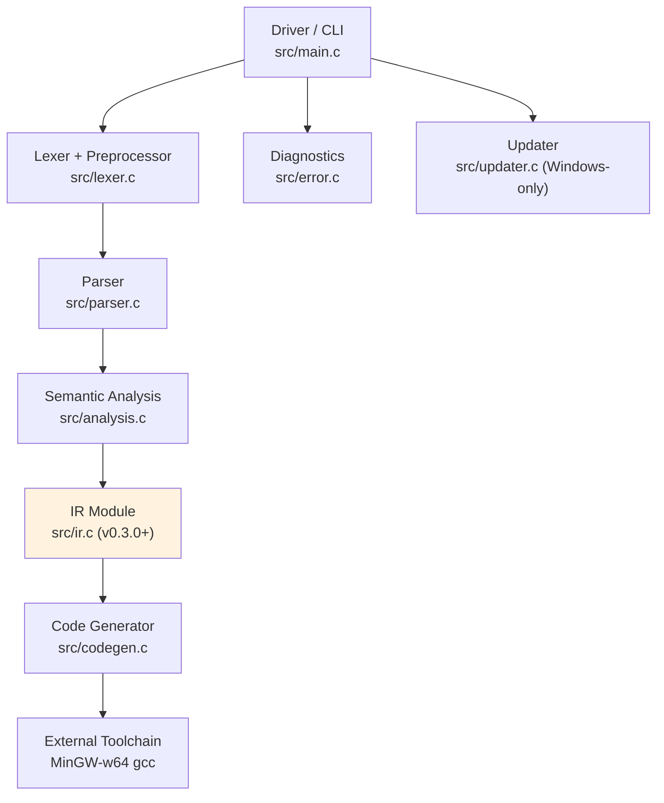

# Baa Compiler Internals

> **Version:** 0.3.0 | [← Language Spec](LANGUAGE.md) | [API Reference →](API_REFERENCE.md)

**Target Architecture:** x86-64 (AMD64)
**Target OS:** Windows (MinGW-w64 Toolchain)
**Calling Convention:** Microsoft x64 ABI

This document details the internal architecture, data structures, and algorithms used in the Baa compiler.

---

## Table of Contents

- [Pipeline Architecture](#1-pipeline-architecture)
- [Lexical Analysis](#2-lexical-analysis)
- [Syntactic Analysis](#3-syntactic-analysis)
- [Abstract Syntax Tree](#4-abstract-syntax-tree)
- [Semantic Analysis](#5-semantic-analysis)
- [Intermediate Representation](#6-intermediate-representation)
- [Code Generation](#7-code-generation)
- [Global Data Section](#8-global-data-section)
- [Naming & Entry Point](#9-naming--entry-point)

---

## 1. Pipeline Architecture

The compiler is orchestrated by the **Driver** (`src/main.c`), which acts as the entry point and build manager. It parses command-line arguments to determine which stages of compilation to run.

### 1.1. Compilation Stages


| Stage | Input | Output | Component | Description |
|-------|-------|--------|-----------|-------------|
| **1. Frontend** | `.baa` Source | AST | `lexer.c`, `parser.c` | Tokenizes, handles macros, and builds the syntax tree. |
| **2. Analysis** | AST | Valid AST | `analysis.c` | **Semantic Pass**: Checks types, scopes, and resolves symbols. |
| **3. IR Lowering** | AST | IR | `ir.c` (v0.3.0+) | Converts AST to SSA-form Intermediate Representation. |
| **4. Optimization** | IR | Optimized IR | (future) | Dead code elimination, constant propagation, etc. |
| **5. Backend** | IR | `.s` Assembly | `codegen.c` | Generates x86-64 assembly code (AT&T syntax). |
| **6. Assemble** | `.s` Assembly | `.o` Object | `gcc -c` | Invokes external assembler. |
| **7. Link** | `.o` Object | `.exe` Executable | `gcc` | Links with C Runtime. |

> **Note (v0.3.0):** IR infrastructure is implemented but AST-to-IR lowering is not yet connected. Current compilation still uses direct AST-to-assembly.

### 1.1.1. Component Map




### 1.2. The Driver (CLI)

The driver in `main.c` (v0.2.0+) supports multi-file compilation and various modes:

| Flag | Mode | Output | Action |
|------|------|--------|--------|
| (Default) | **Compile & Link** | `.exe` | Runs full pipeline. Deletes intermediate `.s` and `.o` files. |
| `-o <file>` | **Custom Output** | `.exe` | Sets the linked output filename (default: `out.exe`). |
| (Multiple Files) | **Multi-File Build** | `.exe` | Compiles each `.baa` to `.o` and links them. |
| `-S`, `-s` | **Assembly Only** | `.s` | Stops after codegen. Writes `<input>.s` (or `-o` when a single input file is used). |
| `-c` | **Compile Only** | `.o` | Stops after assembling. Writes `<input>.o` (or `-o` when a single input file is used). |
| `-v` | **Verbose** | - | Prints commands and compilation time; keeps intermediate `.s` files. |
| `--version` | **Version Info** | stdout | Displays compiler version and build date. |
| `--help`, `-h` | **Help** | stdout | Shows usage information. |
| `update` | **Self-Update** | - | Downloads and installs the latest version. |

### 1.3. Diagnostic Engine

The compiler uses a centralized **Diagnostic Module** (`src/error.c`) to handle errors and warnings.

**Error Features:**
- **Source Context**: Prints the actual line of code where the error occurred.
- **Pointers**: Uses `^` to point exactly to the offending token.
- **Colored Output**: Errors displayed in red (ANSI) when terminal supports it (v0.2.8+).
- **Panic Mode Recovery**: When a syntax error is found, the parser does not exit immediately. Instead, it enters "Panic Mode":
    1.  It reports the error.
    2.  It skips tokens forward until it finds a **Synchronization Point**.
    3.  **Synchronization Points**: Semicolon `.`, Right Brace `}`, or Keywords (`صحيح`, `إذا`, etc.).
    4.  Parsing resumes to find subsequent errors.

**Warning Features (v0.2.8+):**
- **Non-fatal**: Warnings do not stop compilation by default.
- **Colored Output**: Warnings displayed in yellow (ANSI) when terminal supports it.
- **Warning Names**: Each warning shows its type in brackets: `[-Wunused-variable]`.
- **Configurable**: Enable with `-Wall` or specific `-W<type>` flags.
- **Errors Mode**: Use `-Werror` to treat warnings as fatal errors.

**ANSI Color Support:**
- Windows 10+: Automatically enables Virtual Terminal Processing.
- Unix/Linux: Detects TTY via `isatty()`.
- Override with `-Wcolor` (force on) or `-Wno-color` (force off).

## 2. Lexical Analysis

The Lexer (`src/lexer.c`) transforms raw bytes into `Token` structures.

### 2.1. Internal Structure

The Lexer now supports **Nested Includes** via a state stack and **Macro Definitions**.

```c
// Represents the state of a single file being parsed
typedef struct {
    char* source;       // Full source code buffer (owned by this state)
    char* cur_char;     // Current reading pointer
    const char* filename;
    int line;
    int col;
} LexerState;

// Definition (Macro)
typedef struct {
    char* name;
    char* value;
} Macro;

// The main Lexer context
typedef struct {
    LexerState state;       // Current file state
    LexerState stack[10];   // Stack for nested includes (max depth 10)
    int stack_depth;
    
    // Preprocessor state
    Macro macros[100];      // Table of definitions
    int macro_count;
    bool skipping;          // True if inside disabled #if block
} Lexer;
```

### 2.2. Preprocessor Logic

The preprocessor is integrated directly into the `lexer_next_token` function. It intercepts directives starting with `#` before tokenizing normal code.

#### 2.2.1. Definitions (`#تعريف`)
When `#تعريف NAME VALUE` is encountered:
1.  The name and value are parsed as strings.
2.  They are stored in the `macros` table.
3.  When the Lexer later encounters an `IDENTIFIER`:
    - It checks the macro table
    - If found, replaces the token's value with the macro value
    - Updates the token type based on the value (INT if numeric, STRING if quoted, IDENTIFIER otherwise)

#### 2.2.2. Conditionals (`#إذا_عرف`)
When `#إذا_عرف NAME` is encountered:
1.  The lexer checks if `NAME` exists in the macro table.
2.  If it exists, normal parsing continues.
3.  If not, the lexer enters **Skipping Mode**.
4.  In Skipping Mode, all tokens are discarded until `#وإلا` or `#نهاية` is found.

#### 2.2.3. Undefine (`#الغاء_تعريف`)
When `#الغاء_تعريف NAME` is encountered:
1.  The lexer searches for `NAME` in the macro table.
2.  If found, the entry is removed (by shifting subsequent entries).
3.  If not found, the directive is ignored.

#### 2.2.4. Include (`#تضمين`)
When `#تضمين "file"` is encountered:
1.  The filename is extracted from the quoted string.
2.  The file is read into memory using `read_file()`.
3.  The current lexer state is pushed onto the include stack.
4.  The lexer state is updated to point to the new file's content.
5.  When EOF is reached, the previous state is popped and restored.

### 2.3. Key Features

| Feature | Description |
|---------|-------------|
| **UTF-8 Handling** | Full Unicode support for Arabic text |
| **BOM Detection** | Skips `0xEF 0xBB 0xBF` if present |
| **Arabic Numerals** | Normalizes `٠`-`٩` → `0`-`9` |
| **Arabic Punctuation** | Handles `؛` (semicolon) `0xD8 0x9B` |

### 2.4. Token Types

```
Keywords:    صحيح, نص, منطقي, ثابت, إذا, وإلا, طالما, لكل, اختر, حالة, افتراضي, اطبع, اقرأ, إرجع, توقف, استمر
Literals:    INTEGER, STRING, CHAR, TRUE, FALSE
Operators:   + - * / % ++ -- ! && ||
Comparison:  == != < > <= >=
Delimiters:  ( ) { } [ ] , . : ؛
Special:     IDENTIFIER, EOF
```

> **Note:** `ثابت` (const) was added in v0.2.7 for immutable variable declarations.

---

## 3. Syntactic Analysis

The Parser (`src/parser.c`) builds the AST using Recursive Descent with 1-token lookahead.

### 3.1. Grammar (BNF)

```bnf
Program       ::= Declaration* EOF
Declaration   ::= FuncDecl | GlobalVarDecl

FuncDecl      ::= Type ID "(" ParamList ")" Block
                | Type ID "(" ParamList ")" "."    // Prototype (v0.2.5+)
GlobalVarDecl ::= ConstMod? Type ID ("=" Expr)? "."

ConstMod      ::= "ثابت"                           // NEW in v0.2.7
Type          ::= "صحيح" | "نص" | "منطقي"          // Updated in v0.2.9

Block         ::= "{" Statement* "}"
Statement     ::= VarDecl | ArrayDecl | Assign | ArrayAssign
                | If | Switch | While | For | Return | Print | Read | CallStmt
                | Break | Continue

VarDecl       ::= ConstMod? Type ID "=" Expr "."   // Local declarations require an initializer
ArrayDecl     ::= ConstMod? "صحيح" ID "[" INT "]" "."  // Updated in v0.2.7
Assign        ::= ID "=" Expr "."
ArrayAssign   ::= ID "[" Expr "]" "=" Expr "."

If            ::= "إذا" "(" Expr ")" Block ("وإلا" (Block | If))?
Switch        ::= "اختر" "(" Expr ")" "{" Case* Default? "}"
Case          ::= "حالة" (INT | CHAR) ":" Statement*
Default       ::= "افتراضي" ":" Statement*

While         ::= "طالما" "(" Expr ")" Block
For           ::= "لكل" "(" Init? "؛" Expr? "؛" Update? ")" Block
Break         ::= "توقف" "."
Continue      ::= "استمر" "."
Return        ::= "إرجع" Expr "."
Print         ::= "اطبع" Expr "."
Read          ::= "اقرأ" ID "."
```

### 3.2. Expression Precedence

Implemented via precedence climbing:

```
Logical OR   ::= Logical AND { "||" Logical AND }
Logical AND  ::= Equality { "&&" Equality }
Equality     ::= Relational { ("==" | "!=") Relational }
Relational   ::= Additive { ("<" | ">" | "<=" | ">=") Additive }
Additive     ::= Multiplicative { ("+" | "-") Multiplicative }
Multiplicative ::= Unary { ("*" | "/" | "%") Unary }
Unary        ::= ("!" | "-" | "++" | "--") Unary | Postfix
Postfix      ::= Primary { "++" | "--" }
Primary      ::= INT | STRING | CHAR | ID | ArrayAccess | Call | "(" Expr ")"
```

---

### 3.3. Error Handling Strategy

The parser uses `synchronize()` to recover from errors.

**Example Scenario:**
```baa
صحيح س = ١٠  // Error: Missing dot
صحيح ص = ٢٠.
```

1.  Parser expects `.` but finds `صحيح`.
2.  `report_error()` is called.
3.  `synchronize()` is called. It skips until it sees `صحيح` (start of next statement).
4.  Parser continues parsing `صحيح ص = ٢٠.`.
5.  At the end, compiler exits with status 1 if any errors were found.

---

## 4. Abstract Syntax Tree

The AST uses a tagged union structure for type-safe node representation.

### 4.1. Node Types

| Category | Node Types |
|----------|------------|
| **Structure** | `NODE_PROGRAM`, `NODE_FUNC_DEF`, `NODE_BLOCK` |
| **Variables** | `NODE_VAR_DECL`, `NODE_ASSIGN`, `NODE_VAR_REF` |
| **Array Decls** | `NODE_ARRAY_DECL`, `NODE_ARRAY_ACCESS`, `NODE_ARRAY_ASSIGN` |
| **Control Flow** | `NODE_IF`, `NODE_WHILE`, `NODE_FOR`, `NODE_RETURN` |
| **Branching** | `NODE_SWITCH`, `NODE_CASE`, `NODE_BREAK`, `NODE_CONTINUE` |
| **Expressions** | `NODE_BIN_OP`, `NODE_UNARY_OP`, `NODE_POSTFIX_OP`, `NODE_CALL_EXPR` |
| **Literals** | `NODE_INT`, `NODE_STRING`, `NODE_CHAR`, `NODE_BOOL` |
| **Calls & I/O** | `NODE_CALL_STMT`, `NODE_PRINT`, `NODE_READ` |

### 4.2. Node Structure

```c
typedef struct Node {
    NodeType type;      // Discriminator
    struct Node* next;  // Linked list for siblings
    union { ... } data; // Type-specific payload
} Node;
```

---

## 5. Semantic Analysis

The Semantic Analyzer (`src/analysis.c`) performs a static check on the AST before code generation.

### 5.1. Responsibilities

1.  **Symbol Resolution**: Verifies variables are declared before use.
2.  **Type Checking**: Enforces `TYPE_INT`, `TYPE_STRING`, and `TYPE_BOOL` compatibility.
3.  **Scope Validation**: Manages visibility rules.
4.  **Constant Checking** (v0.2.7+): Prevents reassignment of immutable variables.
5.  **Control Flow Validation**: Ensures `break` and `continue` are used only within loops/switches.
6.  **Function Validation**: Checks function prototypes and definitions match.
7.  **Usage Tracking** (v0.2.8+): Tracks variable usage for unused variable warnings.
8.  **Dead Code Detection** (v0.2.8+): Detects unreachable code after `return`/`break`.

### 5.2. Constant Checking (v0.2.7+)

The analyzer tracks the `is_const` flag for each symbol and enforces immutability:

| Error Condition | Error Message |
|-----------------|---------------|
| Reassigning a constant | `Cannot reassign constant '<name>'` |
| Modifying constant array element | `Cannot modify constant array '<name>'` |
| Constant without initializer | `Constant '<name>' must be initialized` |

### 5.3. Warning Generation (v0.2.8+)

The analyzer generates warnings for potential issues that don't prevent compilation:

#### Unused Variable Detection

**Algorithm:**
1. Each symbol has an `is_used` flag initialized to `false`.
2. When a variable is referenced (in expressions, assignments, etc.), the flag is set to `true`.
3. At end of function scope, all local variables with `is_used == false` generate a warning.
4. At end of program, all global variables with `is_used == false` generate a warning.

**Exception:** Function parameters are marked as "used" implicitly to avoid false positives.

#### Dead Code Detection

**Algorithm:**
1. While analyzing a block, track if a "terminating" statement was encountered.
2. Terminating statements: `NODE_RETURN`, `NODE_BREAK`, `NODE_CONTINUE`.
3. If a terminating statement was found and there are more statements after it, generate a warning.

**Implementation:**
```c
static void analyze_statements_with_dead_code_check(Node* statements, const char* context) {
    bool found_terminator = false;
    Node* stmt = statements;
    while (stmt) {
        if (found_terminator) {
            warning_report(WARN_DEAD_CODE, ...);
            found_terminator = false; // Avoid multiple warnings
        }
        analyze_node(stmt);
        if (is_terminating_statement(stmt)) {
            found_terminator = true;
        }
        stmt = stmt->next;
    }
}
```

#### Variable Shadowing

When a local variable is declared with the same name as a global variable, a `WARN_SHADOW_VARIABLE` warning is generated.

### 5.4. Isolation Note

Since v0.2.4, `analysis.c` and `codegen.c` **maintain separate symbol tables** for isolation. The `Symbol` struct definition is shared via `baa.h`, but each module manages its own table. This ensures validation logic is independent from generation logic.

**Future improvement:** Unify symbol tables into a shared context object passed between phases.

The analyzer walks the AST recursively. It maintains a **Symbol Table** stack to track active variables in the current scope. If it encounters:
- `x = "text"` (where x is `int`): Reports a type mismatch error.
- `print y` (where y is undeclared): Reports an undefined symbol error.
- `x = 5` (where x is `const`): Reports a const reassignment error (v0.2.7+).

### 5.5. Memory Allocation

| Type | C Type | Size | Notes |
|------|--------|------|-------|
| `صحيح` | `int64_t` | 8 bytes | Signed integer |
| `نص` | `char*` | 8 bytes | Pointer to .rdata string |
| `منطقي` | `bool` (stored as int) | 8 bytes | Stored as 0/1 in 8-byte slots |

**I/O note (v0.2.9):** The current backend emits `printf("%d\\n", ...)` and `scanf("%d", ...)`, so printed/read integers are effectively 32-bit even though storage uses 8 bytes.

---

### 5.6. Constant Folding (Optimization)

The parser performs constant folding on arithmetic expressions. If both operands of a binary operation are integer literals, the compiler evaluates the result at compile-time.

**Example:**
- Source: `٢ * ٣ + ٤`
- Before folding: `BinOp(+, BinOp(*, 2, 3), 4)`
- After folding: `Int(10)`

**Supported Operations:** `+`, `-`, `*`, `/`, `%`
**Note:** Division/modulo by zero is detected and reported during folding.

---

## 6. Intermediate Representation (v0.3.0+)

The IR Module (`src/ir.h`, `src/ir.c`) provides an Arabic-first Intermediate Representation using SSA (Static Single Assignment) form.

### 6.1. Design Philosophy

Baa's IR is designed with three goals:
1. **Arabic Identity**: All opcodes, types, and predicates have Arabic names.
2. **Technical Parity**: Comparable to LLVM IR, GIMPLE, or WebAssembly in capabilities.
3. **SSA Form**: Each virtual register is assigned exactly once, enabling powerful optimizations.

### 6.2. IR Structure

```
IRModule
├── globals: IRGlobal*      // Global variables
├── funcs: IRFunc*          // Functions
└── strings: IRStringEntry* // String literal table

IRFunc
├── name: char*
├── ret_type: IRType*
├── params: IRParam[]
├── blocks: IRBlock*        // Linked list of basic blocks
├── entry: IRBlock*         // Entry block pointer
└── next_reg: int           // Virtual register counter

IRBlock
├── label: char*            // Arabic label (e.g., "بداية", "حلقة")
├── id: int
├── first/last: IRInst*     // Instruction list
├── succs[2]: IRBlock*      // Successors (0-2 for br/br_cond)
├── preds: IRBlock**        // Predecessors (dynamic array)
└── next: IRBlock*          // Next block in function

IRInst
├── op: IROp                // Opcode
├── type: IRType*           // Result type
├── dest: int               // Destination register (-1 if none)
├── operands[4]: IRValue*   // Up to 4 operands
├── cmp_pred: IRCmpPred     // For comparison instructions
├── phi_entries: IRPhiEntry* // For phi nodes
└── call_*: ...             // For call instructions
```

### 6.3. IR Opcodes (Arabic)

| Category | Opcode | Arabic | Description |
|----------|--------|--------|-------------|
| **Arithmetic** | `IR_OP_ADD` | جمع | Addition |
| | `IR_OP_SUB` | طرح | Subtraction |
| | `IR_OP_MUL` | ضرب | Multiplication |
| | `IR_OP_DIV` | قسم | Division |
| | `IR_OP_MOD` | باقي | Modulo |
| | `IR_OP_NEG` | سالب | Negation |
| **Memory** | `IR_OP_ALLOCA` | حجز | Stack allocation |
| | `IR_OP_LOAD` | حمل | Load from memory |
| | `IR_OP_STORE` | خزن | Store to memory |
| **Comparison** | `IR_OP_CMP` | قارن | Compare with predicate |
| **Logical** | `IR_OP_AND` | و | Bitwise AND |
| | `IR_OP_OR` | أو | Bitwise OR |
| | `IR_OP_NOT` | نفي | Bitwise NOT |
| **Control** | `IR_OP_BR` | قفز | Unconditional branch |
| | `IR_OP_BR_COND` | قفز_شرط | Conditional branch |
| | `IR_OP_RET` | رجوع | Return |
| | `IR_OP_CALL` | نداء | Function call |
| **SSA** | `IR_OP_PHI` | فاي | Phi node |
| | `IR_OP_COPY` | نسخ | Copy value |
| **Conversion** | `IR_OP_CAST` | تحويل | Type cast |

### 6.4. IR Types (Arabic)

| Type | Arabic | Bits | Description |
|------|--------|------|-------------|
| `IR_TYPE_VOID` | فراغ | 0 | No value |
| `IR_TYPE_I1` | ص١ | 1 | Boolean |
| `IR_TYPE_I8` | ص٨ | 8 | Byte/Char |
| `IR_TYPE_I16` | ص١٦ | 16 | Short |
| `IR_TYPE_I32` | ص٣٢ | 32 | Int |
| `IR_TYPE_I64` | ص٦٤ | 64 | Long (primary) |
| `IR_TYPE_PTR` | مؤشر | 64 | Pointer |
| `IR_TYPE_ARRAY` | مصفوفة | varies | Array |
| `IR_TYPE_FUNC` | دالة | - | Function type |

### 6.5. Comparison Predicates

| Predicate | Arabic | Description |
|-----------|--------|-------------|
| `IR_CMP_EQ` | يساوي | Equal |
| `IR_CMP_NE` | لا_يساوي | Not Equal |
| `IR_CMP_GT` | أكبر | Greater Than |
| `IR_CMP_LT` | أصغر | Less Than |
| `IR_CMP_GE` | أكبر_أو_يساوي | Greater or Equal |
| `IR_CMP_LE` | أصغر_أو_يساوي | Less or Equal |

### 6.6. Virtual Registers

Registers use Arabic naming with Arabic-Indic numerals:
- Format: `%م<n>` where `م` = مؤقت (temporary)
- Examples: `%م٠`, `%م١`, `%م٢`, ...

The `int_to_arabic_numerals()` function converts integers to Arabic-Indic digits (٠١٢٣٤٥٦٧٨٩).

### 6.7. Example IR Output

**Baa Source:**
```baa
صحيح الرئيسية() {
    صحيح س = ١٠.
    صحيح ص = ٢٠.
    إرجع س + ص.
}
```

**Generated IR (Arabic mode):**
```
دالة الرئيسية() -> ص٦٤ {
بداية:
    %م٠ = حجز ص٦٤
    خزن ص٦٤ ١٠, %م٠
    %م١ = حجز ص٦٤
    خزن ص٦٤ ٢٠, %م١
    %م٢ = حمل ص٦٤ %م٠
    %م٣ = حمل ص٦٤ %م١
    %م٤ = جمع ص٦٤ %م٢, %م٣
    رجوع ص٦٤ %م٤
}
```

### 6.8. IR Module API

Key functions for building IR:

```c
// Module
IRModule* ir_module_new(const char* name);
void ir_module_add_func(IRModule* module, IRFunc* func);
int ir_module_add_string(IRModule* module, const char* str);

// Function
IRFunc* ir_func_new(const char* name, IRType* ret_type);
int ir_func_alloc_reg(IRFunc* func);
IRBlock* ir_func_new_block(IRFunc* func, const char* label);

// Block
IRBlock* ir_block_new(const char* label, int id);
void ir_block_append(IRBlock* block, IRInst* inst);

// Instructions
IRInst* ir_inst_binary(IROp op, IRType* type, int dest, IRValue* lhs, IRValue* rhs);
IRInst* ir_inst_cmp(IRCmpPred pred, int dest, IRValue* lhs, IRValue* rhs);
IRInst* ir_inst_load(IRType* type, int dest, IRValue* ptr);
IRInst* ir_inst_store(IRValue* value, IRValue* ptr);
IRInst* ir_inst_br(IRBlock* target);
IRInst* ir_inst_br_cond(IRValue* cond, IRBlock* if_true, IRBlock* if_false);
IRInst* ir_inst_ret(IRValue* value);
IRInst* ir_inst_call(const char* target, IRType* ret_type, int dest, IRValue** args, int arg_count);
IRInst* ir_inst_phi(IRType* type, int dest);

// Printing
void ir_module_print(IRModule* module, FILE* out, int use_arabic);
void ir_module_dump(IRModule* module, const char* filename, int use_arabic);
```

For full specification, see [BAA_IR_SPECIFICATION.md](BAA_IR_SPECIFICATION.md).

---

## 7. Code Generation

### 6.1. Loop Control & Branching

To support nested loops and switches, the code generator maintains stacks:

- **Loop Continue Stack** (`loop_continue_stack`): Stores labels for `continue` statements.
- **Loop Break Stack** (`loop_break_stack`): Stores labels for `break` statements.
- **Loop Depth Counter** (`loop_depth`): Tracks nesting level.

**Special Case - Switch Statements:**
- Switch accepts `break` but not `continue` (unless nested in a loop).
- When entering a switch, the continue label is inherited from the enclosing loop (if any).
- The break label points to the end of the switch.

**Switch Code Generation Logic:**
1. **Pass 1 - Comparisons**: Generate jump instructions for all case values.
   - Store case label IDs in an array for Pass 2.
   - If no match, jump to default (if exists) or end.
2. **Pass 2 - Bodies**: Generate code for each case body.
   - Uses the stored label IDs from Pass 1.
   - Natural fallthrough between cases (C-style).
3. **End Label**: All breaks jump here.

**State Management:**
```c
// Reset state for each compilation unit
static void reset_codegen() {
    global_count = 0;
    local_count = 0;
    current_stack_offset = 0;
    label_counter = 0;
    loop_depth = 0;
}
```

**Critical:** `reset_codegen()` is called at the start of each file compilation to prevent state leakage between translation units.

### 6.2. Windows x64 ABI Compliance

| Requirement | Implementation |
|-------------|----------------|
| **Register Args** | RCX, RDX, R8, R9 for first 4 params |
| **Stack Alignment** | 16-byte aligned before `call` (Size 272) |
| **Shadow Space** | 32 bytes reserved above parameters for callee |
| **Return Value** | RAX |
| **Caller-saved** | RAX, RCX, RDX, R8-R11 |
| **Callee-saved** | RBX, RBP, RDI, RSI, R12-R15 |

### 6.3. Printing

The `اطبع` statement uses the symbol type to determine the format string:
- If `TYPE_INT` → call `printf("%d\n")`
- If `TYPE_STRING` → call `printf("%s\n")`

---

## 8. Global Data Section

| Section | Contents |
|---------|----------|
| `.data` | Global variables (mutable) |
| `.rdata` | String literals (read-only) |
| `.text` | Executable code |

### String Table

Strings are collected during parsing and emitted with unique labels:

```asm
.section .rdata,"dr"
.LC0:
    .asciz "مرحباً"
.LC1:
    .asciz "العالم"
```

---

## 9. Naming & Entry Point

| Aspect | Details |
|--------|---------|
| **Entry Point** | `الرئيسية` → exported as `main` |
| **Name Mangling** | None - functions use their Arabic UTF-8 names as assembly labels |
| **Special Case** | `الرئيسية` is explicitly exported as `main` using `.globl main` |
| **External Calls** | C runtime (`printf`, etc.) via `@PLT` |

---

*[← Language Spec](LANGUAGE.md) | [API Reference →](API_REFERENCE.md)*
