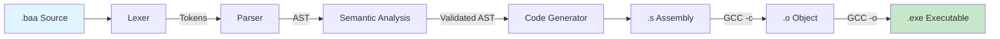

# Baa Compiler Internals

> **Version:** 0.2.4 | [← Language Spec](LANGUAGE.md) | [API Reference →](API_REFERENCE.md)

**Target Architecture:** x86-64 (AMD64)  
**Target OS:** Windows (MinGW-w64 Toolchain)  
**Calling Convention:** Microsoft x64 ABI

This document details the internal architecture, data structures, and algorithms used in the Baa compiler.

---

## Table of Contents

- [Pipeline Architecture](#1-pipeline-architecture)
- [Lexical Analysis](#2-lexical-analysis)
- [Syntactic Analysis](#3-syntactic-analysis)
- [Abstract Syntax Tree](#4-abstract-syntax-tree)
- [Semantic Analysis](#5-semantic-analysis)
- [Code Generation](#6-code-generation)
- [Global Data Section](#7-global-data-section)
- [Naming & Entry Point](#8-naming--entry-point)

---

## 1. Pipeline Architecture

The compiler is orchestrated by the **Driver** (`src/main.c`), which acts as the entry point and build manager. It parses command-line arguments to determine which stages of compilation to run.

### 1.1. Compilation Stages



| Stage | Input | Output | Component | Description |
|-------|-------|--------|-----------|-------------|
| **1. Frontend** | `.baa` Source | AST | `lexer.c`, `parser.c` | Tokenizes and builds the syntax tree. |
| **2. Analysis** | AST | Valid AST | `analysis.c` | **Semantic Pass**: Checks types, scopes, and resolves symbols. |
| **3. Backend** | AST | `.s` Assembly | `codegen.c` | Generates x86-64 assembly code (AT&T syntax). |
| **4. Assemble** | `.s` Assembly | `.o` Object | `gcc -c` | Invokes external assembler. |
| **5. Link** | `.o` Object | `.exe` Executable | `gcc` | Links with C Runtime. |


### 1.2. The Driver (CLI)

The driver logic in `main.c` supports various compilation modes controlled by flags:

| Flag | Mode | Output | Action |
|------|------|--------|--------|
| (Default) | **Compile & Link** | `.exe` | Runs full pipeline. Deletes intermediate `.s` and `.o` files. |
| `-o <file>`| **Custom Output** | `<file>` | Specifies the final filename. |
| (Multiple Files) | **Multi-File Build** | `.exe` | Compiles each `.baa` to `.o` and links them. |
| `-S` | **Assembly Only** | `.s` | Stops after codegen. Preserves the assembly file. |
| `-c` | **Compile Only** | `.o` | Stops after assembling. Does not link. |

### 1.3. Diagnostic Engine

The compiler uses a centralized **Error Reporting Module** (`src/error.c`) to handle compilation errors gracefully.

**Features:**
- **Source Context**: Prints the actual line of code where the error occurred.
- **Pointers**: Uses `^` to point exactly to the offending token.
- **Panic Mode Recovery**: When a syntax error is found, the parser does not exit immediately. Instead, it enters "Panic Mode":
    1.  It reports the error.
    2.  It skips tokens forward until it finds a **Synchronization Point**.
    3.  **Synchronization Points**: Semicolon `.`, Right Brace `}`, or Keywords (`صحيح`, `إذا`, etc.).
    4.  Parsing resumes to find subsequent errors.

## 2. Lexical Analysis

The Lexer (`src/lexer.c`) transforms raw bytes into `Token` structures.

### 2.1. Internal Structure

The Lexer now supports **Nested Includes** via a state stack.

```c
// Represents the state of a single file being parsed
typedef struct {
    char* source;       // Full source code buffer
    char* cur_char;     // Current reading pointer
    const char* filename;
    int line;
    int col;
} LexerState;

// The main Lexer context
typedef struct {
    LexerState state;       // Current active file state
    LexerState stack[10];   // Stack for nested includes (max depth 10)
    int stack_depth;
} Lexer;
```

### 2.2. Key Features

| Feature | Description |
|---------|-------------|
| **UTF-8 Handling** | Full Unicode support for Arabic text |
| **BOM Detection** | Skips `0xEF 0xBB 0xBF` if present |
| **Arabic Numerals** | Normalizes `٠`-`٩` → `0`-`9` |
| **Arabic Punctuation** | Handles `؛` (semicolon) `0xD8 0x9B` |

### 2.3. Token Types

```
Keywords:    صحيح, نص, إذا, وإلا, طالما, لكل, اختر, حالة, افتراضي, اطبع, إرجع, توقف, استمر
Literals:    INTEGER, STRING, CHAR
Operators:   + - * / % ++ -- ! && ||
Comparison:  == != < > <= >=
Delimiters:  ( ) { } [ ] , . : ؛
Special:     IDENTIFIER, EOF
```

---

## 3. Syntactic Analysis

The Parser (`src/parser.c`) builds the AST using Recursive Descent with 1-token lookahead.

### 3.1. Grammar (BNF)

```bnf
Program       ::= Declaration* EOF
Declaration   ::= FuncDecl | GlobalVarDecl

FuncDecl      ::= Type ID "(" ParamList ")" Block
GlobalVarDecl ::= Type ID ("=" Expr)? "."

Type          ::= "صحيح" | "نص"

Block         ::= "{" Statement* "}"
Statement     ::= VarDecl | ArrayDecl | Assign | ArrayAssign
                | If | Switch | While | For | Return | Print | CallStmt
                | Break | Continue

VarDecl       ::= Type ID "=" Expr "."
ArrayDecl     ::= "صحيح" ID "[" INT "]" "."
Assign        ::= ID "=" Expr "."
ArrayAssign   ::= ID "[" Expr "]" "=" Expr "."

If            ::= "إذا" "(" Expr ")" Block ("وإلا" (Block | If))?
Switch        ::= "اختر" "(" Expr ")" "{" Case* Default? "}"
Case          ::= "حالة" (INT | CHAR) ":" Statement*
Default       ::= "افتراضي" ":" Statement*

While         ::= "طالما" "(" Expr ")" Block
For           ::= "لكل" "(" Init? "؛" Expr? "؛" Update? ")" Block
Break         ::= "توقف" "."
Continue      ::= "استمر" "."
Return        ::= "إرجع" Expr "."
Print         ::= "اطبع" Expr "."
```

### 3.2. Expression Precedence

Implemented via precedence climbing:

```
Logical OR   ::= Logical AND { "||" Logical AND }
Logical AND  ::= Equality { "&&" Equality }
Equality     ::= Relational { ("==" | "!=") Relational }
Relational   ::= Additive { ("<" | ">" | "<=" | ">=") Additive }
Additive     ::= Multiplicative { ("+" | "-") Multiplicative }
Multiplicative ::= Unary { ("*" | "/" | "%") Unary }
Unary        ::= ("!" | "-" | "++" | "--") Unary | Postfix
Postfix      ::= Primary { "++" | "--" }
Primary      ::= INT | STRING | CHAR | ID | ArrayAccess | Call | "(" Expr ")"
```

---

### 3.3. Error Handling Strategy

The parser uses `synchronize()` to recover from errors.

**Example Scenario:**
```baa
صحيح س = ١٠  // Error: Missing dot
صحيح ص = ٢٠.
```

1.  Parser expects `.` but finds `صحيح`.
2.  `report_error()` is called.
3.  `synchronize()` is called. It skips until it sees `صحيح` (start of next statement).
4.  Parser continues parsing `صحيح ص = ٢٠.`.
5.  At the end, compiler exits with status 1 if any errors were found.

---

## 4. Abstract Syntax Tree

The AST uses a tagged union structure for type-safe node representation.

### 4.1. Node Types

| Category | Node Types |
|----------|------------|
| **Structure** | `NODE_PROGRAM`, `NODE_FUNC_DEF`, `NODE_BLOCK`, `NODE_PARAM` |
| **Variable Decls** | `NODE_VAR_DECL`, `NODE_ASSIGN`, `NODE_VAR_REF` |
| **Array Decls** | `NODE_ARRAY_DECL`, `NODE_ARRAY_ACCESS`, `NODE_ARRAY_ASSIGN` |
| **Control Flow** | `NODE_IF`, `NODE_WHILE`, `NODE_FOR`, `NODE_RETURN` |
| **Branching** | `NODE_SWITCH`, `NODE_CASE`, `NODE_BREAK`, `NODE_CONTINUE` |
| **Expressions** | `NODE_BIN_OP`, `NODE_UNARY_OP`, `NODE_POSTFIX_OP` |
| **Literals** | `NODE_INT`, `NODE_STRING`, `NODE_CHAR` |
| **Calls** | `NODE_CALL_EXPR`, `NODE_CALL_STMT`, `NODE_PRINT` |

### 4.2. Node Structure

```c
typedef struct Node {
    NodeType type;      // Discriminator
    struct Node* next;  // Linked list for siblings
    union { ... } data; // Type-specific payload
} Node;
```

---

## 5. Semantic Analysis

The Semantic Analyzer (`src/analysis.c`) performs a static check on the AST before code generation.

### 5.1. Responsibilities

1.  **Symbol Resolution**: Ensures variables are declared before use.
2.  **Type Checking**: Strictly enforces `TYPE_INT` vs `TYPE_STRING` compatibility.
3.  **Scope Validation**: Manages visibility rules.

### 5.2. Isolation Note

Currently, `analysis.c` and `codegen.c` **maintain separate symbol tables**. This isolation ensures that the validation logic is independent of the generation logic, though it requires both modules to track scope similarly. Future versions may unify this into a shared Context object.

The analyzer walks the AST recursively. It maintains a **Symbol Table** stack to track active variables in the current scope. If it encounters:
- `x = "text"` (where x is `int`): Reports a type mismatch error.
- `print y` (where y is undeclared): Reports an undefined symbol error.

### 5.3. Memory Allocation

| Type | C Type | Size | Notes |
|------|--------|------|-------|
| `صحيح` | `int64_t` | 8 bytes | Signed integer |
| `نص` | `char*` | 8 bytes | Pointer to .rdata string |

---

### 5.4. Constant Folding (Optimization)

The parser performs constant folding on arithmetic expressions. If both operands of a binary operation are integer literals, the compiler evaluates the result at compile-time.

**Example:**
- Source: `٢ * ٣ + ٤`
- Parse Tree (Before): `BinOp(+, BinOp(*, 2, 3), 4)`
- Parse Tree (After): `Int(10)`

**Supported Operations:** `+`, `-`, `*`, `/`, `%`

---

## 6. Code Generation

### 6.1. Loop Control & Branching

To support nested loops and switches, the code generator maintains stacks:

- **Loop Start Stack**: Used by `continue`.
- **Loop End Stack**: Used by `break`.

**Switch Logic:**
1. Evaluate expression.
2. Generate comparisons for all cases (Pass 1).
3. Generate bodies for all cases (Pass 2).
4. Handle default case or fallthrough.

### 6.2. Windows x64 ABI Compliance

| Requirement | Implementation |
|-------------|----------------|
| **Register Args** | RCX, RDX, R8, R9 for first 4 params |
| **Stack Alignment** | 16-byte aligned before `call` (Size 272) |
| **Shadow Space** | 32 bytes reserved for callee |
| **Return Value** | RAX |

### 6.3. Printing

The `اطبع` statement uses the symbol type to determine the format string:
- If `TYPE_INT` → call `printf("%d\n")`
- If `TYPE_STRING` → call `printf("%s\n")`

---

## 7. Global Data Section

| Section | Contents |
|---------|----------|
| `.data` | Global variables (mutable) |
| `.rdata` | String literals (read-only) |
| `.text` | Executable code |

### String Table

Strings are collected during parsing and emitted with unique labels:

```asm
.section .rdata
.LC0:
    .asciz "مرحباً"
.LC1:
    .asciz "العالم"
```

---

## 8. Naming & Entry Point

| Aspect | Details |
|--------|---------|
| **Entry Point** | `الرئيسية` → exported as `main` |
| **Name Mangling** | None (direct UTF-8 labels) |
| **External Calls** | C runtime (`printf`, etc.) via `@PLT` |

---

*[← Language Spec](LANGUAGE.md) | [API Reference →](API_REFERENCE.md)*