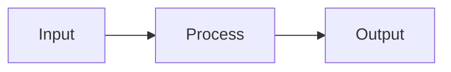

# Baa Documentation Style Guide

> **Version:** 0.3.2.6.5 | **Last Updated:** 2026-02-13

This guide establishes standards for all Baa project documentation to ensure consistency, professionalism, and clarity across all documents.

---

## Table of Contents

- [1. Document Structure](#1-document-structure)
- [2. Version Management](#2-version-management)
- [3. Formatting Standards](#3-formatting-standards)
- [4. Terminology and Language](#4-terminology-and-language)
- [5. Code Examples](#5-code-examples)
- [6. Navigation and Cross-References](#6-navigation-and-cross-references)
- [7. Tone and Voice](#7-tone-and-voice)

---

## 1. Document Structure

### 1.1 Standard Header Template

Every document MUST follow this header format:

```markdown
# Document Title

> **Version:** X.Y.Z | [← Previous Doc](link.md) | [Next Doc →](link.md)

One-sentence description of the document's purpose.

---

## Table of Contents

- [Section 1](#1-section-name)
- [Section 2](#2-section-name)
...

---
```

### 1.2 Standard Footer Template

Every document MUST end with:

```markdown
---

*[← Previous Doc](link.md) | [Next Doc →](link.md)*
```

### 1.3 Section Hierarchy

Use the following hierarchy consistently:

- `#` - Document title (H1) - Use only once
- `##` - Major sections (H2) - Numbered: `## 1. Section Name`
- `###` - Subsections (H3) - Numbered: `### 1.1. Subsection Name`
- `####` - Sub-subsections (H4) - Use sparingly

**Rule**: Always use `##` for main sections with numeric prefixes for reference documents.

---

## 2. Version Management

### 2.1 Current Version

The current version is **0.3.2.4**. All documents must display this version in their header.

### 2.2 Version Update Rule

When the project version changes:
1. Update the version number in this STYLE_GUIDE.md
2. Update the version number in ALL documentation files
3. Document significant changes in CHANGELOG.md

---

## 3. Formatting Standards

### 3.1 Tables

Use left-aligned columns with consistent width:

```markdown
| Column 1 | Column 2 | Column 3 |
|----------|----------|----------|
| Value 1  | Value 2  | Value 3  |
```

**Rules**:
- Use `|` for all column separators
- Include a header separator line: `|---|---|`
- Left-align content (default)
- Keep column widths reasonable (max 40 chars)

### 3.2 Code Blocks

Always specify the language:

```markdown
```baa
// Baa code example
صحيح الرئيسية() {
    إرجع ٠.
}
```

```c
// C code example
int main() {
    return 0;
}
```
```

**Supported languages in this project**:
- `baa` - Baa source code
- `c` - C code
- `powershell` - PowerShell commands
- `bash` - Shell commands
- `asm` or `assembly` - Assembly code
- `bnf` - Grammar definitions

### 3.3 Horizontal Rules

Use `---` (three dashes) for horizontal rules:
- After the header block
- Before the footer navigation
- To separate major sections if needed

### 3.4 Line Length

Keep lines under 100 characters when possible. This improves readability in editors and diffs.

### 3.5 Whitespace

- Use single blank lines between paragraphs
- Use double blank lines before major sections (H2)
- No trailing whitespace at end of lines
- Files must end with a single newline

---

## 4. Terminology and Language

### 4.1 Bilingual Approach

Baa documentation uses both Arabic and English. Follow these rules:

**First Mention Rule**:
> The first time a technical term appears, use: Arabic (English)
> Example: "التّمثيل الوسيط (Intermediate Representation)"

**Subsequent Mentions**:
> Use Arabic primarily. English acceptable for very technical terms.

### 4.2 Standard Terminology Glossary

| English | Arabic | Notes |
|---------|--------|-------|
| Compiler | المُصرِّف | Always use this term |
| Intermediate Representation | التّمثيل الوسيط (IR) | IR acceptable after first mention |
| Preprocessor | المعالج القبلي | Use Arabic form |
| Parser | المحلّل النحوي | Use Arabic form |
| Lexer | المحلّل اللفظي | Use Arabic form |
| Backend | الخلفية | Use Arabic form |
| Frontend | الواجهة الأمامية | Use Arabic form |
| Code Generation | توليد الشيفرة | Use Arabic form |
| Optimization | التحسين | Use Arabic form |
| Register | السّجل | Use Arabic form |
| Basic Block | الكتلة الأساسية | Use Arabic form |
| Virtual Register | السّجل الافتراضي | Use Arabic form |
| Physical Register | السّجل الفعلي | Use Arabic form |
| Stack | المكدّس | Use Arabic form |
| Heap | الكومة | Use Arabic form |
| Function | الدّالة | Use Arabic form |
| Variable | المتغيّر | Use Arabic form |
| Constant | الثّابت | Use Arabic form |
| Array | المصفوفة | Use Arabic form |
| Pointer | المؤشّر | Use Arabic form |
| Type | النّوع | Use Arabic form |
| Statement | العبارة | Use Arabic form |
| Expression | التّعبير | Use Arabic form |
| Keyword | الكلمة المفتاحية | Use Arabic form |
| Identifier | المعرّف | Use Arabic form |
| Literal | القيمة الحرفية | Use Arabic form |
| Operator | المُعامِل | Use Arabic form |
| Operand | المُعامَل | Use Arabic form |
| Control Flow | تدفّق التحكّم | Use Arabic form |
| Loop | الحلقة | Use Arabic form |
| Condition | الشّرط | Use Arabic form |
| Scope | النّطاق | Use Arabic form |
| Symbol | الرّمز | Use Arabic form |

### 4.3 Code-Related Terms

When referring to code elements:

- **Keywords**: Use Arabic with backticks: `` `صحيح` ``
- **Functions**: Use Arabic with backticks: `` `الرئيسية` ``
- **Types**: Use Arabic with backticks: `` `منطقي` ``
- **Operators**: Use symbol with backticks: `` `+` ``, `` `&&` ``

### 4.4 Numbers

- Use Arabic-Indic numerals (٠-٩) in Baa code examples
- Use Western numerals (0-9) in: version numbers, line numbers, technical specifications

---

## 5. Code Examples

### 5.1 Baa Code Standards

All Baa code examples must:

1. Be syntactically correct (test if possible)
2. Use Arabic-Indic numerals (٠-٩)
3. Include the main function if complete program
4. Include comments in Arabic
5. Follow the style in the Language Specification

**Example**:

```baa
// مثال على دالة بسيطة
صحيح جمع(صحيح أ, صحيح ب) {
    إرجع أ + ب.
}

صحيح الرئيسية() {
    صحيح نتيجة = جمع(١٠, ٢٠).
    اطبع نتيجة.
    إرجع ٠.
}
```

### 5.2 Minimal Examples

Keep examples minimal but complete. Remove unrelated code.

### 5.3 Expected Output

When showing expected output, use a comment or separate block:

```baa
// المخرجات المتوقعة: ٣٠
```

---

## 6. Navigation and Cross-References

### 6.1 Document Sequence

Documents must link to each other in this order:

```
README.md → USER_GUIDE.md → LANGUAGE.md → INTERNALS.md → API_REFERENCE.md
     ↓           ↓
BAA_BOOK_AR.md  BAA_IR_SPECIFICATION.md
```

### 6.2 Navigation Link Format

Use this exact format:

```markdown
*[← User Guide](USER_GUIDE.md) | [Compiler Internals →](INTERNALS.md)*
```

**Rules**:
- Use `←` and `→` arrows
- Use readable names (not filenames)
- Place in italics
- Separate with `|`

### 6.3 Internal Cross-References

Link to sections within the same document:

```markdown
See [Section 3.2](#32-subsection-name).
```

Convert section titles to lowercase, replace spaces with hyphens.

---

## 7. Tone and Voice

### 7.1 Document-Specific Tone

| Document | Tone | Person |
|----------|------|--------|
| README.md | Enthusiastic, informative | Second person (you) |
| USER_GUIDE.md | Helpful, instructional | Second person (you) |
| LANGUAGE.md | Formal, precise | Third person |
| INTERNALS.md | Technical, detailed | Third person |
| API_REFERENCE.md | Formal, reference-style | Third person |
| BAA_IR_SPECIFICATION.md | Technical, specification | Third person |
| BAA_BOOK_AR.md | Educational, encouraging | Second person (you) |
| CHANGELOG.md | Factual, organized | Third person |

### 7.2 Consistent Voice Guidelines

**DO**:
- Use active voice
- Be concise
- Use present tense
- Be consistent with terminology

**DON'T**:
- Use overly complex sentences
- Mix formal and casual tone
- Use first person (I/we) except in CHANGELOG commit messages
- Use future tense unnecessarily

### 7.3 Arabic Language Guidelines

When writing in Arabic:
- Use formal Modern Standard Arabic (الفصحى)
- Include tashkeel (تشكيل) for clarity when needed
- Use proper Arabic punctuation (، ؛)
- Avoid colloquial expressions

---

## 8. Mermaid Diagrams

When using Mermaid diagrams (in INTERNALS.md):

```markdown

```

**Rules**:
- Use double quotes for node labels with spaces
- Keep diagrams simple and readable
- Provide text alternative description

---

## Quick Reference Checklist

Before submitting documentation changes:

- [ ] Version number is 0.3.2.4 in header
- [ ] Document follows standard header/footer format
- [ ] Table of Contents is present and accurate
- [ ] Navigation links work and follow format
- [ ] Tables are properly formatted
- [ ] Code blocks have language tags
- [ ] First mention of technical terms uses Arabic (English)
- [ ] Baa code uses Arabic-Indic numerals
- [ ] Line length is under 100 characters
- [ ] Document ends with a single newline
- [ ] Tone matches document type

---

*This style guide ensures all Baa documentation maintains a professional, consistent, and accessible standard.*
