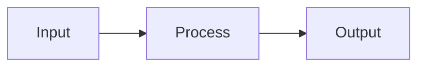

# Baa Documentation Style Guide

> **Version:** 0.3.12.5 | **Last Updated:** 2026-03-02

This guide establishes standards for all Baa project documentation to ensure consistency, professionalism, and clarity across all documents.

---

## Table of Contents

- [1. Document Structure](#1-document-structure)
- [2. Version Management](#2-version-management)
- [3. Formatting Standards](#3-formatting-standards)
- [4. Terminology and Language](#4-terminology-and-language)
- [5. Code Examples](#5-code-examples)
- [6. Navigation and Cross-References](#6-navigation-and-cross-references)
- [7. Tone and Voice](#7-tone-and-voice)
- [8. C Coding Standards](#8-c-coding-standards)
- [9. Baa Language Style](#9-baa-language-style)
- [10. Test File Conventions](#10-test-file-conventions)
- [11. Mermaid Diagrams](#11-mermaid-diagrams)

---

## 1. Document Structure

### 1.1 Standard Header Template

Every document MUST follow this header format:

```markdown
# Document Title

> **Version:** X.Y.Z | [← Previous Doc](link.md) | [Next Doc →](link.md)

One-sentence description of the document's purpose.

---

## Table of Contents

- [Section 1](#1-section-name)
- [Section 2](#2-section-name)
...

---
```

### 1.2 Standard Footer Template

Every document MUST end with:

```markdown
---

*[← Previous Doc](link.md) | [Next Doc →](link.md)*
```

### 1.3 Section Hierarchy

Use the following hierarchy consistently:

- `#` - Document title (H1) - Use only once
- `##` - Major sections (H2) - Numbered: `## 1. Section Name`
- `###` - Subsections (H3) - Numbered: `### 1.1. Subsection Name`
- `####` - Sub-subsections (H4) - Use sparingly

**Rule**: Always use `##` for main sections with numeric prefixes for reference documents.

---

## 2. Version Management

### 2.1 Current Version

The current version is **0.3.12.5**. All documents must display this version in their header.

### 2.2 Version Update Rule

When the project version changes:
1. Update the version number in this STYLE_GUIDE.md
2. Update the version number in ALL documentation files
3. Document significant changes in CHANGELOG.md

---

## 3. Formatting Standards

### 3.1 Tables

Use left-aligned columns with consistent width:

```markdown
| Column 1 | Column 2 | Column 3 |
|----------|----------|----------|
| Value 1  | Value 2  | Value 3  |
```

**Rules**:
- Use `|` for all column separators
- Include a header separator line: `|---|---|`
- Left-align content (default)
- Keep column widths reasonable (max 40 chars)

### 3.2 Code Blocks

Always specify the language:

```markdown
```baa
// Baa code example
صحيح الرئيسية() {
    إرجع ٠.
}
```

```c
// C code example
int main() {
    return 0;
}
```
```

**Supported languages in this project**:
- `baa` - Baa source code
- `c` - C code
- `powershell` - PowerShell commands
- `bash` - Shell commands
- `asm` or `assembly` - Assembly code
- `bnf` - Grammar definitions

### 3.3 Horizontal Rules

Use `---` (three dashes) for horizontal rules:
- After the header block
- Before the footer navigation
- To separate major sections if needed

### 3.4 Line Length

Keep lines under 100 characters when possible. This improves readability in editors and diffs.

### 3.5 Whitespace

- Use single blank lines between paragraphs
- Use double blank lines before major sections (H2)
- No trailing whitespace at end of lines
- Files must end with a single newline

---

## 4. Terminology and Language

### 4.1 Bilingual Approach

Baa documentation uses both Arabic and English. Follow these rules:

**First Mention Rule**:
> The first time a technical term appears, use: Arabic (English)
> Example: "التّمثيل الوسيط (Intermediate Representation)"

**Subsequent Mentions**:
> Use Arabic primarily. English acceptable for very technical terms.

### 4.2 Standard Terminology Glossary

| English | Arabic | Notes |
|---------|--------|-------|
| Compiler | المُصرِّف | Always use this term |
| Intermediate Representation | التّمثيل الوسيط (IR) | IR acceptable after first mention |
| Preprocessor | المعالج القبلي | Use Arabic form |
| Parser | المحلّل النحوي | Use Arabic form |
| Lexer | المحلّل اللفظي | Use Arabic form |
| Backend | الخلفية | Use Arabic form |
| Frontend | الواجهة الأمامية | Use Arabic form |
| Code Generation | توليد الشيفرة | Use Arabic form |
| Optimization | التحسين | Use Arabic form |
| Register | السّجل | Use Arabic form |
| Basic Block | الكتلة الأساسية | Use Arabic form |
| Virtual Register | السّجل الافتراضي | Use Arabic form |
| Physical Register | السّجل الفعلي | Use Arabic form |
| Stack | المكدّس | Use Arabic form |
| Heap | الكومة | Use Arabic form |
| Function | الدّالة | Use Arabic form |
| Variable | المتغيّر | Use Arabic form |
| Constant | الثّابت | Use Arabic form |
| Array | المصفوفة | Use Arabic form |
| Pointer | المؤشّر | Use Arabic form |
| Type | النّوع | Use Arabic form |
| Statement | العبارة | Use Arabic form |
| Expression | التّعبير | Use Arabic form |
| Keyword | الكلمة المفتاحية | Use Arabic form |
| Identifier | المعرّف | Use Arabic form |
| Literal | القيمة الحرفية | Use Arabic form |
| Operator | المُعامِل | Use Arabic form |
| Operand | المُعامَل | Use Arabic form |
| Control Flow | تدفّق التحكّم | Use Arabic form |
| Loop | الحلقة | Use Arabic form |
| Condition | الشّرط | Use Arabic form |
| Scope | النّطاق | Use Arabic form |
| Symbol | الرّمز | Use Arabic form |

### 4.3 Code-Related Terms

When referring to code elements:

- **Keywords**: Use Arabic with backticks: `` `صحيح` ``
- **Functions**: Use Arabic with backticks: `` `الرئيسية` ``
- **Types**: Use Arabic with backticks: `` `منطقي` ``
- **Operators**: Use symbol with backticks: `` `+` ``, `` `&&` ``

### 4.4 Numbers

- Use Arabic-Indic numerals (٠-٩) in Baa code examples
- Use Western numerals (0-9) in: version numbers, line numbers, technical specifications

---

## 5. Code Examples

### 5.1 Baa Code Standards

All Baa code examples must:

1. Be syntactically correct (test if possible)
2. Use Arabic-Indic numerals (٠-٩)
3. Include the main function if complete program
4. Include comments in Arabic
5. Follow the style in the Language Specification

**Example**:

```baa
// مثال على دالة بسيطة
صحيح جمع(صحيح أ، صحيح ب) {
    إرجع أ + ب.
}

صحيح الرئيسية() {
    صحيح نتيجة = جمع(١٠، ٢٠).
    اطبع نتيجة.
    إرجع ٠.
}
```

### 5.2 Minimal Examples

Keep examples minimal but complete. Remove unrelated code.

### 5.3 Expected Output

When showing expected output, use a comment or separate block:

```baa
// المخرجات المتوقعة: ٣٠
```

---

## 6. Navigation and Cross-References

### 6.1 Document Sequence

Documents must link to each other in this order:

```
README.md → USER_GUIDE.md → LANGUAGE.md → INTERNALS.md → API_REFERENCE.md
     ↓           ↓
BAA_BOOK_AR.md  BAA_IR_SPECIFICATION.md
```

### 6.2 Navigation Link Format

Use this exact format:

```markdown
*[← User Guide](USER_GUIDE.md) | [Compiler Internals →](INTERNALS.md)*
```

**Rules**:
- Use `←` and `→` arrows
- Use readable names (not filenames)
- Place in italics
- Separate with `|`

### 6.3 Internal Cross-References

Link to sections within the same document:

```markdown
See [Section 3.2](#32-subsection-name).
```

Convert section titles to lowercase, replace spaces with hyphens.

---

## 7. Tone and Voice

### 7.1 Document-Specific Tone

| Document | Tone | Person |
|----------|------|--------|
| README.md | Enthusiastic, informative | Second person (you) |
| USER_GUIDE.md | Helpful, instructional | Second person (you) |
| LANGUAGE.md | Formal, precise | Third person |
| INTERNALS.md | Technical, detailed | Third person |
| API_REFERENCE.md | Formal, reference-style | Third person |
| BAA_IR_SPECIFICATION.md | Technical, specification | Third person |
| BAA_BOOK_AR.md | Educational, encouraging | Second person (you) |
| CHANGELOG.md | Factual, organized | Third person |

### 7.2 Consistent Voice Guidelines

**DO**:
- Use active voice
- Be concise
- Use present tense
- Be consistent with terminology

**DON'T**:
- Use overly complex sentences
- Mix formal and casual tone
- Use first person (I/we) except in CHANGELOG commit messages
- Use future tense unnecessarily

### 7.3 Arabic Language Guidelines

When writing in Arabic:
- Use formal Modern Standard Arabic (الفصحى)
- Include tashkeel (تشكيل) for clarity when needed
- Use proper Arabic punctuation (، ؛)
- Avoid colloquial expressions

---

## 8. C Coding Standards

This section documents the coding standards for C source files in the Baa compiler codebase (`src/*.c` and `src/*.h`).

### 8.1 Language and Standard

- **Language**: C11 with GNU extensions (`-std=gnu11`)
- **Target platforms**: x86_64-windows (COFF), x86_64-linux (ELF)

### 8.2 Arabic-First Comments (Critical)

**All comments and documentation MUST be written in Arabic (UTF-8).** This is a strict requirement for the Baa codebase.

**User-facing diagnostics** (error messages, warnings) MUST also be Arabic-first.

**File Header Template:**

```c
/**
 * @file filename.c
 * @brief وصف مختصر للملف (Brief description in Arabic)
 * @version 0.3.12.5
 *
 * وصف تفصيلي إضافي إذا لزم الأمر.
 */
```

**Function Documentation:**

```c
/**
 * @brief وصف مختصر للدالة.
 * @param name وصف المعامل
 * @return وصف القيمة المُرجعة
 */
```

**Inline Comments:**

```c
// تعليق على سطر واحد
int x = 5; // تعليق جانبي (sparingly used)

/*
 * تعليق متعدد الأسطر
 * يستخدم للشرح المفصل
 */
```

**Include Block Comments:**

```c
// ============================================================================
// تعريفات المحلل اللفظي (Lexer)
// ============================================================================
```

### 8.3 Formatting

| Aspect | Rule |
|--------|------|
| **Indentation** | 4 spaces, no tabs |
| **Brace Style** | K&R style (opening brace on same line) |
| **Line Length** | Keep lines near 100 columns when practical |
| **Function Size** | Prefer small, focused helpers over very large functions |
| **Section Separators** | Use `// ===...===` for major sections (at least 60 characters wide) |

**Example:**

```c
// ============================================================================
// قسم المعالجة (Processing Section)
// ============================================================================

/**
 * @brief حساب المجموع لمصفوفة من الأعداد.
 */
static int64_t calculate_sum(const int64_t* arr, size_t count) {
    if (!arr || count == 0) return 0;

    int64_t sum = 0;
    for (size_t i = 0; i < count; i++) {
        sum += arr[i];
    }

    return sum;
}
```

### 8.4 Include Order

Headers MUST be included in this order:

1. **Own module header** (if present) - `"module.h"`
2. **Project headers** - `"other_module.h"`
3. **System headers** - `<stdio.h>`, `<stdlib.h>`, etc.

Keep include blocks stable and minimal. Do not add unnecessary includes.

**Example:**

```c
#include "emit.h"           // 1. Own module header
#include "target.h"         // 2. Project headers
#include <stdlib.h>         // 3. System headers
#include <string.h>
#include <stdio.h>
```

### 8.5 Naming Conventions

| Element | Convention | Example |
|---------|------------|---------|
| **Types/Structs** | PascalCase | `BaaTokenType`, `IRBuilder`, `MachineFunc` |
| **Functions** | snake_case (often module-prefixed) | `ir_builder_new()`, `emit_comment()` |
| **Local Variables** | snake_case | `builder`, `current_func`, `total_count` |
| **Global Variables** | snake_case with `g_` prefix | `g_emit_target`, `g_warning_config` |
| **Enums/Macros** | UPPER_SNAKE_CASE | `TOKEN_EOF`, `IR_OP_ADD`, `MACH_MOV` |
| **Static Functions** | snake_case | `calculate_offset()`, `emit_prologue()` |
| **Filenames** | snake_case | `ir_builder.c`, `ir_builder.h` |

### 8.6 Types and Conversions

- Use **fixed-width integers** (`int64_t`, `uint32_t`, etc.) for width-sensitive logic
- Use **`bool`** for predicates (from `<stdbool.h>`)
- Be **explicit** about signed/unsigned behavior and casts
- **Keep pointer-type metadata consistent** across parser/semantic/IR layers

**Example:**

```c
// جيد - استخدام أنواع ذات عرض محدد
uint32_t hash_value = calculate_hash(key);
int64_t offset = (int64_t)index * sizeof(element);

// تجنب - الاعتماد على int العادي للمنطق الحساس للعرض
// int count;  // لا يُنصح به للمنطق الحساس للعرض
```

### 8.7 Error Handling

**Principles:**

1. **Validate pointers before dereference** - prefer early returns for invalid states
2. **Don't silently swallow errors** - report parser/semantic/IR errors
3. **Use centralized diagnostics**: `error_report()`, `warning_report()`
4. **Return NULL or false on failure** - let callers handle errors

**Error Reporting Functions:**

```c
// للأخطاء القاتلة - تتوقف عندها الترجمة
void error_report(Token token, const char* message, ...);

// للتحذيرات - تستمر الترجمة
void warning_report(WarningType type, const char* filename, int line, int col,
                    const char* message, ...);
```

**Pattern Example:**

```c
IRBuilder* ir_builder_new(IRModule* module) {
    // التحقق من المؤشرات أولاً (Validate first)
    if (!module) return NULL;

    IRBuilder* builder = (IRBuilder*)malloc(sizeof(IRBuilder));
    if (!builder) {
        fprintf(stderr, "خطأ: فشل تخصيص باني النواة\n");
        return NULL;
    }

    // ... تهيئة الباني ...
    return builder;
}
```

### 8.8 Memory Management

**Principles:**

1. **Free what you allocate** - `malloc`, `strdup`, `realloc` paths
2. **Preserve existing ownership patterns** and cleanup flow
3. **IR uses arena allocation** - avoid ad-hoc frees of arena-owned objects
4. **Cleanup on failure** - free partially allocated resources on error paths

**Memory Ownership Notes:**
- IR core uses arena allocation; avoid ad-hoc frees of arena-owned objects
- Free what you allocate in `malloc`, `strdup`, `realloc` paths
- Preserve existing ownership patterns and cleanup flow

**Memory Management Patterns:**

```c
// Pattern: allocate → check → use → free
char* buffer = (char*)malloc(size);
if (!buffer) {
    error_report(tok, "نفدت الذاكرة.");
    return NULL;
}

// استخدام المخزن المؤقت
strcpy(buffer, data);

// التحرير في نفس الدالة أو في دالة تنظيف مخصصة
free(buffer);
```

**Arena Allocation (IR):**

```c
// للبيانات المملوكة من IR - استخدام ساحة التخصيص
char* out = (char*)ir_arena_alloc(&module->arena, size, alignment);
// لا تُحرر هذه البيانات يدوياً - تُحرر مع الوحدة
```

**Cleanup Function Pattern:**

```c
void parser_funcsig_free(FuncPtrSig* s) {
    if (!s) return;  // التعامل مع NULL بأمان

    // تحرير جميع الموارد المخصصة
    for (int i = 0; i < s->param_count; i++) {
        free(s->param_ptr_base_type_names[i]);
    }
    free(s->return_ptr_base_type_name);
    free(s->param_types);
    free(s);
}
```

### 8.9 Backend Conventions

**Assembly Syntax:**

- Use **AT&T syntax** (GAS - GNU Assembler)
- Special machine vregs have reserved negative values:

| Value | Register | Description |
|-------|----------|-------------|
| `-1` | RBP | Frame pointer |
| `-2` | RAX | ABI return register |
| `-3` | RSP | Stack pointer |
| `-10..` | ABI arg regs | Integer argument registers (target-dependent) |

**Example AT&T Assembly Output:**

```asm
    # Prologue
    pushq %rbp
    movq %rsp, %rbp
    subq $32, %rsp

    # Load argument
    movq %rdi, -8(%rbp)

    # Return
    movq -8(%rbp), %rax
    leave
    ret
```

### 8.10 Complete Example

Here is a complete example demonstrating the coding standards:

**Header File (`my_module.h`):**

```c
/**
 * @file my_module.h
 * @brief واجهة برمجية لمعالجة البيانات.
 * @version 0.3.12.5
 */

#ifndef BAA_MY_MODULE_H
#define BAA_MY_MODULE_H

#include <stdbool.h>
#include <stdint.h>
#include "baa.h"

typedef struct {
    int64_t* data;
    size_t count;
    size_t capacity;
} IntVector;

/**
 * @brief إنشاء متجه أعداد صحيحة جديد.
 * @param initial_capacity السعة الابتدائية
 * @return مؤشر للمتجر الجديد أو NULL عند الفشل
 */
IntVector* int_vector_new(size_t initial_capacity);

/**
 * @brief إضافة عنصر إلى المتجه.
 * @param vec المتجر المستهدف
 * @param value القيمة المراد إضافتها
 * @return true عند النجاح، false عند الفشل
 */
bool int_vector_push(IntVector* vec, int64_t value);

/**
 * @brief تحرير موارد المتجر.
 * @param vec المتجر المراد تحريره
 */
void int_vector_free(IntVector* vec);

#endif // BAA_MY_MODULE_H
```

**Implementation File (`my_module.c`):**

```c
/**
 * @file my_module.c
 * @brief تنفيذ معالجة البيانات.
 * @version 0.3.12.5
 */

#include "my_module.h"
#include <stdlib.h>
#include <string.h>

// ============================================================================
// الإنشاء والتدمير (Lifecycle)
// ============================================================================

IntVector* int_vector_new(size_t initial_capacity) {
    if (initial_capacity == 0) initial_capacity = 4;

    IntVector* vec = (IntVector*)malloc(sizeof(IntVector));
    if (!vec) return NULL;

    vec->data = (int64_t*)malloc(initial_capacity * sizeof(int64_t));
    if (!vec->data) {
        free(vec);
        return NULL;
    }

    vec->count = 0;
    vec->capacity = initial_capacity;
    return vec;
}

void int_vector_free(IntVector* vec) {
    if (!vec) return;

    free(vec->data);
    free(vec);
}

// ============================================================================
// العمليات (Operations)
// ============================================================================

bool int_vector_push(IntVector* vec, int64_t value) {
    if (!vec) return false;

    // التحقق من الحاجة للتوسع
    if (vec->count >= vec->capacity) {
        size_t new_cap = vec->capacity * 2;
        int64_t* new_data = (int64_t*)realloc(vec->data, new_cap * sizeof(int64_t));
        if (!new_data) return false;

        vec->data = new_data;
        vec->capacity = new_cap;
    }

    vec->data[vec->count++] = value;
    return true;
}
```

---

## 9. Baa Language Style

This section documents the coding style for Baa language programs (`.baa` files).

### 9.1 Arabic-First Programming

Baa is an Arabic-first programming language. All code elements should use Arabic:

- **Keywords**: Arabic (`صحيح`, `إرجع`, `إذا`)
- **Identifiers**: Arabic names (`الرئيسية`, `جمع`, `متغير_محلي`)
- **Comments**: Arabic (UTF-8)
- **Numerals**: Arabic-Indic (٠-٩)

### 9.2 Naming Conventions

| Element | Convention | Example |
|---------|------------|---------|
| **Functions** | snake_case with Arabic | `حساب_المجموع`, `اطبع_النتيجة` |
| **Variables** | snake_case with Arabic | `عدد_الطلاب`, `القيمة_العليا` |
| **Types** | Single descriptive nouns | `نقطة`, `لون`, `سيارة` |
| **Constants** | Descriptive with `ثابت` keyword | `الحد_الأقصى` |
| **Boolean variables** | Question-like names | `هل_مكتمل`, `تم_الحفظ` |

### 9.3 Code Structure

**File Organization:**

```baa
// ============================================================================
// وصف الملف
// ============================================================================

// ────────────────────────────────────────────────────────────────────────────
// المعالج القبلي (Preprocessor)
// ────────────────────────────────────────────────────────────────────────────
#تضمين "ملف_التعريف.baahd"
#تعريف الحد_الأقصى ١٠٠

// ────────────────────────────────────────────────────────────────────────────
// المتغيرات العامة
// ────────────────────────────────────────────────────────────────────────────
صحيح متغير_عام = ٠.

// ────────────────────────────────────────────────────────────────────────────
// أنواع مركبة
// ────────────────────────────────────────────────────────────────────────────
هيكل نقطة {
    عشري س.
    عشري ص.
}

// ────────────────────────────────────────────────────────────────────────────
// الدوال
// ────────────────────────────────────────────────────────────────────────────
صحيح جمع(صحيح أ، صحيح ب) {
    إرجع أ + ب.
}

صحيح الرئيسية() {
    صحيح نتيجة = جمع(١٠، ٢٠).
    إرجع ٠.
}
```

### 9.4 Comments

Use `//` for single-line comments. Use section separators for major divisions:

```baa
// تعليق على سطر واحد
صحيح متغير = ١٠. // تعليق جانبي ( sparingly )
```

**Section Separators:**

```baa
// ============================================================================
// عنوان القسم
// ============================================================================

// ────────────────────────────────────────────────────────────────────────────
// عنوان فرعي
// ────────────────────────────────────────────────────────────────────────────
```

### 9.5 Statements

All statements end with a period (`.`):

```baa
صحيح متغير = ١٠.
إذا (شرط) {
    اطبع "نص".
}
إرجع ٠.
```

### 9.6 Indentation

Use 4 spaces for indentation (consistent with C code):

```baa
صحيح مثال() {
    صحيح س = ٠.
    طالما (س < ١٠) {
        إذا (س % ٢ == ٠) {
            اطبع "زوجي".
        }
        س = س + ١.
    }
    إرجع ٠.
}
```

---

## 10. Test File Conventions

This section documents the conventions for test files in the Baa project.

### 10.1 Test Categories

| Category | Location | Purpose |
|----------|----------|---------|
| **Integration Tests** | `tests/integration/**/*.baa` | End-to-end compiler tests |
| **Negative Tests** | `tests/neg/*.baa` | Tests expecting compiler failure |
| **Stress Tests** | `tests/stress/*.baa` | Performance/stress tests |
| **Fixtures** | `tests/fixtures/` | Shared test includes |

### 10.2 Test Metadata

Test files use special comment markers for metadata:

**RUN Contract:**
```baa
// RUN: expect-pass
```

Values:
- `expect-pass` - Test should compile and run successfully (default)
- `expect-fail` - Test should fail compilation
- `runtime` - Runtime test
- `compile-only` - Only compile, don't run
- `skip` - Skip this test

**EXPECT Marker (for negative tests):**
```baa
// RUN: expect-fail
// EXPECT: semantic error
// EXPECT: incompatible types
```

**FLAGS for extra compiler options:**
```baa
// FLAGS: -O2 --verify
```

### 10.3 Complete Test Example

**Positive Test (backend test):**
```baa
// ============================================================================
// اختبار جمع الأعداد في مصفوفة
// ============================================================================

صحيح جمع_المصفوفة(صحيح[] أرقام، صحيح العدد) {
    صحيح المجموع = ٠.
    صحيح س = ٠.
    طالما (س < العدد) {
        المجموع = المجموع + أرقام[س].
        س = س + ١.
    }
    إرجع المجموع.
}

صحيح الرئيسية() {
    صحيح أرقام[٥] = {١، ٢، ٣، ٤، ٥}.
    صحيح النتيجة = جمع_المصفوفة(أرقام، ٥).
    
    // المجموع المتوقع: ١٥
    إرجع (النتيجة == ١٥) ? ٠ : ١.
}
```

**Negative Test (semantic error):**
```baa
// RUN: expect-fail
// EXPECT: cannot assign to const variable

ثابت صحيح الحد = ١٠.

صحيح الرئيسية() {
    الحد = ٢٠.  // خطأ: لا يمكن تعديل الثابت
    إرجع ٠.
}
```

---

## 11. Mermaid Diagrams

When using Mermaid diagrams (in INTERNALS.md):

```markdown

```mermaid
flowchart LR
    A["Input"] --> B["Process"]
    B --> C["Output"]
```
```

**Rules**:
- Use double quotes for node labels with spaces
- Keep diagrams simple and readable
- Provide text alternative description

---

## Quick Reference Checklist

### Documentation Changes

- [ ] Version number is 0.3.12.5 in header
- [ ] Document follows standard header/footer format
- [ ] Table of Contents is present and accurate
- [ ] Navigation links work and follow format
- [ ] Tables are properly formatted
- [ ] Code blocks have language tags
- [ ] First mention of technical terms uses Arabic (English)
- [ ] Baa code uses Arabic-Indic numerals
- [ ] Line length is under 100 characters
- [ ] Document ends with a single newline
- [ ] Tone matches document type

### C Code Changes

- [ ] Comments and Doxygen blocks are in Arabic (UTF-8)
- [ ] User-facing diagnostics are Arabic-first
- [ ] 4-space indentation, no tabs
- [ ] K&R brace style
- [ ] Include order: own header → project headers → system headers
- [ ] Naming conventions followed (PascalCase types, snake_case functions)
- [ ] Fixed-width integers used for width-sensitive logic
- [ ] Pointers validated before dereference
- [ ] Errors reported via `error_report()` / `warning_report()`
- [ ] Memory properly allocated and freed
- [ ] Arena-owned objects not freed ad-hoc
- [ ] Lines kept near 100 columns when practical

### Baa Code Changes

- [ ] Arabic identifiers used
- [ ] Arabic-Indic numerals (٠-٩) used
- [ ] Comments in Arabic
- [ ] Proper section separators
- [ ] 4-space indentation
- [ ] Statements end with period (.)

### Test File Changes

- [ ] RUN contract specified if needed
- [ ] EXPECT markers for negative tests
- [ ] FLAGS specified for special options
- [ ] Test is in correct directory

---

*This style guide ensures all Baa documentation maintains a professional, consistent, and accessible standard.*
